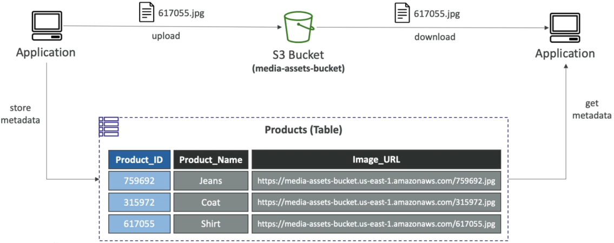
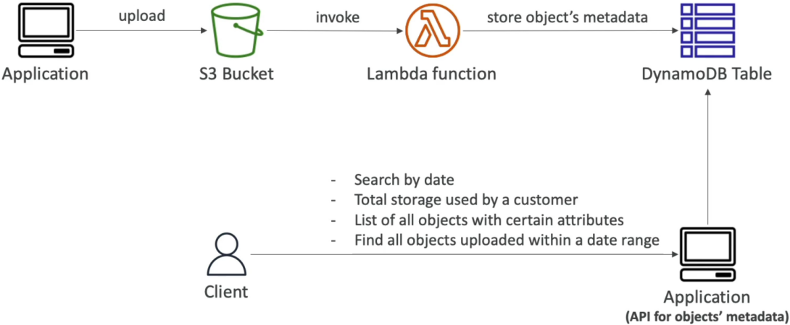

# DynamoDB Patterns with S3

Blending **Amazon DynamoDB** and **Amazon S3** is the absolute cheat code for building elite, cost-optimized, infinitely scalable cloud architectures.

In cloud design, you never want to force a service to do something it wasn’t built for. DynamoDB is an absolute speed demon for fast, indexed, key-value lookups, but it carries a strict, unyielding **400 KB item size limit**. S3, on the other hand, is a flat storage ocean that can effortlessly swallow a 5 TB object but completely sucks at granular query filtering or fast attribute lookups.

---

## 🛠️ Pattern 1: Offloading Large Items (The Pointer Pattern)

When your application handles profile avatars, deep JSON payloads, video uploads, or text-heavy PDF contracts that risk smashing past the 400 KB database ceiling, you pull this lever, chief.

Instead of stuffing raw binary or massive text blocks directly into a DynamoDB row, you split the data lifecycle:

### 🔄 The Write and Read Lifecycles:

- **The Mutation Ingestion Route ✍️:**
  1. Your application layer streams the heavy asset (e.g., an e-commerce product image) straight into a secure **Amazon S3 bucket** first.
  2. S3 writes the object and returns a unique identifier key or **S3 Object URI** (e.g., `s3://my-bucket/products/prod_999.png`).
  3. The app then fires a lightweight `PutItem` or `UpdateItem` request over to **DynamoDB**. The payload contains basic metadata fields (`product_id`, `price`, `stock`) along with a string attribute named `image_url` holding that exact S3 path token!

  

- **The Retrieval Read Route 🔍:**
  1. A frontend client requests the product profile. The app fires a lightning-fast `GetItem` point lookup at DynamoDB targeting the `product_id` key.
  2. DynamoDB returns the tiny metadata document in single-digit milliseconds.
  3. The application intercepts the `image_url` pointer string and uses it to generate a secure **S3 Presigned URL**, passing it back to the client browser to stream the heavy media asset directly from the S3 edge!

---

## 🗀 Pattern 2: S3 Metadata Indexing (The Search Bar Pattern)

Amazon S3 is a phenomenal blob store, but it does **not** feature a dynamic query index. If you have a bucket containing 50 million files, and a project lead asks you to _"Find every object uploaded by Client_X between 9 AM and 10 AM yesterday that is over 5 MB in size,"_ you cannot execute that query natively on S3 without executing a high-cost, high-latency bucket list scan.

To build a high-performance search index over your static files, you invert the dependency relationship using event-driven compute:

### ⚡ The Real-Time Indexing Pipeline:

1. **The Object Ingestion:** A microservice uploads an asset to an S3 bucket.
2. **The Reactive Ingest Trigger:** The bucket captures the `s3:ObjectCreated:Put` event notification and instantly fires a webhook to trigger an **AWS Lambda function**.
3. **The Metadata Extraction:** The Lambda worker intercepts the trigger payload, inspects the file attributes (like `ContentLength`, `StorageClass`, or custom user tags), and normalizes the attributes.
4. **The NoSQL Commit:** Lambda maps that metadata into a structured row and executes a `PutItem` call against a **DynamoDB index table**. The primary partition key might be the `Customer_ID`, and the Sort Key could be the `Upload_Timestamp`!

### 🎯 The Payoff:

Now, when your corporate analytical dashboard needs to answer complex discovery questions, it bypasses S3 completely. Your code runs a highly optimized, single-digit millisecond **`Query`** against the DynamoDB index table, isolates the exact target file paths, and directly extracts strictly the necessary matching objects from S3, bro!

---

## Exam Tips

- **The Validation / Validation Size Trap ⚠️:** If an exam prompt introduces a scenario where a legacy logging application migrating to serverless starts crashing with hard `ItemSizeExceededException` faults during peak spikes—look straight for the architectural fix: **Refactor the workflow to save the raw log payload body to Amazon S3, and store strictly the S3 bucket name and object key references inside the primary DynamoDB item document**
- **Eliminating the Multi-Table Relational List Scan:** If a scenario states that an operations team needs real-time, ultra-fast queries to report on internal structural characteristics of files dropping inside a massive, multi-petabyte S3 data lake (e.g., sorting by timestamp or file extensions), and warns against high execution latencies—**the absolute correct answer is to build a serverless metadata index using an S3 Event Notification to trigger a Lambda function that logs the file details directly into an indexed DynamoDB table**
