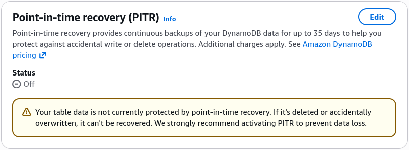
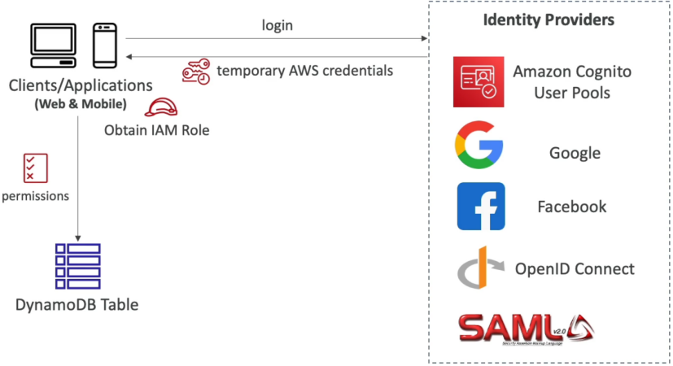

# DynamoDB Security & Other Features

Locking down **DynamoDB Security & Governance Architecture** is how you safely expose a globally distributed NoSQL database straight to millions of untrusted mobile and web client apps without leaking corporate data secrets or creating massive backdoors. 🔐🌍

In standard legacy setups, your database sits locked away in a private zone, and only your trusted backend servers talk to it. But in the serverless era, we want lean, direct client-to-data interactions to slice out heavy API middleware latency. To pull this off without compromising security, AWS equips you with advanced cryptography, cross-region replication networks, and fine-grained identity federation.

---

## Key Takeaways

### 🏛️ Infrastructure Security & Network Hardening

Before looking at user access, your baseline resource footprint must be completely locked down, bro:

- **VPC Endpoints (Private Network Isolation) 🛰️:** To allow your private EC2 instances or Lambda functions to hammer your DynamoDB tables without their traffic ever touching the public internet wire, you deploy a **VPC Gateway Endpoint**. It maps a secure, unmetered private route directly inside your VPC routing tables to keep all database packets entirely on the AWS global private fiber network.
- **Encryption Planes:**
  - **In-Transit:** Every single payload traveling over the wire is strictly wrapped inside industry-standard **SSL/TLS encryption** by default.
  - **At-Rest:** Fully handled out of the box using **AWS KMS (Key Management Service)**. You can pick the default AWS-managed key for free or hook up a custom Customer Managed Key (CMK) to satisfy strict corporate rotation audits.

- **Point-In-Time Recovery (PITR) 🕒:** Activating PITR acts as an automated time-machine layer. It captures continuous incremental logs, allowing you to execute a non-disruptive, zero-performance-impact restore of your table to **any exact second within the last 35 days**, saving your team from catastrophic accidental updates or deletion bugs.
  

---

### 🌍 Enterprise Topology: Global Tables & Local Simulation

- **DynamoDB Global Tables (Multi-Region Active-Active) 🚀:** If your full-stack app has thousands of users sitting in Sydney and another massive batch in New York, a single regional table will inject heavy cross-ocean latency for half your traffic. Turning on Global Tables spins up fully replicated, high-performance, **active-active tables across multiple AWS regions** simultaneously! Users read and write to their closest local region in single-digit milliseconds, and updates sync globally automatically.
- **The Golden Requirement ⚠️:** **You cannot activate Global Tables without enabling DynamoDB Streams first** The background cross-region replication engine literally relies on the stream's change data capture logs to sync mutations across the world.
- **DynamoDB Local (Zero-Cost Local Development) 💻:** To develop code or run integration test pipelines without spinning up live AWS bills or needing an active internet connection, you can download **DynamoDB Local**. It runs a complete NoSQL emulator inside a local Docker container or Java executable right on your machine.

---

### 🛡️ Fine-Granular Access Control (FGAC): Row & Column Defense



This is the ultimate favorite target area on the developer certification blueprint.

Imagine you are building a fitness tracking mobile app. Millions of users log in using **Amazon Cognito User Pools** (or Google/Facebook federated login) and receive temporary, short-lived AWS IAM credentials via an IAM Role. You want them to fire `PutItem` and `GetItem` requests _directly_ at your central table—but they must be strictly blocked from reading or altering anyone else's health logs!

To achieve this absolute row-level and column-level safety, you inject dynamic runtime evaluation **Conditions** straight into your IAM permission policy block:

```json
{
  "Version": "2012-10-17",
  "Statement": [
    {
      "Effect": "Allow",
      "Action": ["dynamodb:GetItem", "dynamodb:PutItem", "dynamodb:Query"],
      "Resource": "arn:aws:dynamodb:us-east-1:123456789012:table/UserFitnessLogs",
      "Condition": {
        "ForAllValues:StringEquals": {
          "dynamodb:LeadingKeys": ["${cognito-identity.amazonaws.com:sub}"],
          "dynamodb:Attributes": ["user_id", "steps_counted", "heart_rate"]
        }
      }
    }
  ]
}
```

#### 🧮 The Policy Validation Mechanics:

- **Row-Level Security (`dynamodb:LeadingKeys`) 🔑:** This strict condition clause states that a client can _only_ touch or query an item **if the item's primary Partition Key value exactly matches their unique, runtime-substituted Cognito user identity string (`${cognito-identity.amazonaws.com:sub}`)**. If User A tries to pass User B's ID into the query payload, DynamoDB drops a hard AccessDenied block instantly.
- **Column-Level Security (`dynamodb:Attributes`) 📊:** By specifying an attributes list whitelist array, you restrict exactly which field columns the incoming user can see or alter. If they try to request an unlisted system configuration field or an admin flag field, the query bounces off the table door!

---

## Exam Tips

- **The Multi-Region Scaling Blueprint:** If an exam prompt presents a scenario where a global web application requires multi-region data persistence with active-active write access paths to keep latencies low for international users, and asks what the mandatory first step is to enable this—**the absolute correct answer is to enable DynamoDB Streams on the source table before configuring Global Tables.**
- **The Shared Multi-Tenant Mobile Table Scenario:** If a question introduces a mobile multiplayer game where millions of distinct smartphone client apps need to save their inventory metrics directly to a single shared DynamoDB table, and asks how to prevent players from snooping or overwriting sibling accounts without spinning up complex server middleware layers—look straight for **Cognito Identity Federation combined with an IAM policy utilizing the `dynamodb:LeadingKeys` condition check matching the user's identity token variable.**

### Practice Test

**Question**: An organization with high data volume workloads have successfully moved to DynamoDB after having many issues with traditional database systems. However, a few months into production, DynamoDB tables are consistently recording high latency.

As a Developer Associate, which of the following would you suggest to reduce the latency? (Select two)

- [ ] Use DynamoDB Accelerator (DAX) for businesses with heavy write-only workloads
- [ ] Consider using Global tables if your application is accessed by globally distributed users
- [ ] Reduce connection pooling, which keeps the connections alive even when user requests are not present, thereby, blocking the services
- [ ] Use eventually consistent reads in place of strongly consistent reads whenever possible
- [ ] Increase the request timeout settings, so the client gets enough time to complete the requests, thereby reducing retries on the system

<details>
<summary>Correct Answer</summary>

- [ ] Use DynamoDB Accelerator (DAX) for businesses with heavy write-only workloads
  - **Explanation**: DAX is an in-memory cache designed for read-heavy workloads (not write-only), delivering up to a 10x performance improvement for read requests.
- [x] Consider using Global tables if your application is accessed by globally distributed users
  - **Explanation**: If you have globally dispersed users, using DynamoDB Global Tables allows data to be replicated across your chosen AWS Regions, significantly reducing latency by bringing data closer to your users.
- [ ] Reduce connection pooling, which keeps the connections alive even when user requests are not present, thereby, blocking the services
  - **Explanation**: Reusing connections or leveraging connection pooling helps keep internal caches warm and avoids the overhead of establishing new connections for each request, keeping latency low.
- [x] Use eventually consistent reads in place of strongly consistent reads whenever possible
  - **Explanation**: Eventually consistent reads maximize read throughput, use half the read capacity units compared to strongly consistent reads, and are less likely to experience higher latency.
- [ ] Increase the request timeout settings, so the client gets enough time to complete the requests, thereby reducing retries on the system
  - **Explanation**: The recommended approach is to reduce request timeout settings so high-latency requests are abandoned quickly and retried, which often completes much faster on the second attempt.

</details>
