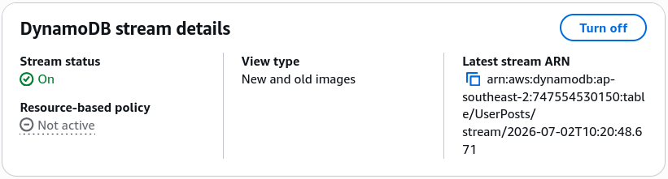
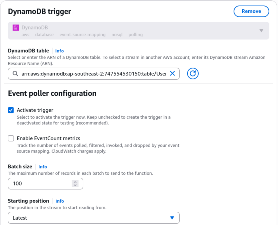

# DynamoDB Streams - Hands On

Stephane’s hands-on lab lays out the exact pipeline mechanics for change-data-capture (CDC). When you modify an item, you don't manually fire off a separate notification line from your app code; you let the database engine safely emit a structured transactional record down the wire.

---

## 🛠️ Step-by-Step Stream and Lambda Integration Hands On

### 1. Activating the Streaming Pipe

- **Step 1: Enable the Ledger**
  - Jump into your **`UserPosts`** table workspace dashboard ──► select the **Exports and streams** configuration tab.
  - Under the **DynamoDB stream details** panel section, click **Turn on**.

- **Step 2: Maximize Image Visibility**
  - Select **New and old images** to ensure your downstream consumers get full data context—both the past baseline state and the incoming patch mutations. Click **Enable stream**.

    

---

### 2. Wiring Up the Serverless Consumer (Lambda & Trigger ESM)

- **Step 3: Leverage a Blueprint Shell**
  - Head to the AWS Lambda console ──► click **Create function** ──► toggle **Use a blueprint**.
  - Search for the official core scaffold: **`Process updates made to a DDB table`** (pick either Node.js or Python).
  - Name your function: `Lambda-demo-dynamodb-stream`. Keep the default setting to auto-generate a fresh execution role wrapper.

- **Step 4: Configure the Event Source Mapping (ESM)**
  - Scroll to the built-in trigger configuration block:
    - **DynamoDB table:** Select `UserPosts` from the dropdown list.
    - **Batch size:** Set it to `100` (This dictates the maximum number of stream records the poller will pack into a single invocation flight).
    - **Starting position:** Select **Latest** (or **Trim horizon** if you want to scan existing unread items up to the 24-hour expiration ceiling). Click **Create function**.

    

- **Step 5: Inject Missing Stream IAM Rights (Triage) 🚨**
  - The console will throw an immediate access warning check banner because a basic Lambda execution role lacks rights to crawl database streams.
  - Fix it fast: Navigate to **Configuration -> Permissions** ──► click the clickable IAM Role ARN string.
  - Inside the IAM console drawer, hit **Attach policies** ──► search for and link the managed **`AWSLambdaDynamoDBExecutionRole`** policy token. (This instantly whitelists `GetRecords`, `GetShardIterator`, `DescribeStream`, and `ListStreams`).
  - Head back to Lambda and flip your trigger check to active!

---

### 🔍 3. Live Telemetry Event Verification

Go back to your `UserPosts` table items view and run three quick data mutations to populate the stream shards:

1. **The `MODIFY` Action:** Edit John's second post text string to say: `"Second post yay! edit"`.
2. **The `INSERT` Action:** Duplicate Alice's row and commit a fresh post entry.
3. **The `REMOVE` Action:** Select the duplicate Alice row item and delete it completely from disk.

Now, navigate to your Lambda function's **Monitor** tab ──► click **View CloudWatch Logs** ──► click into the latest active log stream record block. Look at how the engine prints out your payloads:

```json
// Event Record Node 1: MODIFY
{
  "eventName": "MODIFY",
  "dynamodb": {
    "Keys": { "user_ID": {"S": "John123"}, "post_TS": {"S": "2026-06-30T11:30:00Z"} },
    "OldImage": { "content": {"S": "Second post yay!"} },
    "NewImage": { "content": {"S": "Second post yay! edit"} } // 👑 Both states provided!
  }
}

// Event Record Node 2: INSERT
{
  "eventName": "INSERT",
  "dynamodb": {
    "Keys": { "user_ID": {"S": "Alice456"}, "post_TS": {"S": "2026-07-02T09:00:00Z"} },
    "NewImage": { "content": {"S": "New Alice blog, bro!"} } // ❌ No OldImage exists for an insert!
  }
}

// Event Record Node 3: REMOVE
{
  "eventName": "REMOVE",
  "dynamodb": {
    "Keys": { "user_ID": {"S": "Alice456"}, "post_TS": {"S": "2026-07-01T09:00:00Z"} },
    "OldImage": { "content": {"S": "Alice blog edited"} } // ❌ No NewImage exists for a deletion!
  }
}

```

---

## Exam Tips

- **The Stream Record Duplication Realities:** This is a crucial data processing constraint for the exam blueprint. While DynamoDB Streams guarantee that all item changes appear in the exact order they occurred on disk, **the Lambda trigger loop enforces an "at-least-once" delivery mechanism, bro!** This means if a network stutter occurs between the ESM poller and your function execution container, the same batch of mutations might get passed into your code a second time. To safeguard your system from processing double webhooks or corrupting downstream aggregations, **always design your consumer Lambda functions to be completely idempotent!** Track an internal unique transaction identifier (like a cryptographic hash of the record keys and timestamps) inside a tracking log to ignore any identical incoming replays gracefully!
