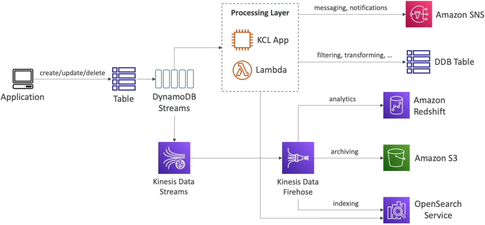
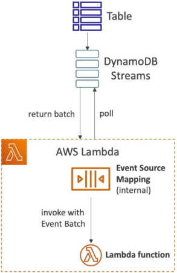

# DynamoDB Streams

Turning on **DynamoDB Streams** is how you upgrade your architecture from a passive storage bucket into a living, breathing, event-driven ecosystem. 👑⚡

In traditional database systems, if you want to trigger an action when a row changes (like sending a welcome email when a user signs up), you either have to write risky database-level procedural triggers or continuously poll the table, which kills your compute performance.

DynamoDB Streams solves this by capturing a time-ordered sequence of every single write, update, and delete event, formatting them into an immutable ledger, and instantly piping them down to your processing layer.

---

## Key Takeaways

**DynamoDB Streams** is a serverless change-data-capture (CDC) mechanism that logs an ordered sequence of all item-level modifications (`INSERT`, `MODIFY`, `REMOVE`) within a table. Retaining event logs for a fixed **24-hour window**, streams act as an real-time orchestrator for event-driven workflows, asynchronous aggregations, and third-party engine syncs (such as Amazon OpenSearch).

---

### 🛰️ The Change Data Capture Event Architecture

The moment any component modifies an item in your base table, the change is written to the stream. From there, you have two core paths to route your streaming data:

#### 🟢 Path A: Direct Serverless Reaction (The Lambda Loop)

You attach an **AWS Lambda function** straight to your stream via an **Event Source Mapping (ESM)**.

- **The Polling Mechanism:** The internal ESM process continuously polls the stream's background shards, extracts records in organized batches, and invokes your processing Lambda function **synchronously**!
- **IAM Security Guardrail 🔒:** Your Lambda function’s execution role must carry permissions to talk to the stream endpoints. It explicitly requires these four policy permissions to read the stream successfully:
- `dynamodb:GetRecords`
- `dynamodb:GetShardIterator`
- `dynamodb:DescribeStream`
- `dynamodb:ListStreams`

#### 🔀 Path B: Broad Analytical Ingestion (The Kinesis Bridge)

If you want to fan out your stream to multiple custom consumer apps or keep the data for a long-term audit trail, you can pipe your DynamoDB Stream directly into **Amazon Kinesis Data Streams (KDS)**.

- **Overcoming the Retention Cap 🕒:** DynamoDB Streams carry a strict, immutable **24-hour data retention window!** If your consumer bugs out and falls behind for more than a day, those events are gone forever. Shifting the data into a Kinesis stream expands your retention runway up to **365 days**!
- **The Delivery Pipeline:** Once inside Kinesis, you can use **Kinesis Data Firehose** to automatically package the events and stream them downstream into **Amazon S3** for compliance archiving, or dump them into **Amazon OpenSearch Service** to build lightning-fast free-text search indexes over your NoSQL dataset, chief!

---

### 📜 Stream View Types (Choosing Your Record Payload)

When you flip the switch to enable a stream, you must tell DynamoDB exactly how much data context to package inside each event node, bro. This choice dictates your downstream network footprint:

| Stream View Type Vector  | What is Written to the Shard Record Payload?                                                 | Ideal Production Use Case Pattern                                                                                                                                               |
| ------------------------ | -------------------------------------------------------------------------------------------- | ------------------------------------------------------------------------------------------------------------------------------------------------------------------------------- |
| **`KEYS_ONLY`**          | Only the primary key attributes of the modified item (`PK` and `SK`).                        | Smallest footprint. Perfect when you just need to pass an identity token to drop an item cache elsewhere, chief!                                                                |
| **`NEW_IMAGE`**          | The entire item attribute block _exactly as it appears after_ the modification took place.   | Triggering a downstream pipeline that expects the final, updated state of an asset.                                                                                             |
| **`OLD_IMAGE`**          | The entire item attribute block _exactly as it appeared before_ the modification took place. | Archiving a historical delta record or maintaining an audit trail tracking old states.                                                                                          |
| **`NEW_AND_OLD_IMAGES`** | **Both** the prior state AND the fresh post-mutation item block in the same event object.    | **The Notification Sweet-Spot, bro!** Lets your code run localized diff calculations (e.g., checking if `Status` changed from `PENDING` to `SHIPPED` to trigger a text alert!). |

---

## Exam Tips

- **The Retroactive Population Trap:** This is a classic exam trick question, chief. A scenario will state: _"A developer has a table with 10 million rows. They realize they need an audit trail, so they enable DynamoDB Streams on the active table and immediately check the stream for their historical records."_ **The stream will be completely empty** Activating a stream **never retroactively populates existing data.** Events are only captured for modifications occurring _after_ the exact millisecond the stream is enabled. To get those old rows into the stream, you have to run a script to touch/update every existing record in the table.
- **Shard Auto-Management Comfort:** If a question asks how to scale the shard capacity of a DynamoDB Stream because your application's write volume just spiked by $10\times$—don't look for an manual adjustment answer! Unlike standard Kinesis streams where you have to split shards yourself, **DynamoDB Streams handle shard scaling 100% automatically in the background** It's fully hands-off serverless execution.
