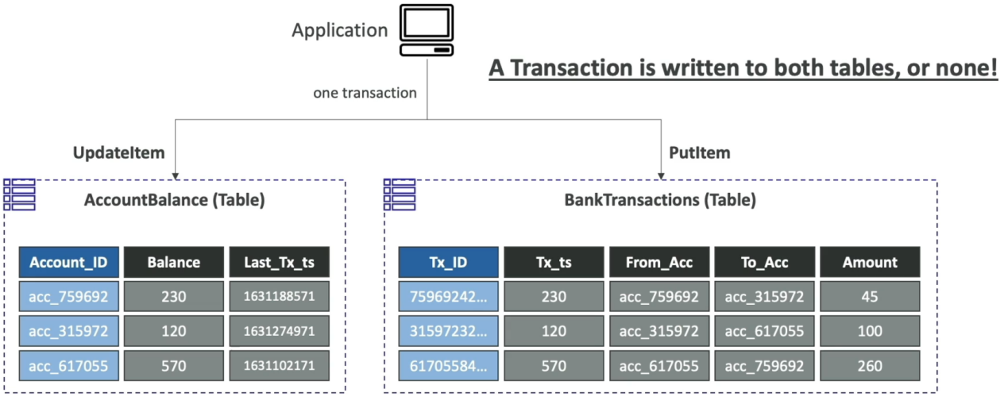

# DynamoDB Transactions

Diving into **DynamoDB Transactions** is how we unlock absolute enterprise-grade financial integrity directly inside a distributed NoSQL engine, bro! 👑🏦

In the past, if you needed strict **ACID transactional guarantees** (Atomicity, Consistency, Isolation, Durability), NoSQL was an immediate dealbreaker, and you were forced to stick to traditional relational setups. If your application needed to deduct money from one table and credit it to another, you had to write complex rollback logic in your backend application code to clean up if the second step failed.

DynamoDB Transactions completely vaporizes that complexity. It gives you a native **"all-or-nothing"** execution framework across multiple items, rows, and even _entirely different tables_ simultaneously.

---

## Key Takeaways

### 🗺️ The Core Transactional API Elements

When your application invokes a transaction, the engine coordinates the operation in a two-phase commit protocol under the hood. It prepares the changes across the partitions first, and then locks them down simultaneously.

- **`TransactWriteItems` (The Atomic Mutation Bundle) ✍️:** Group up to **100 distinct write actions** (or up to a total payload cap of **4 MB**) in a single atomic bundle.! You can mix and match `PutItem`, `UpdateItem`, `DeleteItem`, and `ConditionCheck` statements across completely different tables. If even one single condition check fails or one partition runs out of capacity, **the entire transaction drops instantly**, rolling back every single modification so your data state stays perfectly clean!
- **`TransactGetItems` (The Isolated Point-in-Time Read) 🔍:** Group up to **100 read actions** (up to 4 MB total) to extract multiple items simultaneously. This ensures your microservice receives a perfectly isolated, point-in-time snapshot across all targeted rows with zero risk of reading partial updates from concurrent writes occurring mid-flight.

---

### 📊 The Core Read Consistency Spectrum

With transactions in the mix, DynamoDB now supports three distinct read flavors. Let's look at how they stack up:

```text
📊 THE DYNAMODB READ CONSISTENCY LIFECYCLE:
   ├── 1. Eventually Consistent Read (Default) ──► Fast, half the RCU cost, minor stale data risk.
   ├── 2. Strongly Consistent Read ──► Guarantees absolute data freshness from disk; standard RCU cost.
   └── 3. Transactional Read ──► Coordinated point-in-time ACID snapshot across multiple records; 2x RCU cost!
```

---

### 🧮 Crucial Transaction Capacity Mathematics

Because the database engine has to execute a two-phase handshake behind the scenes (preparing the transaction and then committing it), **transactional operations consume exactly TWICE ($2\times$) the baseline capacity units**.

#### ✍️ Transactional Write Capacity Units (WCUs) Formula

$$\text{Total Transactional WCUs} = \left( \text{Items per Second} \right) \times \left\lceil \frac{\text{Average Item Size in KB}}{1\text{ KB}} \right\rceil \times \mathbf{2}$$

##### 🏢 Example Problem Space:

- **The Task Scenario:** Your banking application processes **3 transactional writes per second**, and each ledger item footprint measures exactly **5 KB**.
  - **Step A: Apply Ceiling Rounding (5 KB / 1 KB):** $\lceil 5\text{ KB} \rceil = 5\text{ Base Units}$
  - **Step B: Apply the Transaction Multiplier ($2\times$):**

  $$\text{Total Capacity Allocation} = 3\text{ Requests/Sec} \times 5\text{ Base Units} \times 2 = \mathbf{30\text{ WCUs}}$$

---

#### 🔍 Transactional Read Capacity Units (RCUs) Formula

$$\text{Total Transactional RCUs} = \left( \text{Items per Second} \right) \times \left\lceil \frac{\text{Average Item Size in KB}}{4\text{ KB}} \right\rceil \times \mathbf{2}$$

##### 🏢 Example Problem Space:

- **The Task Scenario:** Your gaming microservice handles **5 transactional reads per second**, fetching inventory items with an average footprint size of **5 KB**.
  - **Step A: Apply the 4 KB Envelope Rounding Rule:**

  $$\text{Rounded Footprint Size} = \lceil 5\text{ KB} \rceil \text{ to next multiple of 4} = 8\text{ KB}$$

  $$\text{Base Units per Item} = \frac{8\text{ KB}}{4\text{ KB}} = 2\text{ Base Units}$$
  - **Step B: Compute with the Transaction Multiplier ($2\times$):**

  $$\text{Total Capacity Allocation} = 5\text{ Requests/Sec} \times 2\text{ Base Units} \times 2 = \mathbf{20\text{ RCUs}}$$

---

## Exam Tips

- **The Ledger Double-Entry Scenario:** If an exam question introduces a double-entry accounting system where an API needs to update a customer's `AccountBalance` table while simultaneously inserting a transaction record into a `BankTransactions` log table, and mandates that one entry cannot exist without the other—**look straight for `TransactWriteItems`** Avoid options that suggest manually handling rollbacks via Lambda code loops!
  
- **The Double-Cost Arithmetic Trap ⚠️:** Watch out for math questions that quietly switch context midway through a prompt. If a scenario asks you to calculate the cost to support a workflow, always scan for the keyword **"transactional"**. The second you spot it, ensure you calculate your baseline rounded item units and slap that **$2\times$ multiplier** right onto the final output! Forgetting to double the capacity units is the #1 way developers drop points on throughput math questions.
