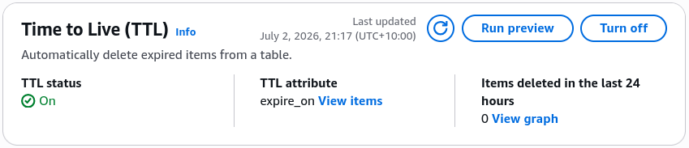
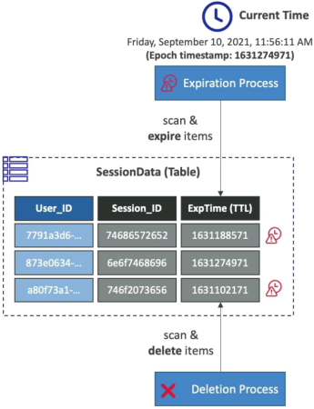

# DynamoDB TTL

Managing storage bloat and handling automatic data retention windows using **DynamoDB Time To Live (TTL)** is how you slash your cloud storage bill down to absolute zero without writing a single line of high-overhead cron-job cleanup code. 📉🧹

In a high-velocity application, caching temporary user session states, tracking short-lived login tokens, or retaining rolling debug logs is mandatory. But if you let that data pile up on your disk partitions indefinitely, you're just lighting money on fire.

DynamoDB TTL solves this by acting as a built-in, automated garbage collection sweep that auto-evicts stale data in the background.

---

## Key Takeaways

**AWS DynamoDB TTL (Time To Live)** is a fully automated data lifecycle mechanism that purges expired items from tables based on a designated timestamp attribute. Requiring a strictly typed **Number** field representing a valid **Unix Epoch timestamp** in seconds, the background execution engine drops expired records asynchronously without consuming any Provisioned Write Capacity Units (WCUs) or disrupting active production traffic channels.

---

### ❄️ The Absolute Laws of TTL Configuration

When you flip the switch on the console dashboard or deploy it via an infrastructure template, your items must comply with three hard platform constraints:

- **The Data Type Absolute Clause 🔢:** Your tracking attribute (e.g., `expire_on`) **must be configured strictly as a Number data type.** If you accidentally pass an ISO-8601 string signature (like `"2026-07-02T20:10:00Z"`), the background TTL scanner will completely ignore the item, and it will sit on your disk forever.
  
- **The Unix Epoch Target Standard:** The integer value stored inside that number field must represent a standard **Unix Epoch timestamp formatted precisely in seconds** (e.g., `1775073000`), tracking how far the target time sits from January 1, 1970.
- **The Ultimate Free Play ($0 WCUs) 🤑:** This is the best part, bro. When the platform purges an expired record, **it costs absolute zero WCUs!** You don't have to over-provision your write capacity units or buy extra scaling headroom just to run data cleanups.

---

### ⏳ The 48-Hour Background Deletion Window

This is a massive milestone conceptual point that the DVA-C02 blueprint targets with tricky scenario prompts. Pay very close attention to how the background sweep processes bytes:

The moment the current real-world clock tick surpasses the integer value stamped inside an item's `expire_on` attribute field, that item is officially considered **expired**.

$$\text{Current Real Time (Seconds)} > \text{Item TTL Attribute Value} \implies \text{Item Eligible for Background Eviction}$$

- **The Asynchronous Lag Reality 🕒:** DynamoDB does not execute an instantaneous delete the exact millisecond an item expires. Instead, a low-priority background process continually scans the partition array to evict records. **It can take up to 48 hours for an item to physically vanish from the disk matrix!**
- **The Client-Side Filter Necessity:** Because of that 48-hour sweeping lag, an expired item can still show up inside your standard `GetItem`, `Query`, or `Scan` read API calls. If your application logic cannot afford to expose stale data to users, **you must write a client-side or server-side filter expression to manually drop rows where the expiration attribute is less than the current time.**

```sql
-- 🛡️ Operational Client Filter: Drop expired ghost records manually!
SELECT * FROM "DemoTTL"
WHERE "user_id" = 'john_123' AND "expire_on" > :currentTimeInSeconds;

```



---

### 🛰️ Secondary Impacts: Indexes and Streams

When the background process finally drops the hammer and removes the item, a synchronized chain reaction executes automatically across the rest of your cloud stack:

- **Complete Index Syncing:** The item is wiped out from all your attached **Local Secondary Indexes (LSIs)** and **Global Secondary Indexes (GSIs)** completely automatically, keeping your search footprints clean.
- **The Streams Recovery Pathway 🪝:** Even though a TTL deletion doesn't burn WCUs, **it still generates a formal `REMOVE` event node inside your DynamoDB Stream!**
  - _The Downstream Play:_ If your compliance team requires long-term tracking data, a Lambda function monitoring the stream can catch that `REMOVE` payload and archive the expired item directly into an **Amazon S3 Glacier** bucket before it vanishes from the live database tier.

---

## Exam Tips

- **The Ghost Records Query Scenario:** If an exam prompt introduces a banking or healthcare app where users are occasionally seeing expired subscription states or stale shopping carts up to 24 hours past their expiration deadlines, and asks how to resolve it without increasing table capacity—look for the double-pronged solution: **Ensure TTL is active, but inject a `FilterExpression` into your active Query and Scan logic to explicitly omit rows where the epoch integer is less than the current system time.**
- **The Wrong Variable String Trap:** If a question shows a code snippet where a developer is stamping an expiration field using JavaScript's `Date.now()`, and the table fails to evict any records—check the time factor, chief. `Date.now()` outputs time in **milliseconds**, whereas DynamoDB TTL strictly evaluates time in **seconds**. A millisecond value looks thousands of years into the future to the engine, meaning the rows will never trigger for deletion. Always divide your millisecond stamps by 1,000 before saving them down.
