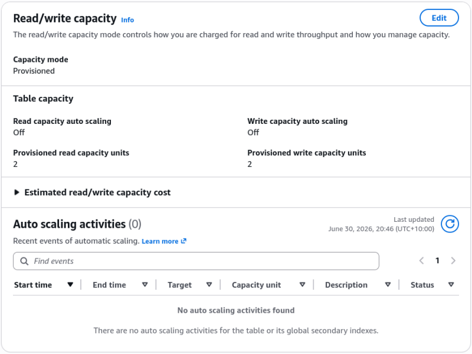
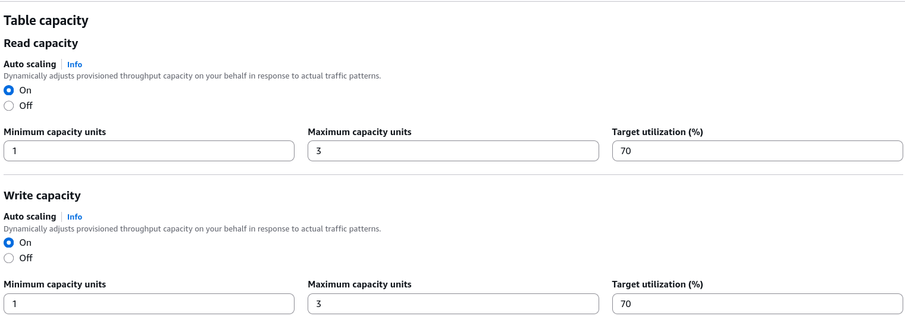
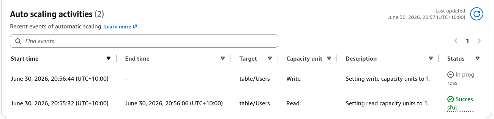

# DynamoDB WCU & RCU - Hands On

Stephane’s console run exposes the core mechanics of how DynamoDB bridges the gap between manual capacity math and automated cloud elasticity. In production, you don't want to get paged at 3 AM because a massive traffic wave crushed your hardcoded 2 RCU ceiling. You let Auto Scaling track a target utilization percentage so the platform does the heavy lifting for you.

---

## 🛠️ Step-by-Step Capacity Optimization Hands On

### 1. Harnessing the Native Dashboard Calculator

- **Step 1: Locate Throughput Scaling Controls**
  - Jump into your `Users` table workspace dashboard ──► select the **Settings** tab.
  - Locate the **Read/write capacity** sub-panel and click **Edit**.
    

- **Step 2: Interactive Parameter Prototyping**
  - Expand the built-in **Capacity calculator** tool.
  - Input a sample structural footprint size (e.g., `6 KB`).
  - Dial in your throughput velocity targets: `3 Reads/sec` and `2 Writes/sec`.
  - Toggle between **Eventually Consistent** and **Strongly Consistent** options. Watch how the calculated RCU value instantly scales by a factor of $2\times$ the moment you request absolute data freshness down the wire!

---

### 2. Implementing Target Tracking Auto Scaling

Instead of leaving capacity pinned to static limits, let's pass orchestration control directly to the DynamoDB Auto Scaling service engine:

- **Step 3: Define the Target Boundaries**
  - Under **Capacity mode**, maintain **Provisioned**.
  - Check **Read capacity Auto scaling** ──► toggle it to **On**.
  - Set your **Minimum capacity units** value parameter to `1`.
  - Set your **Maximum capacity units** value ceiling to `3`.
  - Set the **Target utilization (%)** slider exactly to **`70%`**. (This instructs the service: _"If my average consumed capacity climbs past 70% of my current allocation, proactively scale up my headroom; if traffic drops, scale me down to shave off costs, bro!"_)

- **Step 4: Align the Write Planes**
  - Apply the exact same structural settings (`Min: 1 / Max: 3 / Target: 70%`) to the **Write capacity Auto scaling** block and click **Save changes**.
    

$$\text{Scale-Up Trigger Condition} \implies \left( \frac{\text{Consumed Capacity}}{\text{Provisioned Headroom}} \times 100 \right) > 70\% \implies \text{Increase Desired Allocation}$$

---

### 🔍 3. Auditing the Telemetry Activity Logs

Once you save the modifications, the background orchestration engine spins up managed **Amazon CloudWatch Alarms** tracking your table metrics.

- **Step 5: The Idle Scale-Down Validation**
  - Click over to the **Monitor** or **Auto scaling activities** log dashboard.
  - **The Operational Scaling Event:** Because you are executing zero transactional hits against the table workspace, the utilization index sits at absolute 0%. The CloudWatch alarm fires a low-utilization trigger, and the dashboard logs show a successful status entry: **`Setting Read/Write capacity to 1.`**
  - Refresh your main table overview profile panel. The active RCUs and WCUs have shifted from their original static `2` allocations down to a tight, cost-efficient baseline of **`1`**!
    

---

## Exam Tips

- **The Scaling Step Lag Pitfall:** This is an absolute milestone favorite exam architecture scenario. If a prompt notes that an enterprise application experiences a massive, instantaneous explosion in write traffic within a fraction of a single second (e.g., flash sales or tick-counter events), and the DynamoDB table drops immediate throttling errors despite Auto Scaling being enabled—look for the architecture explanation. **DynamoDB Auto Scaling is not instantaneous** It relies on CloudWatch target tracking evaluation windows which take minutes to react and scale up. For massive, sudden, sub-second traffic spikes, you must either switch the table completely to **On-Demand Capacity Mode** or leverage pre-warmed **Reserved Concurrency/Throughput** flags ahead of time!
