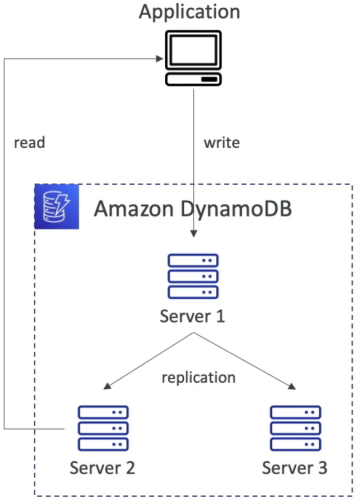
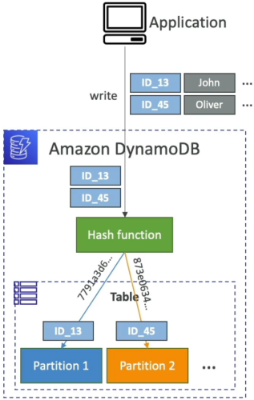

# DynamoDB WCU & RCU - Throughput

In your professional career, you've likely seen systems fall over because someone threw a high-traffic workload at a database layer without thinking about the underlying storage engine's physical limits. DynamoDB handles this using **Partitions**, but to protect those partitions from throttling, you must master the math of throughput allocation.

---

## Key Takeaways

Before running computations, you have to choose how AWS bills you for performance:

- **Provisioned Capacity Mode (Cost-Optimized Baseline):** You explicitly define your maximum sustained scale thresholds via **Write Capacity Units (WCUs)** and **Read Capacity Units (RCUs)**. You are invoiced flat hourly rates for these allocations regardless of actual usage traffic. Best for predictable, steady workloads.
- **On-Demand Capacity Mode (Zero-Management Elasticity):** The platform handles all capacity scaling dynamically with zero upfront provisioning. You are billed directly per transaction based on **Write Request Units (WRUs)** and **Read Request Units (RRUs)**.
- ⚠️ **The Expense Trap:** On-Demand is roughly **$2.5\times$ more expensive** per request than provisioned mode! It's fantastic for highly unpredictable, spiky, or completely unknown new workloads, but a terrible choice for high-volume, steady-state production lines.
- _The Flipping Gate:_ You can switch a live table between Provisioned and On-Demand tracking states **once every 24 hours**.

---

### 🧮 The Write Capacity Unit (WCU) Master Formula

$$\text{1 WCU} \equiv \text{1 Write / Second for an item up to 1 KB in size}$$

#### 🛑 The Rule of the Upper Boundary Ceiling:

DynamoDB **never** processes fractional values when evaluating file dimensions. **Every item size calculation MUST be rounded UP to the nearest whole kilobyte before applying multipliers, bro!**

$$\text{Total WCUs Required} = \left( \text{Items per Second} \right) \times \left\lceil \frac{\text{Average Item Size in KB}}{1\text{ KB}} \right\rceil$$

#### 🏢 Example Problem Space:

- **The Task Scenario:** Your application needs to ingest **120 items per minute**, and each isolated item footprint measures exactly **4.5 KB**.
  - **Step A: Standardize the Chronological Cadence:**
    $$\text{Items per Second} = \frac{120\text{ Items}}{60\text{ Seconds}} = 2\text{ Items/Sec}$$
  - **Step B: Apply the Upper Ceiling Rounding Rule:**
    $$\text{Rounded Footprint Size} = \lceil 4.5\text{ KB} \rceil = 5\text{ KB}$$
  - **Step C: Compute the Final Output Allocation:**
    $$\text{Total Throughput Allocation} = 2\text{ Items/Sec} \times 5\text{ WCUs} = \mathbf{10\text{ WCUs}}$$

---

### 🧮 The Read Capacity Unit (RCU) Master Formula

$$\text{1 RCU} \equiv \begin{cases} \mathbf{1\text{ Strongly Consistent Read / Sec}} \\ \mathbf{2\text{ Eventually Consistent Reads / Sec (Default)}} \end{cases} \text{for an item up to 4 KB}$$

#### 🛑 The Rule of the 4 KB Extraction Envelope:

Just like WCUs, you must round item footprints UP—but this time, you round up to the nearest **multiple of 4 KB**, chief!

$$\text{Total RCUs (Strongly Consistent)} = \left( \text{Items per Second} \right) \times \left\lceil \frac{\text{Average Item Size in KB}}{4\text{ KB}} \right\rceil$$

$$\text{Total RCUs (Eventually Consistent)} = \frac{\left( \text{Items per Second} \right) \times \left\lceil \frac{\text{Average Item Size in KB}}{4\text{ KB}} \right\rceil}{2}$$

#### 🏢 Example Problem Space:

- **The Task Scenario:** Your application handles **16 requests per second**, each fetching an item size of **10 KB**. Your project requirements mandate **Eventually Consistent Reads**.
  - **Step A: Apply the 4 KB Envelope Rounding Rule:**
    $$\text{Rounded Footprint Size} = \lceil 10\text{ KB} \rceil \text{ to next multiple of 4} = 12\text{ KB}$$
    $$\text{Base Units per Item} = \frac{12\text{ KB}}{4\text{ KB}} = 3\text{ Base Units}$$
  - **Step B: Compute the Raw Request Ingestion Baseline:**
    $$\text{Raw Ingestion Base} = 16\text{ Items/Sec} \times 3 = 48\text{ Units}$$
  - **Step C: Factor the Consistency Multiplier Split:**
    $$\text{Total Throughput Allocation} = \frac{48\text{ Units}}{2} = \mathbf{24\text{ RCUs}}$$

---

### 🚨 Distributed Partitions & The Anatomy of Throttling

When you provision throughput capacity, DynamoDB **does not** allocate those units to a single monolithic engine. Instead, it divides your total throughput evenly across all the underlying physical storage partitions in the background.
When you provision $1,000\text{ WCUs}$ and $1,000\text{ RCUs}$ globally across your parent table resource, DynamoDB does not pool those limits onto a single monolithic engine. It divides your throughput parameters **completely evenly across all your underlying background physical storage partitions**.

- **The Allocation Fragmentation Reality:** If your massive data pool spans **10 discrete physical storage partition drives** in the background, each partition drive receives exactly:  
  $$\text{Local Partition Allocation Ceiling} = 100\text{ WCUs} \quad\land\quad 100\text{ RCUs}$$
- **The Production Crash Hook:** If a million frontend clients blast requests targeting the exact same partition key (e.g., retrieving a trending product item), **100% of that traffic hits a single physical partition drive.** Even if your global table dashboard shows 90% of your provisioned capacity is sitting idle, that single partition will exhaust its local allocation ceiling instantly, throwing a hard **`ProvisionedThroughputExceededException`** crash code.

---

## Exam Tips

- **The Exponential Backoff Remedy:** If a scenario states that an application is encountering intermediate, short-lived `ProvisionedThroughputExceededException` bursts during peak morning hours, don't rush to pay for more throughput capacity right away. Look for the software remedy: **Implement an Exponential Backoff and Jitter Retry Strategy within the calling client application code wrapper.** (This is natively handled automatically out of the box by official AWS SDK configurations!)
- **The Read Acceleration Strategy:** If your application is dropping read throttling faults because a celebrity item is being accessed millions of times a minute, look straight for **DynamoDB Accelerator (DAX)**. DAX acts as a fully managed, in-memory caching sidecar that intercepts read requests before they ever touch your database table partitions, completely wiping out read throttling issues!
