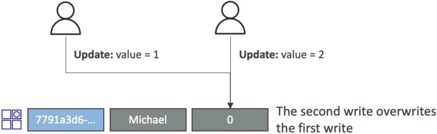
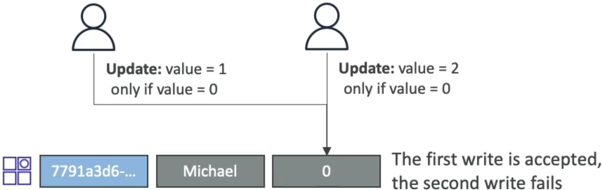
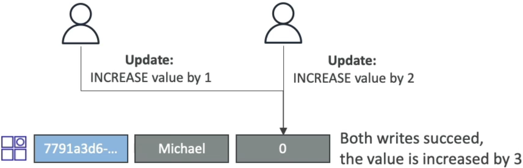
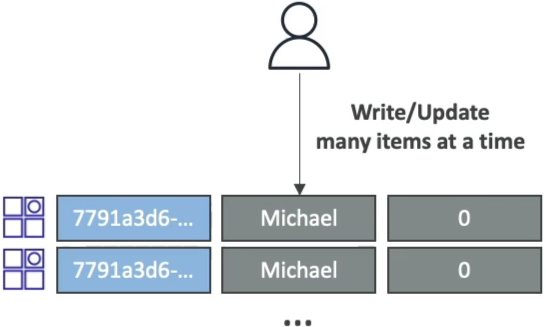
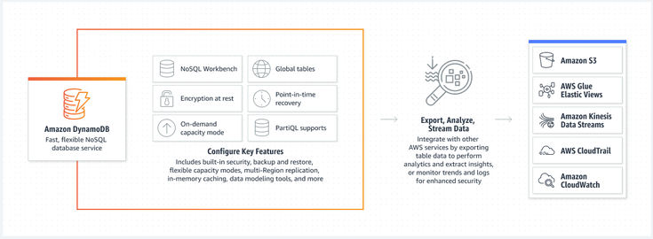
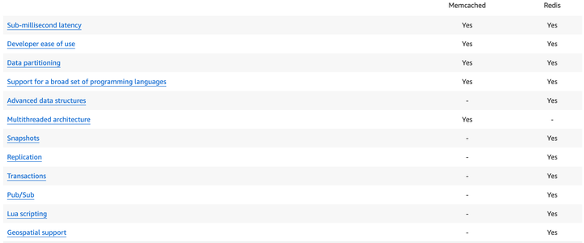

# DynamoDB Conditional Writes, Concurrent Writes & Automatic Writes

Locking down the exact differences between **Concurrent, Conditional, and Atomic writes** is how you prevent your distributed serverless backend from dropping updates, throwing inaccurate counter logs, or corrupting database records, bro! 👑⚡

When multiple AWS Lambda workers or ECS containers are hammering your database at the exact same millisecond, how you structure your mutation payloads determines whether your state stays bulletproof or collapses into a race-condition nightmare.

---

## Key Takeaways

### 🛠️ The Ultimate Data Plane Write Breakdown

AWS targets these exact transactional write behaviors aggressively, bro. Let's map out exactly what happens under the hood for each pattern:

#### 1. Concurrent Writes (The Blind Overwrite Risk) 🔄

- **The Operational Setup:** Two distributed client threads read an item baseline simultaneously. Both decide they want to change a value and fire off standard `PutItem` or `UpdateItem` calls completely independently.
- **The Engine Reaction:** **Both write requests succeed at the API layer** Whichever network packet hits the DynamoDB partition drive last will silently overwrite the changes committed by the packet that landed a microsecond earlier.
- **The Danger Trap:** The first writer receives a `200 OK` success response code, but their update is instantly erased from history. This is an anti-pattern for concurrent data states, bro!
  s
  

#### 2. Conditional Writes (Optimistic Locking Shield) 🔒

- **The Operational Setup:** Clients append a strict validation rule via a `ConditionExpression` directly inside the mutation payload.
- **The Engine Reaction:** The database storage layer acts as the absolute gatekeeper. It checks your rule server-side _before_ modifying the drive.
- **The Concurrency Fix:** If Client 1 updates the value first, the baseline state changes. When Client 2's packet arrives a split second later, the condition evaluates to false. The engine rejects the write, blocks the overwrite, and drops a clean **`ConditionalCheckFailedException`**, allowing Client 2 to gracefully retry with the fresh data.

#### 3. Atomic Writes (The Hands-Off Increment Loop) 🔢

- **The Operational Setup:** Instead of reading a value, modifying it in code, and pushing it back, your app uses `UpdateItem` combined with an mathematical expression operator.
- **The Syntax Engine:** `SET counter_value = counter_value + :inc`
- **The Magic Multiplication:** Both writes execute successfully without blocking each other or checking a baseline. If Thread A requests a `+1` increment and Thread B requests a `+2` increment at the exact same millisecond, the final value on disk automatically steps up by exactly **`+3`**, bro!
- ⚠️ _The Idempotency Caveat:_ Atomic writes are perfect for high-speed tracking (like web page view hit counters), but because they are unconditional, **retrying a failed network request can accidentally increment the value a second time, chief!**

---

### 📊 Structural Concurrency Mapping

Let's look at how the exact same multi-threaded collision payload modifies a database row on the partition drive based on your chosen strategy:

| Write Strategy Lever  | Client 1 Intent Payload     | Client 2 Intent Payload     | Final Committed DB State               | Architectural Concurrency Penalty                                                                        |
| --------------------- | --------------------------- | --------------------------- | -------------------------------------- | -------------------------------------------------------------------------------------------------------- |
| **Concurrent Write**  | Set `Val = 1`               | Set `Val = 2`               | **`Val = 2`** (Last packet wins)       | **Silent Data Loss!** Client 1's update is completely vaporized.                                         |
| **Conditional Write** | Set `Val = 1` if `Val == 0` | Set `Val = 2` if `Val == 0` | **`Val = 1`** (Client 2 gets rejected) | **Safe State Isolation.** Client 2 catches a `400` error and handles a self-healing retry loop.          |
| **Atomic Write**      | Increment `Val` by `1`      | Increment `Val` by `2`      | **`Val = 3`** (Both counts sum up)     | **Unconditional Accumulation.** Zero read lock overhead, but carries an idempotent retry duplicate risk. |

---

### 📦 The Batch Ingestion Layer (`BatchWriteItem`)

Completely independent of your item concurrency strategies, **Batch writes** are explicitly designed for bulk ingestion throughput optimization.

- It lets you pack up to **25 independent point operations** (`PutItem` and `DeleteItem`) across multiple tables into a single network flight payload, bypassing network latency overhead.
- ⛔ **The Core Rule Reminders:** You **cannot** execute `UpdateItem` operations inside a batch block, and you **cannot** attach conditional check expressions to batch rows! It is strictly for high-velocity raw data dumping or purging.

---

## Exam Tips

- **The Web Traffic Page Counter Scenario:** If an exam prompt presents a scenario where a high-velocity serverless app needs to track global analytics hit logs, and mandates ultra-low latency write speeds where a minor statistical duplicate during a network retry is acceptable—**look straight for Atomic Counters via `UpdateItem` math expressions, chief!**
- **The Inventory Stock Outcheck Scenario:** If the prompt shifts context to a strict financial booking or e-commerce cart seat reservation system where multiple users are clicking checkout at the exact same second, and you must absolutely guarantee that a seat is never double-booked—**never choose an atomic or concurrent write. You explicitly implement Conditional Writes backed by Optimistic Locking version checks**

### Practice Test

**Question:** A company is creating a gaming application that will be deployed on mobile devices. The application will send data to a Lambda function-based RESTful API. The application will assign each API request a unique identifier. The volume of API requests from the application can randomly vary at any given time of day. During request throttling, the application might need to retry requests. The API must be able to address duplicate requests without inconsistencies or data loss.  
Which of the following would you recommend to handle these requirements?

- [ ] Persist the unique identifier for each request in a DynamoDB table. Change the Lambda function to send a client error response when the function receives a duplicate request
- [ ] Persist the unique identifier for each request in an RDS MySQL table. Change the Lambda function to check the table for the identifier before processing the request
- [ ] Persist the unique identifier for each request in an ElastiCache for Memcached cache. Change the Lambda function to check the cache for the identifier before processing the request
- [ ] Persist the unique identifier for each request in a DynamoDB table. Change the Lambda function to check the table for the identifier before processing the request

Correct Answer

- [x] Persist the unique identifier for each request in a DynamoDB table. Change the Lambda function to check the table for the identifier before processing the request
  - **Explanation**: DynamoDB is a fully managed, serverless, key-value NoSQL database designed to run high-performance applications at any scale. DynamoDB offers built-in security, continuous backups, automated multi-Region replication, in-memory caching, and data import and export tools. On-demand backup and restore allows you to create full backups of your DynamoDB. Point-in-time recovery (PITR) helps protect your DynamoDB tables from accidental write or delete operations. PITR provides continuous backups of your DynamoDB table data, and you can restore that table to any point in time up to the second during the preceding 35 days.  
    These features ensure that there is no data loss for the application, thereby meeting a key requirement for the given use case. The solution should also be able to address any duplicate requests without inconsistencies, so the Lambda function should be changed to inspect the table for the given identifier and process the request only if the identifier is unique.  
     

Incorrect Answers

- [ ] Persist the unique identifier for each request in an ElastiCache for Memcached cache. Change the Lambda function to check the cache for the identifier before processing the request
  - **Explanation**: Memcached is designed for simplicity and it does not offer any snapshot or replication features. This can lead to data loss for applications. Therefore, this option is not the right fit for the given use case.  
    
- [ ] Persist the unique identifier for each request in an RDS MySQL table. Change the Lambda function to check the table for the identifier before processing the request
  - **Explanation**: DynamoDB is a better fit than RDS MySQL to handle massive traffic spikes for write requests. DynamoDB is a key-value and document database that supports tables of virtually any size with horizontal scaling. DynamoDB scales to more than 10 trillion requests per day and with tables that have more than ten million read and write requests per second and petabytes of data storage. DynamoDB can be used to build applications that need consistent single-digit millisecond performance. MySQL RDS can be scaled vertically, however, it cannot match the performance benefits offered by DynamoDB for the given use case.
- [ ] Persist the unique identifier for each request in a DynamoDB table. Change the Lambda function to send a client error response when the function receives a duplicate request
  - **Explanation**: The solution should be able to address any duplicates without any inconsistencies. If Lambda sends a client error response upon receiving a duplicate request, it represents an inconsistent response. So this option is incorrect.

