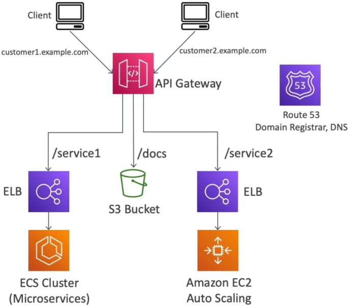

# API Gateway - Architecture

This final microservice blueprint ties the entire stack together, bro! It shows exactly how **Amazon API Gateway** acts as the ultimate decoupled "front door" for an entire multi-tiered corporate ecosystem.

In a real-world production engine, your clients shouldn't have to deal with a messy web of different URLs, port numbers, or protocol endpoints for every separate feature your company builds. Instead, you wrap all that chaotic backend infrastructure behind a single, clean domain name, using API Gateway as an intelligent reverse-proxy router to abstract away the complexity.

---

## Key Takeaways

### 🏗️ The Unified Unified Front Perimeter Architecture

Instead of exposing separate endpoints, you route distinct URL resource path patterns straight to the specific infrastructure fleet best suited to handle that data type natively:

```text
🌐 CLIENT OVER THE WIRE ──► https://api.mycompany.com
                                   │
       ┌───────────────────────────┴───────────────────────────┐
       ▼ (Path-Based Routing)                                  ▼
 📂 /service1 ──► Application Load Balancer ──► 🐳 Amazon ECS Container Cluster (Heavy Compute)
 📂 /service2 ──► Application Load Balancer ──► 🏎️ EC2 Auto Scaling Fleet (Legacy App Tier)
 📂 /docs     ──► Direct AWS Service Map    ──► 📦 Amazon S3 Bucket (Static Documentation Pages)
```

#### ⚡ The Multi-Backend Integration Split:

- **The Container Route (`/service1`) 🐳:** Points straight to an Application Load Balancer (ALB) or Network Load Balancer (NLB) backing an **Amazon ECS** task cluster running Dockerized microservices.
- **The Elastic Compute Route (`/service2`) 🏎️:** Maps directly to an ALB fronting an **Amazon EC2 Auto Scaling Group** handling long-running monolithic workloads.
- **The Storage Pass-Through (`/docs`) 📦:** Uses a direct **AWS Service Integration** to fetch static markdown or HTML documentation guides right out of an **Amazon S3** bucket. **No code overhead, no Lambda costs, bro!**

---

### 🗺️ SaaS Multi-Tenant Routing (Custom White-Labeling)

If you're building a software-as-a-service (SaaS) platform where different enterprise clients require their own branded, white-labeled access lines, you combine API Gateway with **Amazon Route 53** and **AWS Certificate Manager (ACM)**:

1. **The DNS Alias Layer:** Inside Route 53, you declare multiple alias/CNAME records mapping separate tenant domains (like `customer1.example.com` and `customer2.example.com`) to the exact same underlying API Gateway distribution endpoint.
2. **The Cryptographic Handshake 🔒:** You generate a single wildcard or multi-domain SSL certificate wrapper inside ACM and bind it directly to your API Gateway **Custom Domain Names** panel.
3. **The Context Injection Pass:** Because the gateway catches the fully qualified domain name (FQDN) at runtime, you can configure mapping templates to inject the client's host header context directly into the request payload. The backend systems instantly know exactly which tenant database pool to query without forcing the user to pass a tracking ID.



---

## Exam Tips

- **The Monolith-to-Microservice Strangler Pattern:** If an exam prompt presents a migration task where a company wants to split a giant, aging EC2 monolith into a modern mesh of independent Lambda functions and ECS containers, but mandates that the public consumer client apps must suffer **zero configuration changes or down-time** during the transition—**look straight for API Gateway as the absolute abstraction layer, bro!** You map the public endpoints on the gateway, and gracefully swap the backend integration links from the legacy load balancer over to the new serverless functions path-by-path behind the scenes!
- **The Single-Entry Perimeter Security Win:** Centralizing your routing footprint at the gateway means you only have to write your security, caching, rate-limiting, and firewall compliance rules **once**. Your backend microservice teams don't have to spend a single line of code worrying about validating Cognito JWTs or blocking bad IP pools—they just focus purely on their business logic because API Gateway handles the gatekeeping at the edge.
