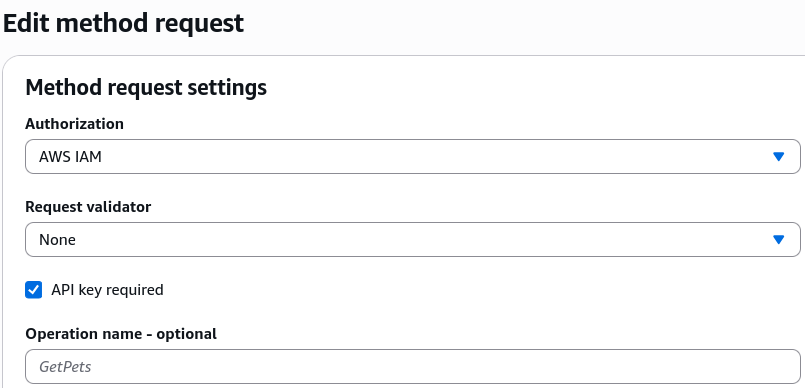
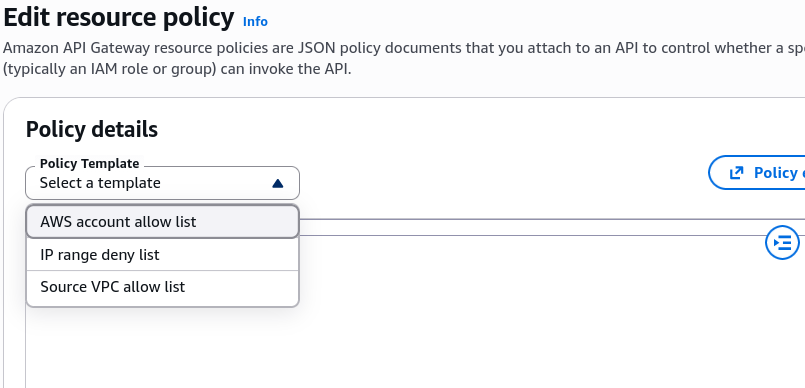
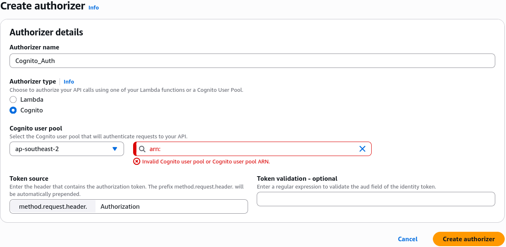

# API Gateway Authentication and Authorization - Hands On

Checking out the raw dashboard control planes puts all that heavy security theory straight into a developer's hands.

Seeing exactly where to toggle `AWS_IAM` signatures, how to write resource JSON blocks, and where to mount your managed identity tokens bridges the gap between basic scaffolding and a hardened enterprise gateway perimeter.

---

## 🛠️ Step-by-Step Gateway Perimeter Configuration Hands On

When you're ready to secure your resources in the AWS Management Console, you use these exact pathing configurations:

### 1. Hardening Individual Methods (`AWS_IAM` & SigV4)

- **The Console Route:** Open your API ──► click your target **Resource Path** folder ──► select your HTTP Method verb (e.g., `GET` or `POST`).
- **The Configuration Switch:** Click into the **Method Request** options block. Locate the **Authorization** field dropdown, click edit, and toggle it straight from `NONE` over to **`AWS_IAM`**.
- _The Runtime Handshake:_ Once deployed, any client trying to ping this specific URL route must cryptographically sign their headers using their AWS Access/Secret keys using the **Signature Version 4 (SigV4)** spec, or the gatekeeper bounces the request instantly!



---

### 2. Mounting the Global Firewall (Resource Policies)

- **The Console Route:** Look on the left-hand main navigation panel of your specific API ──► click on the **Resource Policies** tab.
- **The Structural Templates:** The console gives you instant, drop-down JSON schema templates to bypass manual syntax typing, chief:
- **Cross-Account Allow List:** Generates an IAM policy string where you drop in a sibling AWS Account ID, letting external roles invoke your private endpoints natively.
- **IP Range Deny/Allow List:** Drops an IP network firewall rule block utilizing `aws:SourceIp` condition keys to block or whitelist specific corporate network offices, bro.
- **Source VPC Whitelist:** Hardens the API so it rejects all public internet packets, locking execution access down exclusively to internal resources querying through a private **VPC Gateway Endpoint**.



---

### 3. Deploying Dedicated Authorizers (Cognito vs. Lambda)

If you aren't using raw IAM keys and want to secure traffic using bearer tokens or external database handshakes, you navigate to the left-hand navigation pane and click the **Authorizers** management tab. Click **Create Authorizer**, and pick your architectural weapon:

```text
🎛️ COGNITO USER POOLS LAYOUT:              🧠 CUSTOM LAMBDA AUTHORIZER LAYOUT:
   ├── 1. Name: Cognito_Auth                 ├── 1. Name: Custom_JWT_Auth
   ├── 2. Type: Select "Cognito"             ├── 2. Type: Select "Lambda"
   ├── 3. Pool ARN: Paste Cognito ID         ├── 3. Lambda Function: Pick your Auth Lambda ARN
   └── 4. Token Source: "Authorization"      └── 4. Authorizer Caching: Toggle TTL (Up to 1 Hour)
```



---

## Exam Tips

- **The Missing Resource Policy Activation Hook:** This is a major catch on the exam blueprint. If a DevOps engineer goes into the **Resource Policies** tab, pastes a bulletproof IP block list JSON, and hits save, but notes that blacklisted public servers can still hit the backend endpoints—**remind them that no changes to Resource Policies take effect until they hit "Deploy API" and overwrite the active Stage snapshot artifact** Just like resource updates, security perimeter snapshots must be formally pushed live.
- **The Caching Latency Window ⚠️:** If a developer updates a user's permissions inside an external database, but notes that the user's revoked token is still successfully hitting backend resources via a custom **Lambda Authorizer**—the culprit is sitting inside the policy cache. **The developer must either wait out the configured Authorizer Result TTL clock, or clear the stage policy cache to force API Gateway to invoke the validation function fresh on the next flight request**
