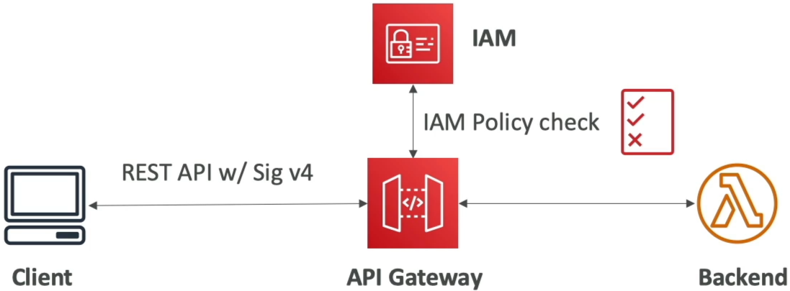
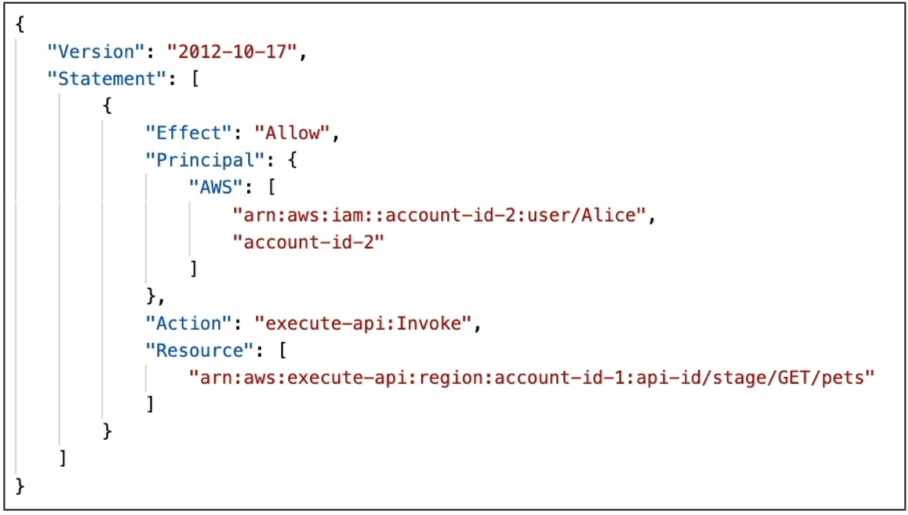
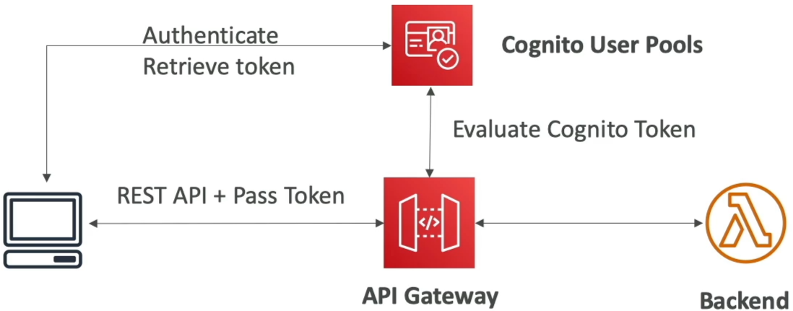
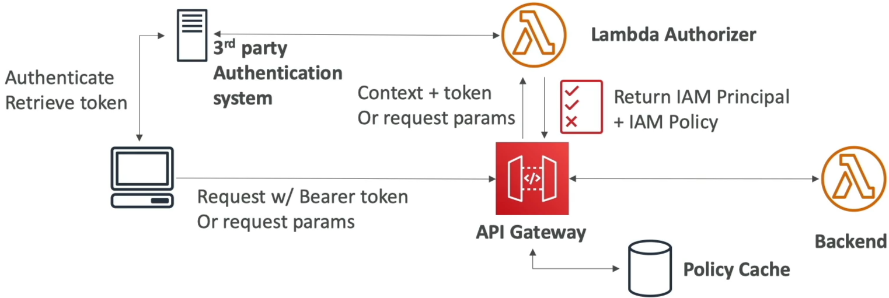

# API Gateway Authentication and Authorization

Unpacking the **Authentication & Authorization** plane of API Gateway is where you secure the absolute perimeter of your cloud ecosystem, bro! 🔒🚀

When you expose endpoints to the wild, you need an ironclad gatekeeper. AWS gives you three distinct architectural levers to validate who a user is (Authentication) and what they are allowed to touch (Authorization).

---

## Key Takeaways

To secure your resources, you choose the identity provider that matches your consumer profile, chief:

```text
🔐 STACK ACCESS PERIMETER PLANES:
   ├── 1. AWS_IAM ──────────► Best for internal AWS workloads, trusted cross-account architectures, and SigV4 workflows.
   ├── 2. Cognito User Pools ──► Purpose-built for consumer-facing apps (mobile/web logins via Google, Facebook, or native pools).
   └── 3. Lambda Authorizers ──► Ultimate fallback custom logic wrapper (custom JWTs, OAuth2 servers like Auth0/Okta).
```

---

### 🛡️ Pillar 1: `AWS_IAM` Authorization (The Native Infrastructure Track)

If your API is being hit by internal corporate resources—like an application fleet running on EC2 instances, automated ECS containers, or separate Lambda functions—you use native `AWS_IAM` security, bro.

#### 🔄 The Signature Validation Flow:

1. The client constructs an HTTP request and signs the entire packet using their temporary AWS access keys via the **Signature Version 4 (SigV4)** cryptographic algorithm.
2. The packet hits API Gateway. The gateway decrypts the SigV4 payload signature and passes the identity context over to the internal IAM evaluation engine.
3. IAM cross-checks the caller's explicit identity policy statements. If it allows `execute-api:Invoke`, traffic moves down to the backend.



#### 🎛️ Combining with Resource Policies (Cross-Account & Network Walls)

To scale this across complex corporate networks, you couple IAM with an **API Gateway Resource Policy**. This JSON policy attaches directly to the gateway itself, letting you:

- Whitelist or blacklist traffic originating from specific **Public IP CIDR ranges**.
- Create a strict boundary allowing access _only_ via a specific private **VPC Gateway Endpoint** (Private API isolation).
- Execute **Cross-Account access handshakes**, allowing an IAM Role sitting in Account B to call a secure API endpoint hosted in Account A without opening it to the public web!



---

### 👥 Pillar 2: Amazon Cognito User Pools (The Managed User Directory)

If you're building a massive consumer app where regular users sign up, log in, and track metrics, you use **Amazon Cognito User Pools**. It manages the entire user lifecycle, password rotation protocols, and multi-factor authentication (MFA) out of the box with **zero custom code**!

#### 🔄 The Managed Token Flow:

1. Your client app prompts the user for credentials. They authenticate straight with the Cognito User Pool endpoint.
2. Cognito returns an identity signature payload consisting of standard JSON Web Tokens (**JWT ID or Access Tokens**).
3. The client captures that token and embeds it straight into the standard HTTP authorization header when hitting your API Gateway: `Authorization: Bearer <Cognito_JWT_Token>`.
4. **The Native Advantage:** API Gateway intercepts the request and verifies the token's cryptographic signatures _directly_ against the User Pool behind the scenes. If the token is valid, traffic flows down to Lambda. You don't have to write or pay for any middleware processing code to read the signature.



---

### 🧠 Pillar 3: Lambda Authorizers (The Custom Code Override)

When your enterprise architecture relies on a third-party identity platform (like **Auth0, Okta, custom OAuth2 servers**, or an old legacy database containing user credentials), Cognito can't parse it natively. You need absolute flexibility, so you deploy a **Lambda Authorizer**.

#### 🔄 The Event-Driven Policy Flow:

1. The client logs into your custom authentication system, retrieves a proprietary bearer token or custom header payload, and ships it down to API Gateway.
2. API Gateway catches the string and maps it into an event object, invoking your custom **Lambda Authorizer function**.
3. **The Custom Verification Logic:** Inside this authorizer function, _you_ write the manual validation code. Your code validates the JWT claims or runs a rapid lookup check against an internal data store.
4. **The Mandatory Output:** If the token checks out, your authorizer function **MUST dynamically construct and return a formal AWS IAM Policy document string** back to API Gateway, along with a principal user context ID:

```json
{
  "principalId": "user_identity_999",
  "policyDocument": {
    "Version": "2012-10-17",
    "Statement": [
      {
        "Action": "execute-api:Invoke",
        "Effect": "Allow",
        "Resource": "arn:aws:execute-api:us-east-1:123456789012:api-id/stage/GET/houses"
      }
    ]
  }
}
```

5. **The Policy Cache Shield 🕒:** To prevent your system from suffering severe latency drops and massive runtime cost explosions from invoking this authorizer function on _every single incoming request_, API Gateway lets you configure a **Policy Cache TTL** (up to 1 hour). The gateway caches that generated IAM policy against the incoming token, letting subsequent requests pass through instantly at zero code cost!



---

## Exam Tips

- **The Cross-Account Access Blueprint:** If an exam prompt introduces an architecture where a business intelligence tool hosted in AWS Account B needs to pull data from a secure REST API Gateway hosted in AWS Account A, look straight for the combination: **Set the Method Request Authorization parameter to `AWS_IAM` and attach an API Gateway Resource Policy whitelisting the explicit IAM Role ARN from Account B!**
- **The No-Code Consumer Scale Strategy:** If a scenario mandates building a customer-facing portal that requires simple user registration, social login federation (like Google/Facebook), and strict endpoint protection with minimal backend code overhead—**choose the native Amazon Cognito User Pools Authorizer option**
- **The Third-Party JWT Verification Bottleneck:** If a question describes a complex custom OAuth2 ecosystem where tokens contain custom scopes and attributes that must be processed manually before granting execution access—the answer is explicitly to **build a Lambda Authorizer that parses the bearer headers and returns a dynamic IAM Allow/Deny statement**
