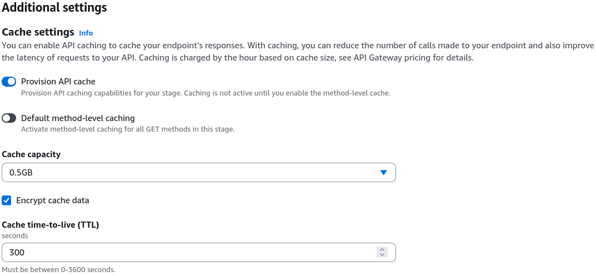
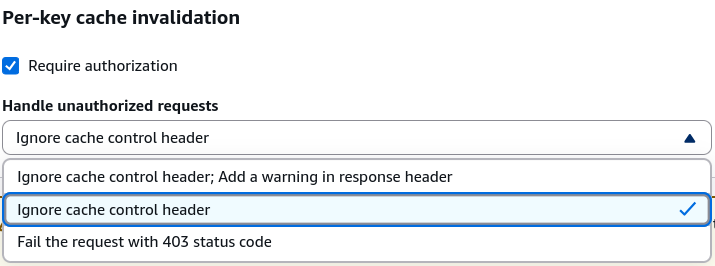
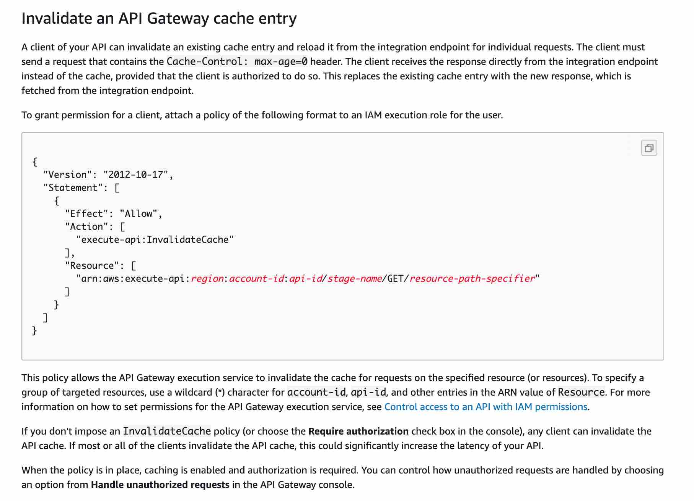

# API Gateway Caching

Turning on **API Gateway Response Caching** is the absolute ultimate way to smash down high latencies and slash your serverless compute bills to zero, bro! 👑⚡

When a massive wave of users hits your public endpoint requesting identical data (like a global product catalog or a sports leaderboard), you do _not_ want to invoke your backend AWS Lambda function or hammer your DynamoDB tables millions of times per minute. Instead, API Gateway intercepts those duplicate reads directly at the edge, serving up the frozen response document in single-digit milliseconds without spending a single penny on background execution.

---

## Key Takeaways

### 🏗️ The Cache Architecture Blueprint

Caching is applied globally at the **Stage Level**, meaning every route inside that stage inherits the setup. However, you carry full granular power to explicitly override or deactivate caching on an individual method path if needed!

- **The Cache Envelope Dimension 📊:** Provisioned cache sizes sit on a scale starting from a lean **0.5 GB all the way up to a massive 237 GB cluster**.
- **The TTL Lifespan Matrix ⏱️:**
  - **Default Time-To-Live:** 300 seconds (5 minutes).
  - **Minimum Limit:** 0 seconds (effectively turns off caching for that route).
  - **Maximum Limit:** 3,600 seconds (1 full hour).
- **Data Protection Flag:** You can natively check a box to **encrypt the cached data at rest**, locking down your cached JSON parameters from compliance vulnerabilities.
  

:::warning
**THE EXPENSE WARNING:** Unlike serverless pricing which scales down to absolute zero when traffic dies, an API Gateway cache acts like provisioned infrastructure. **You are billed 24/7 based on your allocated GB capacity size**, regardless of whether anyone is using it. Turn it on strictly in production or pre-production, and keep it wiped out in your `dev` sandbox!
:::

---

### 🧹 Cache Invalidation & The Security Perimeter

When your backend data updates (e.g., a product description changes), your cache is now holding stale data. You can either wipe the entire global cache from the AWS Console UI or let your client applications trigger a targeted execution refresh by passing a native HTTP header down the wire:

$$\text{Required Client Header Location} \longrightarrow \mathbf{\text{Cache-Control: max-age=0}}$$

#### 🚨 The Cache Invalidation Vulnerability Trap

By default, if you don't secure your cache settings, **any random user over the public internet can append `Cache-Control: max-age=0` to their request**, bypass your cache completely, force a fresh invocation on your backend Lambda, and drive up your serverless bills—effectively launching an expensive **Denial of Service (DoS) attack** on your compute resources!

To lock this door down, you execute two core security configurations:

1. **Configure Invalidation Strategy in Console:** Switch your stage cache invalidation settings to **Require Authorization**. You can choose to **Fail with a 403 Forbidden** error or silently **Ignore the cache-control header** for unauthorized clients.
2. **Attach an Explicit IAM Policy:** To grant a trusted client app or internal server the right to clear your cache shards, you must explicitly whitelist them with the `execute-api:InvalidateCache` action policy block:

```json
{
  "Version": "2012-10-17",
  "Statement": [
    {
      "Effect": "Allow",
      "Action": "execute-api:InvalidateCache",
      "Resource": "arn:aws:execute-api:us-east-1:123456789012:your-api-id/prod/GET/mapping"
    }
  ]
}
```



---

## Exam Tips

- **The Runaway Lambda Execution Invoice:** If an exam scenario presents a high-traffic system where Lambda functions are processing massive numbers of redundant requests for static, identical database reads, resulting in crazy high bills—look straight for **Enabling API Gateway Caching on the Production Stage and tuning the TTL to match the data's update cycle**
- **The Unauthorized Cache-Busting Attack:** If a question describes a production API Gateway cache cluster that keeps getting bypassed by untrusted clients spamming `Cache-Control: max-age=0` headers, leading to backend performance drops—the correct answer is to **Require Authorization in the API Gateway Stage details panel and restrict cache invalidation permissions using an IAM policy containing the `execute-api:InvalidateCache` action.**

### Practice Test

**Question 1**: A financial services company with over 10,000 employees has hired you as the new Senior Developer. Initially caching was enabled to reduce the number of calls made to all API endpoints and improve the latency of requests to the company’s API Gateway.

For testing purposes, you would like to invalidate caching for the API clients to get the most recent responses. Which of the following should you do?

- [ ] Use the Request parameter: `?bypass_cache=1`
- [ ] Using the Header `Bypass-Cache=1`
- [ ] Using the request parameter `?cache-control-max-age=0`
- [ ] Using the Header `Cache-Control: max-age=0`

<details>
<summary>Correct Answer</summary>

- [ ] Use the Request parameter: `?bypass_cache=1`
  - **Explanation**: Method parameters take query string but this is not one of them.
- [ ] Using the Header `Bypass-Cache=1`
  - **Explanation**: This is a made-up option.
- [ ] Using the request parameter `?cache-control-max-age=0`
  - **Explanation**: To invalidate cache it requires a header and not a request parameter.
- [x] Using the Header `Cache-Control: max-age=0`
  - **Explanation**: A client of your API can invalidate an existing cache entry and reload it from the integration endpoint for individual requests. The client must send a request that contains the Cache-Control: max-age=0 header. The client receives the response directly from the integration endpoint instead of the cache, provided that the client is authorized to do so. This replaces the existing cache entry with the new response, which is fetched from the integration endpoint.  
    

</details>
