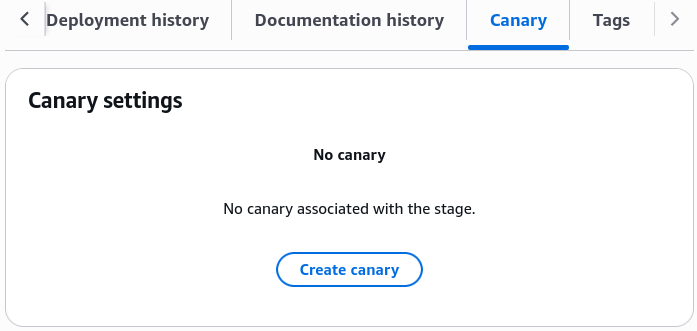
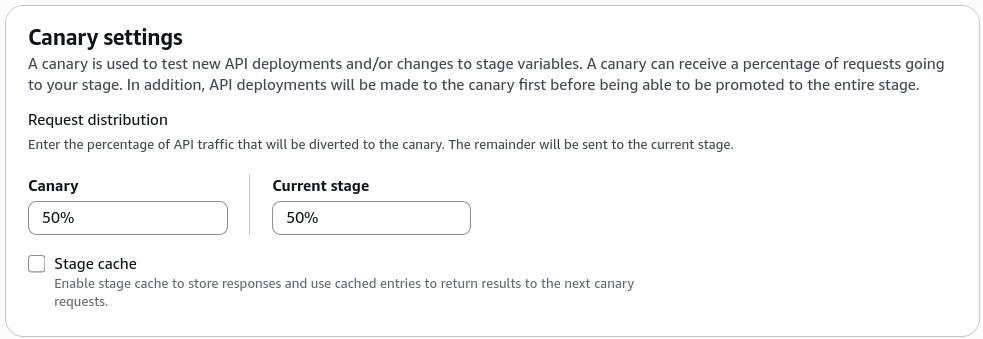
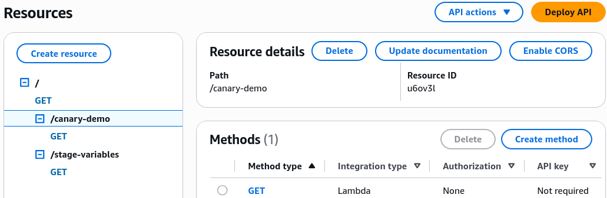
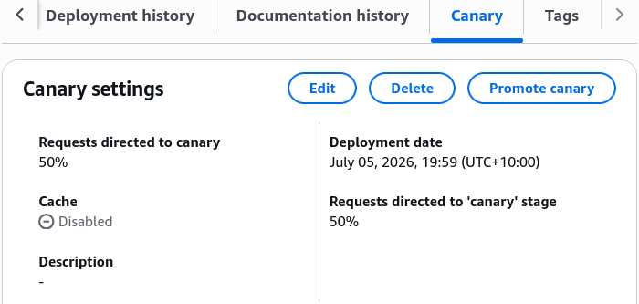
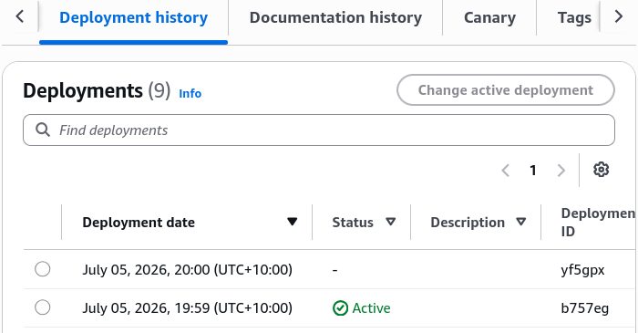
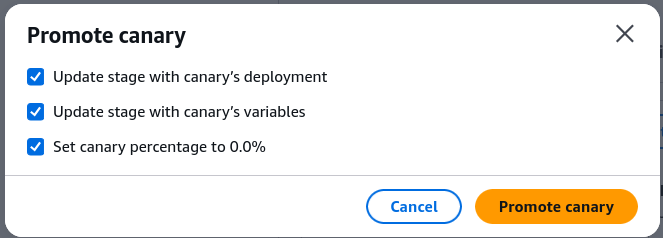
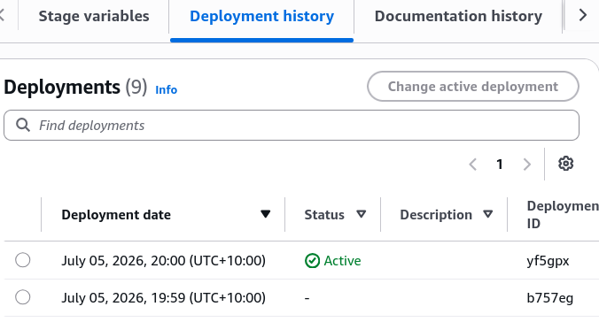

# API Gateway Canary Deployment Hands On

Witnessing that live traffic split toggle between `v1` and `v2` straight inside your web browser is wild, bro! 🎰💥

Stephane’s hands-on lab blows the doors off standard, rigid release strategies. By pinning explicit Lambda versions directly onto your API paths (`:1` and `:2`) and manipulating the Canary workspace, you can safely launch an absolute game-changing update to production with zero user friction.

---

## 🛠️ Step-by-Step API Gateway Canary Release Hands On

### 1. Establishing the Base Deployment Runway

- **Step 1: Create the Demo Path**
  - In your API Gateway dashboard, create a brand-new resource path called `/canary-demo` ──► add a `GET` method.
  - **Target Integration Mapping:** Toggle Lambda Proxy mode to `Enabled`, paste your target function ARN, and append the explicit version suffix, chief:

  $$\text{Source Route Target} \longrightarrow \text{arn:aws:lambda:ap-southeast-2:123456789012:function:my-func:}\mathbf{1}$$
  - Click **Deploy API** ──► create a fresh environment stage explicitly named **`canary`**, bro.
  - _The Baseline State:_ If you hit the live URL (`/canary/canary-demo`), the screen returns a steady `"Hello from Lambda v1"`.

---

### 2. Spawning the Canary Split Environment

- **Step 2: Activate the Canary Dial**
  - Inside your active `canary` stage dashboard ──► navigate to the **Canary** sub-tab page ──► click **Create Canary**, chief.
    
  - **The Percentage Lever:** For this live lab scenario, we crank it up to a clean **50% / 50% split** so we don't have to hit refresh a thousand times to see it work, bro. _(Production Standard Reminder: In a real-world enterprise rollout, you'd start this at a safe 5% or 10% ceiling!)_
    

- **Step 3: Commit the New Target Code (The Pivot Shift)**
  - Go right back to your `/canary-demo` method workspace ──► hit **Integration Request** ──► click **Edit**.
    
  - Change the trailing version number string block to target the fresh code layer:

  $$\text{Updated Route Target} \longrightarrow \text{arn:aws:lambda:ap-southeast-2:123456789012:function:my-func:}\mathbf{2}$$

- **Step 4: Fire the Canary Snapshot Flight**
  - Hit **Deploy API** yet again, selecting your active `canary` stage. Because a Canary configuration is active on this stage, **API Gateway automatically routes this fresh deployment snapshot straight into the Canary channel, leaving the production baseline completely untouched**
    
    

---

## 🔍 3. The Live Traffic Flip Verification

The exact second that second deployment finishes baking into the routing matrix, your public URL splits incoming traffic evenly across the network path:

```text
🔄 REFRESH 1 ──► Hitting URL ──► Evaluates Stage Config ──► Returns "Hello from Lambda v1"!
🔄 REFRESH 2 ──► Hitting URL ──► Evaluates Canary Config ──► Returns "Hello from Lambda v2"!
🔄 REFRESH 3 ──► Hitting URL ──► Evaluates Canary Config ──► Returns "Hello from Lambda v2"!
🔄 REFRESH 4 ──► Hitting URL ──► Evaluates Stage Config ──► Returns "Hello from Lambda v1"!
```

---

## 🚀 4. Promoting the Configuration to 100% Stability

Once you watch your CloudWatch dashboard panels, see that your `5XX` error metrics are completely flat, and confirm that `v2` is handling the traffic beautifully, you close out the release loop, bro:

1. Head back into the **Canary** tab layout under your stage configurations.
2. Click **Promote Canary**, chief.
3. _The Underlying Shift:_ API Gateway takes the configuration artifact snapshot currently sitting in the canary channel, stamps it directly over the baseline stage profile, and automatically tears down the canary split engine.
   

From that exact second onward, every single user hitting your live endpoint gets directed straight to **`v2`** with absolute consistency, bro!


---

## Exam Tips

- **The Staged Promotion Pattern:** This is a key operational concept for the exam blueprint. Remember the lifecycle order: **Modify your source method integration settings -> Deploy the API directly to your active Stage containing the Canary -> Run your live telemetry testing loop -> Promote the Canary to push it to 100% visibility.**
- **The Instant Kill-Switch Mitigation:** If a question describes a rollout scenario where your fresh canary deployment immediately begins throwing database execution drops or broken JSON syntax blocks back to your users, and demands the fastest way to stabilize production without running a code rollback—**the correct answer is to click "Delete Canary" inside the stage dashboard settings, bro!** This immediately drops the traffic split channel and safely locks 100% of your production traffic back onto the trusted baseline configuration in a split second.
