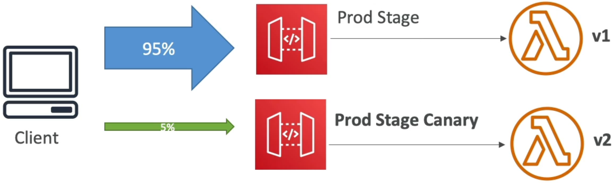

# API Gateway Canary Deployments

Setting up **API Gateway Canary Deployments** is the ultimate way to push rolling updates to your production stack with zero stress and absolute safety, bro! 👑🛡️

In a high-velocity production environment, you never want to execute a blind "big bang" release where 100% of your real-world traffic instantly shifts onto brand-new, unvetted API routing configurations or backend code. If a hidden bug slips through, you risk taking down your entire active user base in a single second.

With Canary deployments, you safely bleed a tiny, controlled fraction of live customer traffic (like 5%) onto your fresh API adjustments. You isolate their logs, watch the error metrics like a hawk, and only promote the changes to the rest of the fleet when you are 100% confident it's bulletproof.

---

## Key Takeaways

### 🏗️ The Canary Architecture Layout

When you activate a Canary configuration directly on a target deployment stage (like `prod`), API Gateway splits that single environment stage into two distinct, parallel execution tracks under the hood:

#### 🔄 The Progressive Traffic Split:

1. **The Production Baseline Track:** The vast majority of your active traffic (e.g., 95%) keeps routing cleanly to your pre-existing, trusted API Gateway configuration.
2. **The Canary Test Track:** The remaining thin slice of live traffic (e.g., 5%) automatically detours onto your newly updated API settings, routing to your updated backend handlers or modified stage variable hooks.  
   

---

### 📊 Deep Metric & Configuration Isolation

The biggest engineering win of using native API Gateway Canaries is how cleanly AWS isolates the blast radius:

- **Separated CloudWatch Metrics 📊:** API Gateway automatically bifurcates your operational telemetry logs. Canary requests generate their own unique metric dimensions inside CloudWatch. This means you can spot a sudden spike in `5XX` error codes or execution latencies on the new code version instantly, without polluting or drowning out your baseline production health curves!
- **Stage Variable Overrides:** If your stage uses a variable like `${stageVariables.lambdaAlias}` pointing to `PROD`, you can explicitly tell the Canary track to override that exact key to point to a test alias or a specific pre-release version instead. This acts exactly like an elegant, zero-downtime **Blue/Green deployment** wrapper!

---

### 🚀 The Canary Release Lifecycle Flow

To successfully execute a canary rotation out in the field, your deployment pipeline follows this exact three-step dance:

```text
🚀 THE THREE-STEP CANARY RELEASE DANCE:
   ├── Step 1: Create Canary ──► Inject the fresh API changes onto the stage and set the traffic dial to 5%.
   ├── Step 2: Monitor Fields ──► Let live traffic hit it. Inspect isolated logs and verify stability.
   └── Step 3: Promote Canary ──► Hit "Promote". The Canary layout wipes out the old config, taking 100% of traffic!
```

If anything catches fire during Step 2, you don't need to panic or run complex code rollbacks. You simply click **Delete Canary**, and the traffic dial immediately snaps back to 100% stable baseline production layout in a fraction of a second, completely shielding your users from the blast radius!

---

## Exam Tips

- **The Low Blast-Radius Deployment Scenario:** If an exam prompt presents a mission-critical financial or retail application where the operations team wants to test out a brand-new API version using a tiny subset of active real-world production users, and mandates that tracking telemetry logs for the new version must be completely isolated from existing production curves—**look straight for API Gateway Canary Deployments on the production stage**
- **The Quick-Kill Rollback Strategy:** If a scenario highlights a rollout that goes sideways (e.g., the canary version starts throwing errors) and demands the fastest way to stabilize the system with zero user impact—the answer is to **Delete the Canary configuration directly from the stage settings page.** This instantly cuts off the traffic split and restores safety without a deployment loop.
