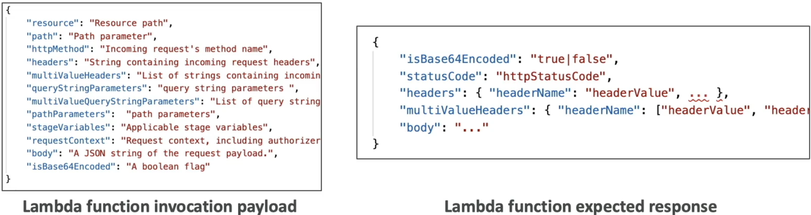
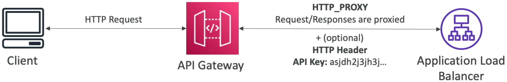
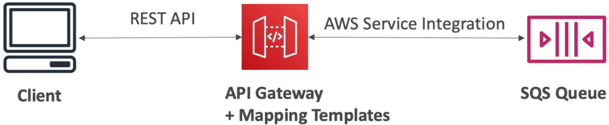
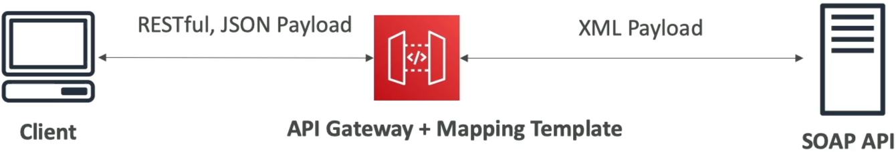
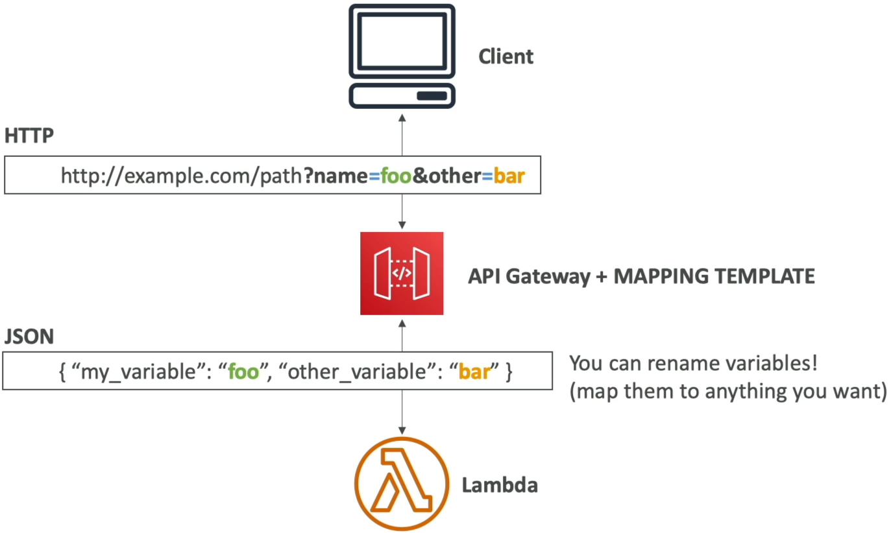

# API Gateway Integration Types & Mappings

Dropping the **Lambda Proxy Integration** shield and taking full manual control over your request/response pipelines is how you turn API Gateway into a high-powered, data-transforming middleware layer!

When we use **Proxy Integration** (the default mode we ran in the previous labs), API Gateway acts like a blind digital postman. It takes the raw HTTP packet from the user browser and dumps it directly onto the backend runtime untouched.

But when you flip over to **Non-Proxy Integration (Custom Integration)**, you unlock the ability to morph, sanitize, filter, and translate the data payloads traveling across your wire using **Mapping Templates**, bro!

---

## Key Takeaways

### 🛠️ The Core Integration Types Deep-Dive

API Gateway gives you five distinct execution lanes to back your resource endpoints. Here is exactly how they stack up for the exam:

- **`MOCK` (The Frontend Sandboxing Track) 🧪:** Instantly halts the transaction inside API Gateway and reflects a hardcoded JSON/HTML payload straight back to the client browser **without hitting any backend compute layer** This is an absolute lifesaver for rapid scaffolding, decoupling frontend teams while the backend engineers are still spinning up code, or handling basic pre-flight `OPTIONS` requests for CORS.
- **`AWS Proxy` / `HTTP Proxy` (The Blind Pipeline) 🪟:** Pass-through lanes. Network headers, query strings, and payloads drop straight into your code runtime or Application Load Balancer with zero translation overhead. You cannot attached templates here.
  
  
- **`AWS` / `HTTP` (The Custom Data-Morphing Engine) ⚙️:** The ultimate heavy-duty custom lane. You explicitly configure an **Integration Request** panel (to modify what hits the backend) and an **Integration Response** panel (to sanitize what gets sent back to the user). This is the _only_ lane where mapping templates live, bro!
  

---

### 🧮 The Power of Mapping Templates & VTL

To reshape your payloads inside a Custom Integration, AWS uses **VTL (Velocity Template Language)**. It’s a specialized scripting syntax that runs looping logic, checks variables, and builds structured outputs server-side at the edge.

#### 🎯 Key Engineering Transformations:

1. **Variable Renaming & Structural Shifts:** If a frontend team sends query strings like `?name=foo&other=bar`, your VTL code can capture those variables and wrap them into a neat, nested JSON object structure before hitting Lambda:

```vtl title="VTL Input Mapping Template Sample"
{
  "my_custom_foo_var": "$input.params('name')",
  "nested_data": {
    "secondary_field": "$input.params('other')"
  }
}

```

2. **Payload Sanitization (The Security Strip):** When your database returns a comprehensive user record object containing a hashed password, an internal audit ID, and an email address, you don't want to expose that to the open web, bro. You can write an **Integration Response Mapping Template** to extract _strictly_ the public username string, shielding your backend internal schemas completely!

---

### 🏛️ High-Priority Enterprise Architecture Use Cases

The DVA-C02 blueprint expects you to recognize exactly when to pull the Non-Proxy Custom Integration lever over standard Lambda Proxy mode, chief:

#### 📥 Case A: The SOAP to REST Translation Bridge (XML ◄──► JSON)

- **The Problem:** Your enterprise enterprise client apps only talk modern JSON, but your company relies on a legacy, on-premises backend web service running a **SOAP API** that strictly processes heavy XML envelopes.
- **The Serverless Solution:** You mount an API Gateway endpoint using an `HTTP` custom integration. The gateway catches the clean JSON object from the web client, fires a VTL template to wrap those attributes inside a formal XML SOAP structure, and shoots the XML back to the server. When the SOAP API returns an XML file, a secondary response template parses the nodes back into a beautiful JSON string for the user!
  

#### 🔏 Case B: Security Header Injection

- **The Play:** You route traffic to a background internal Application Load Balancer, but want to make sure no outside bad actor can bypass your API Gateway perimeter and hit the ALB directly.
- **The Custom Integration Fix:** You configure an `HTTP Proxy` pass-through, but inject a static, hidden security key wrapper (e.g., `X-Custom-Secret-Header`) straight into the **Integration Request** parameters. The client browser has no idea this header exists, but your backend server intercepts it to verify the packet strictly originated from your trusted API Gateway edge!

#### Case C: Query String parameters

- **The Play:** Your frontend team is sending query strings like `?name=foo&other=bar`, but your backend service only accepts a single JSON object with nested fields.
- **The Custom Integration Fix:** You configure an `HTTP` custom integration and write a VTL mapping template to capture the query string parameters and wrap them into a single JSON object before sending it to the backend service.
  

---

## Exam Tips

- **The Enterprise XML Heritage Scenario:** If an exam prompt presents a migration task where a company needs to expose an aging corporate **SOAP/XML backend service** as a clean, public-facing serverless **REST/JSON API** without spinning up a fleet of EC2 instances to handle the protocol translation—**the absolute correct answer is to implement an API Gateway REST API configured with Non-Proxy Integration utilizing VTL Mapping Templates to handle the JSON-to-XML serialization natively at the edge**
- **The Missing Mapping Template Feature Trap ⚠️:** Watch out for tricky multi-choice answers that describe a developer trying to clean up headers or rename query fields using mapping templates, but their settings panel is completely grayed out or throwing errors. Scan the setup details! If the question states they activated **Lambda Proxy Integration**, they are locked down. **You must explicitly strip out Proxy Mode and swap the endpoint integration over to custom `AWS` or `HTTP` mode to unlock mapping templates**
