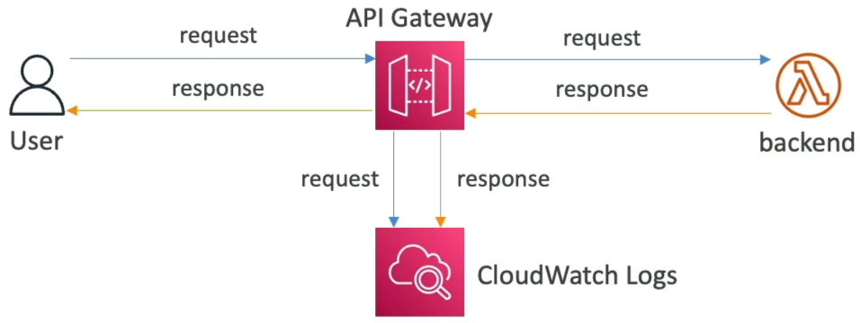
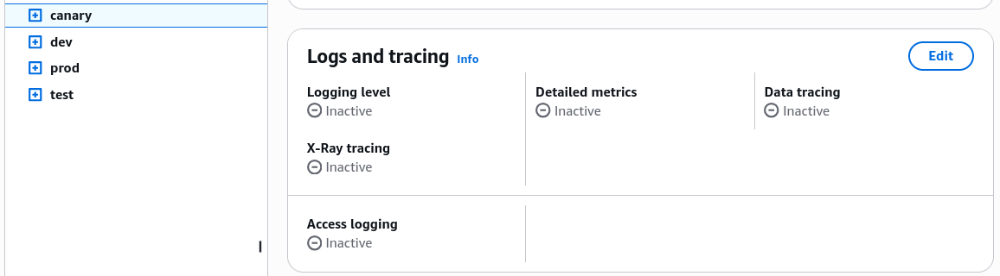
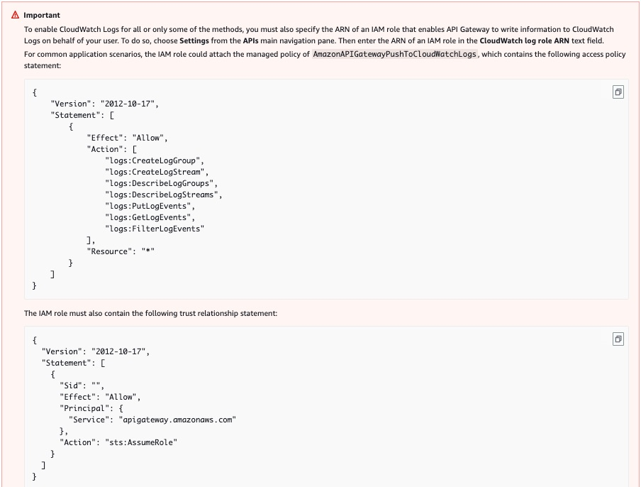

# API Gateway Monitoring, Logging and Tracing

Yo, locking down the deep telemetry metrics, execution logs, and error code classifications of **Amazon API Gateway** is the single absolute difference between blind guessing in the dark and running a fine-tuned, auto-healing distributed architecture.

When you scale up to millions of requests per second, things _will_ break at some point. Knowing whether a crash is originating from a client misconfiguration, a routing handshake failure, or a completely stalled-out backend compute server requires a clean-room master understanding of AWS observability tools.

---

## Key Takeaways

### 🔍 The Observability Triad: Logs, Traces, & Metrics

To capture absolute visibility over the perimeter traffic, you fire up three independent diagnostic channels on your active stages, chief:

#### 📜 A. CloudWatch Logs (The Textual Ledger)

- **The Execution Plane:** Tracks the raw step-by-step processing lifecycle of an incoming packet—from authorization checks to mapping template executions and backend handshakes.
- **The Log Level Selector:** You can toggle between `ERROR` or full `INFO/DEBUG`.
- **🚨 The Production Leak Warning:** While turning on full body logging is amazing for local troubleshooting, keeping it active in active high-velocity production runs is dangerous! It dumps raw request and response bodies straight into text lines, which can accidentally leak plain-text user passwords, credit card info, or session tokens into your CloudWatch logs.
  

---


Logging is enabled per **Stage**.

---

#### 🛰️ B. AWS X-Ray (The Micro-Millisecond Stop Watch)

- If a client complains that your application feels sluggish, you activate X-Ray tracing. It injects a unique correlation ID header down the wire, tracking the exact timeline across the service hops:

  $$\text{Total User Wait} \longrightarrow \text{API Gateway Latency} \longrightarrow \text{Lambda Execution} \longrightarrow \text{DynamoDB Query Time}$$

#### 📊 C. CloudWatch Metrics (The Architectural Dashboard)

You must absolutely memorize the difference between these two core network delay metrics for the exam:

```text
⏱️ THE TOTAL LATENCY SCALE OVERVIEW:
   ├── IntegrationLatency ──► strictly measures how long your backend (Lambda/ALB) takes to process data and reply to the gateway.
   └── Latency ─────────────► measures the TOTAL round-trip time from the moment the user packet hits the edge to when it returns.

```

$$\text{Latency} = \text{IntegrationLatency} + \text{Gateway Overhead (Auth + Cache Checks + VTL Mappings)}$$

- **Cache Health Diagnostics:** Track `CacheHitCount` vs. `CacheMissCount` to measure your edge optimization cache efficiency. If misses are spiking, your TTL configuration or query strings might be misconfigured!

---

### 🎛️ The Throttling Account Trap (The Noisy Neighbor Vector)

By default, AWS imposes a regional **Account-Level Soft Limit of 10,000 requests per second (RPS)** across all APIs combined inside your account.

- **The Noisy Neighbor Crash:** If you have an unprotected internal testing script that accidentally runs wild and blasts 10,000 RPS against a staging endpoint, **it will completely saturate your entire account quota, causing your high-priority production APIs to get instantly throttled too!**
- **The Solution Shield:** To defend your core business units from cross-api starvation, you must explicitly isolate your perimeters by configuring individual **Stage Limits, Method Limits, or scoped Usage Plans** to trap runaway traffic buckets!
- **The Error Signature:** Throttled clients catch a clean **`429 Too Many Requests`** client-side fault. Your client applications should catch this and immediately step down using an **Exponential Backoff and Jitter** retry routine.

---

### 🛑 The Error Code Classification Blueprint

The DVA-C02 blueprint forces you to triage distributed network bugs based on their classic HTTP status codes. Memorize this diagnostic grid, chief:

| HTTP Status Code Class           | Native Operational Meaning       | Real-World Architecture Root Cause & Remediations, bro!                                                                                                                                                                     |
| -------------------------------- | -------------------------------- | --------------------------------------------------------------------------------------------------------------------------------------------------------------------------------------------------------------------------- |
| **`400 Bad Request`** ❌         | Client-Side Error                | The client sent a malformed JSON body or missed parameters that failed your **Edge Request Validator** model checks.                                                                                                        |
| **`403 Access Denied`** 🔒       | Perimeter Security Defeat        | The client passed an invalid API key, signature handshake failed, or a custom WAF firewall blocked their source IP pool.                                                                                                    |
| **`429 Too Many Requests`** 🛑   | Rate Limit Smashed               | The client hit your Usage Plan quota bucket limit or ran face-first into an account-level RPS throttle ceiling.                                                                                                             |
| **`502 Bad Gateway`** 💥         | Backend Integration Format Crash | The backend Lambda function ran and finished cleanly, but **returned a malformed JSON dictionary format output** that failed to match the mandatory proxy structure (`statusCode`, `body`, `headers`).                      |
| **`503 Service Unavailable`** 🔌 | Infrastructure Dropout           | The background target service is completely offline, crashing, or hitting resource starvation drops.                                                                                                                        |
| **`504 Gateway Timeout`** ⏳     | The 29-Second Hard Wall          | **The background Lambda or HTTP server took over 29 seconds to respond, chief!** Even if your Lambda timeout is dialed to 15 minutes, API Gateway violently cuts the cord at 29 seconds flat, throwing a 504 to the caller. |

---

## Exam Tips

- **The Elusive 502 Proxy Disconnect Trap ⚠️:** If an exam prompt presents a backend Lambda function that tests perfectly inside the Lambda console panel (returning standard dictionary data structures) but continuously spits out an ugly **`502 Bad Gateway`** error code the exact second a live browser hits the public API Gateway URL—look straight for the proxy payload contract format. **The backend developer returned raw text or omitted the strict `"statusCode"` or stringified `"body"` keys from their handler dictionary output string, chief!**
- **The Cloud Cost Timeout Optimization:** If a scenario presents an API endpoint that handles deep, complex batch data processing loops, and clients are getting constant **`504 Gateway Timeout`** errors while your backend workers keep running in the background for minutes—look for the asynchronous serverless decoupling pattern: **Refactor the API Gateway path to immediately drop the incoming packet into an Amazon SQS queue using a direct service integration, return an instant `202 Accepted` response back to the client browser, and let Lambda drain the queue asynchronously in the background.**

### Practice Test

**Question 1**: A developer has just integrated an AWS Lambda function to an Amazon API Gateway API. The integration has led to errors that the developer is unable to troubleshoot. The developer has decided to enable CloudWatch logging at the method level for the API Gateway API.

What are the key points of consideration while configuring method-level logging for the API Gateway? (Select two)

- [ ] API Gateway API log groups or streams can only be deleted and recreated by redeploying the API
- [ ] To enable CloudWatch Logs for all or only some of the methods, you must also specify the ARN of an IAM role that enables API Gateway to write information to CloudWatch Logs on behalf of your user. The IAM role must also contain the following trust relationship statement
- [ ] AWS Security Token Service(STS) is used by API Gateway for logging data to CloudWatch logs. Hence, AWS STS has to be enabled for the Region that you're using
- [ ] You are charged for accessing method-level and stage-level CloudWatch metrics, but not for API-level metrics
- [ ] In access logging, only \$context and \$input variables are supported

<details>
<summary>Correct Answer</summary>

- [ ] API Gateway API log groups or streams can only be deleted and recreated by redeploying the API
  - **Explanation**: API Gateway API log groups or streams can be deleted directly from the CloudWatch console, though it is not recommended as it may disrupt logging until the API is redeployed.
- [x] To enable CloudWatch Logs for all or only some of the methods, you must also specify the ARN of an IAM role that enables API Gateway to write information to CloudWatch Logs on behalf of your user. The IAM role must also contain the following trust relationship statement
  - **Explanation**: To enable CloudWatch Logs for all or only some of the methods, you must also specify the ARN of an IAM role that enables API Gateway to write information to CloudWatch Logs on behalf of your user. To do so, choose `Settings` from the APIs main navigation pane. Then enter the ARN of an IAM role in the `CloudWatch log role ARN` text field. The IAM role must also contain the trust relationship statement.

    Policy of AmazonAPiGatewayCloudWatchLogsRole for IAM Role:  
     

- [x] AWS Security Token Service(STS) is used by API Gateway for logging data to CloudWatch logs. Hence, AWS STS has to be enabled for the Region that you're using
  - **Explanation**: API Gateway calls AWS STS to assume the IAM role assigned for CloudWatch logging. Therefore, AWS STS must be enabled in the AWS Region you are using to avoid authorization errors when setting or executing the logging role.
- [ ] You are charged for accessing method-level and stage-level CloudWatch metrics, but not for API-level metrics
  - **Explanation**: You are charged for accessing method-level CloudWatch metrics, but API-level and stage-level metrics are provided at no extra charge.
- [ ] In access logging, only \$context and \$input variables are supported
  - **Explanation**: In API Gateway access logging, only `$context` variables are supported. `$input` variables are not supported for access logging.

</details>
