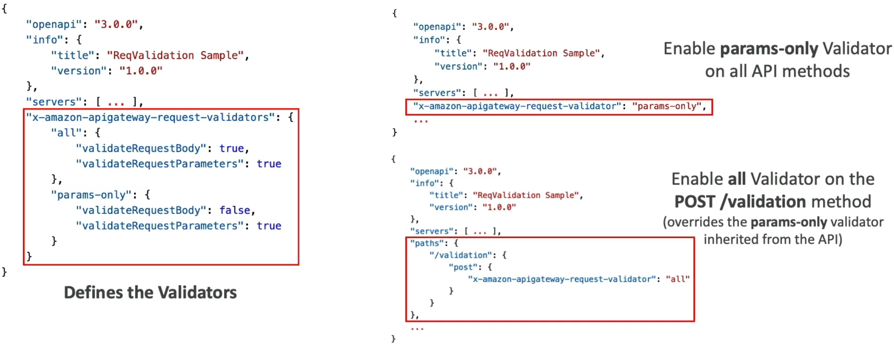

# API Gateway OpenAPI

Shifting over to **OpenAPI and Swagger Specifications** is how you treat your entire serverless API tier strictly as **Infrastructure as Code (IaC)**, bro! 📜💥

In a chaotic enterprise environment, you don't want engineers manually clicking around the AWS UI console creating paths, setting up method verbs, or typing integration links. Instead, you map your entire REST routing architecture—including your validation rules and backend Lambda connections—inside a single **YAML or JSON** file definition sheet.

---

## Key Takeaways

### 🛠️ The Bidirectional OpenAPI Lifecycle

API Gateway treats the OpenAPI standard as a native, first-class citizen, chief. This unlocks a seamless bidirectional synchronization pipeline:

- **The Ingestion Import Pass 📥:** You feed a `swagger.yaml` or `openapi.json` file directly into the API Gateway engine via the CLI, SDK, or Console. The edge engine parses the definitions and **instantly scaffolds your entire API asset footprint**—including all endpoints, resources, HTTP verbs, and data models—in seconds!
- **The Client Code Export Pass 🖨️:** You can take a live, running API Gateway setup and export it directly as a clean OpenAPI Specification file. From there, your frontend or mobile teams can drop that spec into an automation tool (like OpenAPI Generator) to instantly build **strongly typed Client SDKs** in TypeScript, Swift, or Android Java, keeping your contract schemas perfectly synced.

---

### 🎛️ AWS Extensions (`x-amazon-apigateway-*`)

Standard OpenAPI spec sheets only define basic HTTP routing logic. To configure specialized AWS-native cloud controls, you inject proprietary **AWS Extension Objects** directly into your YAML tree, chief.

These extensions let you completely automate your backend wire configurations straight from the raw text file:

- **`x-amazon-apigateway-integration` ⚙️:** Placed right under an HTTP verb path block (like `GET /users`). It explicitly instructs the gateway how to route the request—defining the integration type (`aws_proxy`, `http`, etc.), pointing to the exact backend Lambda ARN or ALB string, and declaring your timeout limits!
- **`x-amazon-apigateway-authorizer` 🔐:** Binds your perimeter security directly to the path, specifying whether to validate incoming bearer tokens via an Amazon Cognito User Pool or a custom Lambda Authorizer function.

---

### 🛡️ Request Validation (The Edge Sentry Shield)

This is an absolute milestone favorite target area on the developer certification exam.

If a client fires a malformed or garbage payload to your API (e.g., leaving a mandatory `user_email` field blank, or missing a required query parameter tracking token like `?voter_id=`), you do **not** want that garbage request routing down to your backend layers. Running a Lambda function just to catch a basic validation error still costs you compute time, execution latency, and burns RCU capacity pool headroom on your database tables.

By declaring a strict JSON Schema model inside your OpenAPI spec file, you activate a low-latency **Edge Request Validator**!

```text
🛡️ API GATEWAY EDGE REQUEST VALIDATION PIPELINE:
   ├── Incoming Client HTTP Request
   ├── API Gateway Sentry Check (Evaluates x-amazon-apigateway-request-validator)
   │     ├── ❌ Fails Validation ──► Throws immediate 400 Bad Request at the edge ($0 Lambda cost!)
   │     └── 🚀 Passes Validation ──► Routes clean payload safely down to background Lambda code
```

#### 📋 The Core Validation Levers

You control the strictness of the gatekeeper using the **`x-amazon-apigateway-request-validator`** property hook, choosing between:

1. **Parameters Only:** Ensures that specified query string strings are present in the URI map and that required request headers are populated and non-blank.
2. **Body Only:** Compares the incoming JSON payload schema directly against your defined JSON Schema model structure, verifying types and nested attributes, bro.
3. **Body and Parameters (All Validators):** Imposes full-perimeter compliance checking before a single bit of traffic maps down to your compute instances.
   

---

## Exam Tips

- **The Runaway Compute Validation Scenario:** If an exam prompt presents a scenario where a high-velocity API is running up massive Lambda bills because backend functions are constantly firing up just to parse incoming JSON payloads, catch basic user validation format errors (like missing keys), and return `400` validation failures—**look straight for the architectural optimization fix: Implement an OpenAPI specification model using the `x-amazon-apigateway-request-validator` to validate the body and parameters at the API Gateway edge, short-circuiting malformed traffic before it hits Lambda**
- **The Configuration Drift Challenge:** If a DevOps pipeline requires that API Gateway deployments are fully automated, trackable via Git repository history charts, and must prevent manual adjustment anomalies in the web console—the answer is to **define the routes inside an OpenAPI template using `x-amazon-apigateway-integration` extensions and deploy the API via infrastructure file imports**
