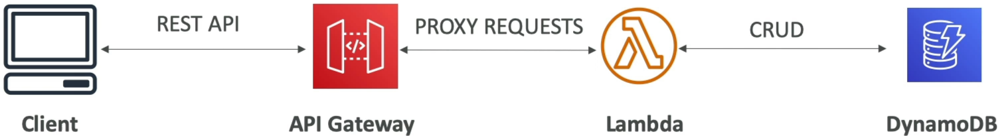
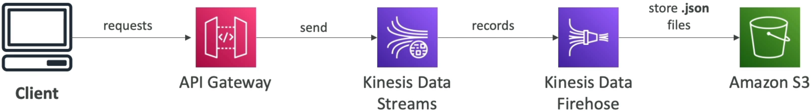

# API Gateway Overview

Shifting from an Application Load Balancer over to **Amazon API Gateway** is where your serverless applications transition from basic HTTP handlers into an enterprise-grade API suite, bro! 📈🛡️

An ALB is great if you just want to dump a basic HTTP URL in front of a Lambda function. But the moment you need real-world API infrastructure—like letting third-party companies pay for access via API Keys, throttling bad actors, versioning your code, or caching heavy responses to save compute cash—API Gateway crushes it out of the park.

---

## Key Takeaways

### 🛠️ The Three Massive Backend Integration Paths

API Gateway doesn't just pass traffic to Lambda. It acts as an abstraction router that can hook directly into three major backend styles:

#### 🟢 Path A: Lambda Functions (Serverless Holy Trinity)

- **The Blueprint:** The absolute most common serverless pattern, bro. API Gateway exposes a public REST endpoint and seamlessly maps incoming HTTP packets directly down into your backend Lambda functions.
  

#### 🔀 Path B: HTTP Endpoints (The Legacy/Hybrid Shield)

- **The Blueprint:** You can point API Gateway straight at _any_ public HTTP URL. It could be a legacy monolithic app running on an on-premises server room or an internal application load balancer backed by an EC2 server farm.
- **Why do this?** It lets you slap modern cloud features (like rate-limiting, Amazon Cognito user authentication, and response caching) right on top of your old heritage code without rewriting a single legacy line.

#### ⚡ Path C: Direct AWS Service Integration (The No-Code Speedpass)

- **The Blueprint:** You can expose _any_ AWS API directly to the public web **without putting a Lambda function in the middle to handle routing.**
- **The Kinesis / SQS Pipeline Pattern:** If thousands of IoT devices are blasting data packets down the wire, routing them through `Client ──► API Gateway ──► Lambda ──► Kinesis` burns unnecessary Lambda invocation costs and injects execution overhead. Instead, you wire up a **Direct AWS Service Integration** to pipe it straight through: `Client ──► API Gateway ──► Kinesis Data Streams ──► S3`. API Gateway handles the authentication and pushes the payload straight onto the data streaming bus natively.s
  

---

### 📊 The Endpoint Deployment Matrix

When you deploy your API, you must choose the network topology that matches where your target customers live:

| Endpoint Type         | Network & Routing Blueprint                                                                                                                                                     | Ideal Production Use Case Pattern                                                                                                                              |
| --------------------- | ------------------------------------------------------------------------------------------------------------------------------------------------------------------------------- | -------------------------------------------------------------------------------------------------------------------------------------------------------------- |
| **Edge-Optimized** 🌐 | Routes your public API endpoints globally through the **Amazon CloudFront Edge Network** automatically.                                                                         | Default Choice. Perfect for international clients spread across the world to ensure low network latency.                                                       |
| **Regional** 📍       | Bypasses CloudFront completely. Your API endpoint lives strictly inside the single AWS region where it was created.                                                             | Used when your customers live in the exact same geographic region. Plus, it lets you front the API with your own custom, finely tuned CloudFront distribution! |
| **Private** 🔒        | The API is completely invisible to the public internet wire. It can _only_ be accessed from within your private **Amazon VPC** using Interface VPC Endpoints (AWS PrivateLink). | Strict internal corporate backends, microservice-to-microservice internal routing, and compliance isolation.                                                   |

---

### 🔐 The Front-Door Security Triage

API Gateway acts as the absolute security perimeter for your stack It handles both **Authentication** (verifying who the user is) and **Authorization** (verifying what they are allowed to do) using three primary weapons:

```text
🔐 API GATEWAY PERIMETER SECURITY PLANE:
   ├── 1. AWS IAM Roles ──► Perfect for internal workloads (e.g., an EC2 instance using SigV4 signatures to hit the API securely).
   ├── 2. Amazon Cognito User Pools ──► Purpose-built for consumer apps (web/mobile users authenticate via Google/Facebook).
   ├── 3. Lambda Authorizers (Custom) ──► Custom token logic (validating proprietary OAuth headers or external databases via code).
```

### 🏷️ Custom Domains and the ACM US-East-1 Trap

If your business team demands a clean brand URL (like `api.mycompany.com`) instead of the default ugly AWS string, you bind a custom domain using **AWS Certificate Manager (ACM)** for SSL certificates.

- ⚠️ **THE EXAM TRAP:** If your API Gateway is deployed as an **Edge-Optimized** endpoint, your ACM SSL certificate **MUST be generated inside the `us-east-1` (N. Virginia) region**! This is because CloudFront handles the edge termination and natively pulls its certs from the primary US node. If your endpoint is configured as **Regional**, the cert must live in the exact same region as your API stage!

---

## Exam Tips

- **The High-Volume Ingestion Bottleneck:** If a scenario presents an architecture where a mobile app sends real-time clickstream events directly to a Lambda function which merely validates and pushes them into an SQS queue, and the system is hitting high execution costs due to Lambda scale peaks—look for the optimization fix: **Eliminate the middleman Lambda completely and implement an API Gateway Direct AWS Service Integration to drop data straight into the SQS queue or Kinesis stream.**
- **The Global Client Latency Fault:** If a global corporation notices that users in Europe are experiencing high connection latencies when pulling data from an API hosted in `us-west-2`, look for the configuration toggle: **Switch the endpoint type over to Edge-Optimized to utilize AWS's worldwide edge locations for faster TLS handshakes and packet routing.**
