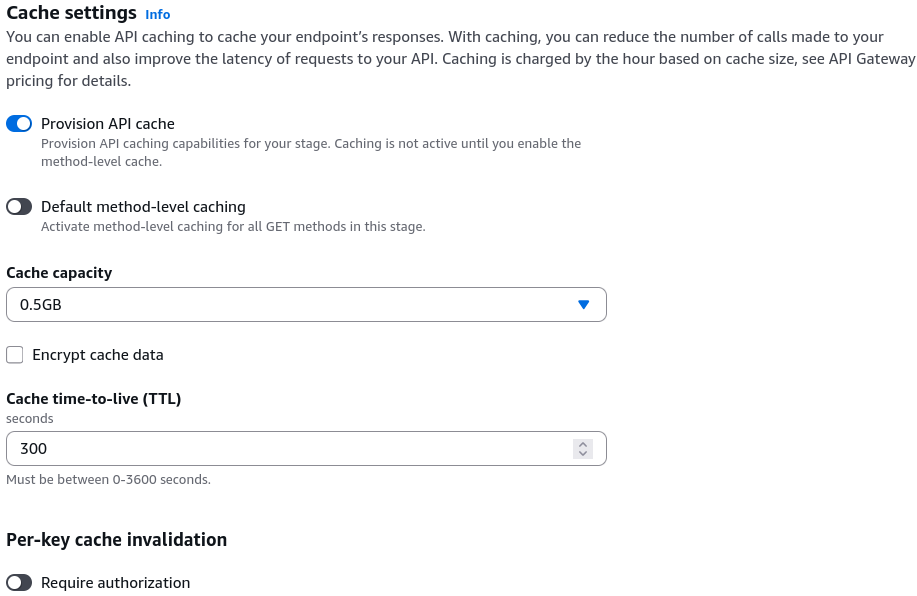
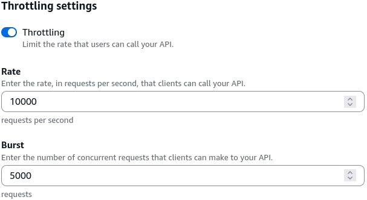
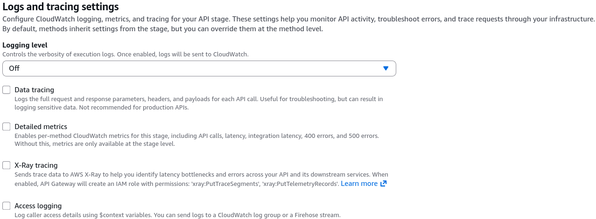

# API Gateway Stages Configurations Hands On

Clicking through that **Stage Configurations** dashboard reveals the actual enterprise knobs and switches that turn a basic development prototype into a bulletproof, hardened production endpoint! 🏎️🛡️

While resources and methods define _how_ your API data routes, the **Stage** dashboard is where you control performance telemetry, rate-limiting firewalls, and deep observability pipelines for the outside world.

---

## 📊 1. The Stage Configuration Command Center

When you click into a stage like `prod` or `dev`, you can tune four high-priority operational zones:

### ⚡ A. The Performance & Traffic Shaping Pane

- **API Response Caching 🧠:** You can flip this switch to cache your backend Lambda or HTTP responses based on specific TTL clocks. This cuts your backend invocation fees down to zero and slashes frontend latencies for identical recurring queries!  
  
- **Throttling Parameters (Rate & Burst) 🛑:** Natively controls traffic volume to defend your application layer from sudden surges or malicious denial-of-service (DDoS) loops:
  - **Rate (Steady State):** The target token-bucket baseline capacity allowed per second (e.g., 10,000 requests per second).
  - **Burst:** The absolute maximum peak buffer cap the gateway will tolerate for a microsecond split-second burst before throwing a hard `429 Too Many Requests` rate-limit block back to the caller.  
    

### 🔍 B. The Observability & Monitoring Suite

- **CloudWatch Logs Level Integration 📜:** Controls your debugging depth:
  - _Errors Only:_ Captures hard internal crashes (`5xx` errors).
  - _Errors and Info Logs:_ Logging enabled for all events.
  - _Data tracing:_ Logs the full request and response parameters, headers, and payloads for each API call. _Production Warning:_ Not recommended for production APIs, due to might log sensitive data.
    
- **Detailed Metrics:** Enable per-Method metrics, including API calls, latency, integration latency, 400/500 errors for this stage.
- **AWS X-Ray Active Tracing 🛰️:** Activating this box injects an execution tracking header down the wire. It maps a complete visual service graph showing exactly how many milliseconds an HTTP packet spends hanging out inside API Gateway versus processing down inside your Lambda functions or DynamoDB tables.

### 🔐 C. Perimeter Security & Verifications

- **Client Certificates 🏷️:** Generates a cryptographic certificate wrapper for API Gateway. When the gateway forwards traffic to your backend HTTP servers or application load balancers, the backend server inspects this cert to cryptographically verify the incoming traffic is explicitly originating from _your_ trusted API Gateway perimeter, not a public internet spoof!

---

## 🕒 2. Configuration Infrastructure Lifecycle

```text
🛠️ STAGE LIFECYCLE MANAGEMENT BOARDS:
   ├── Deployment History ──► The ledger of past states. Lets you execute safe point-and-click rollbacks!
   ├── Stage Variables ──► Key-Value maps ($stageVariables.lambdaAlias) to route environments dynamically.
   └── Canary Deployments ──► Safely bleeds a small percentage of live traffic (e.g., 5%) onto a fresh API snapshot.
```

---

## Exam Tips

- **The Runaway Integration Cost Rescue:** If an exam prompt presents a scenario where a massive backend microservice stack is hitting crazy high AWS bills and experiencing database connection spikes because thousands of clients keep requesting identical static profile datasets over and over—look for the stage remediation: **Enable API Response Caching directly on the active Production Stage settings block to intercept and serve identical reads at the edge.**
- **The Invisible Blind Spot Debugging Scenario:** If a development team launches a new feature and users start complaining about intermittent timeout errors, but the Lambda logs are completely clean and show zero invocations—the bottleneck is sitting at the front perimeter. **Go straight into the Stage settings, turn on CloudWatch Execution Logs at the INFO level, and activate AWS X-Ray Tracing to track down exactly where the HTTP requests are stalling out before hitting your code.**
