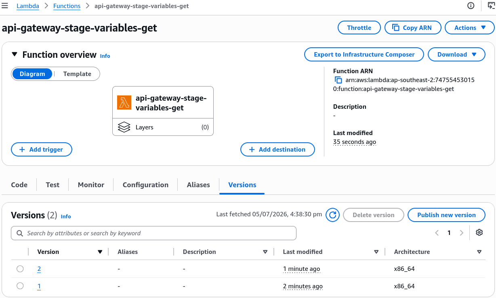
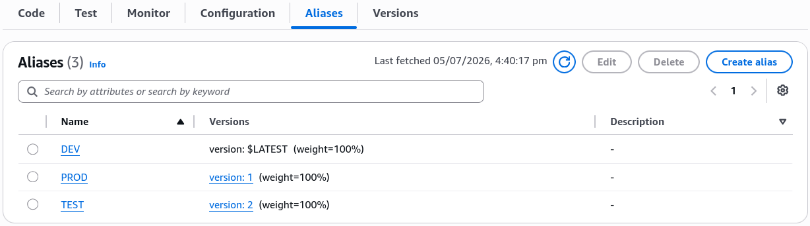
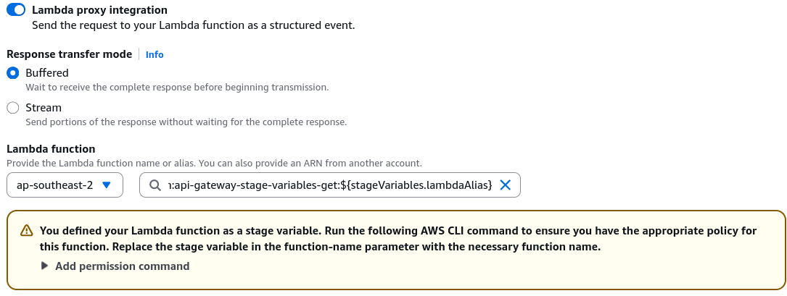
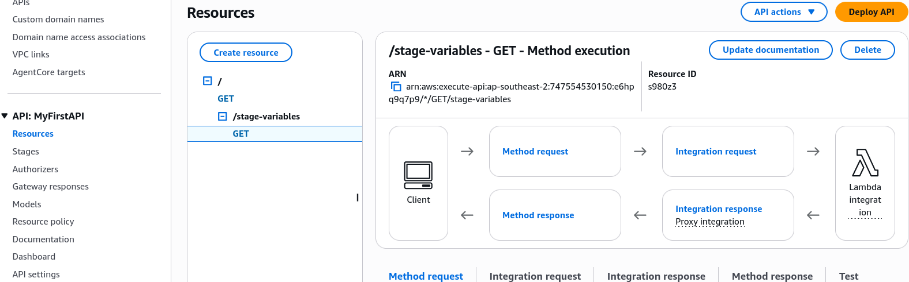
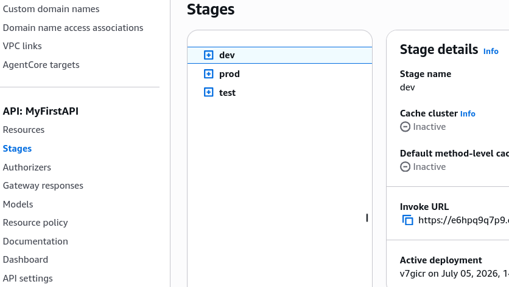
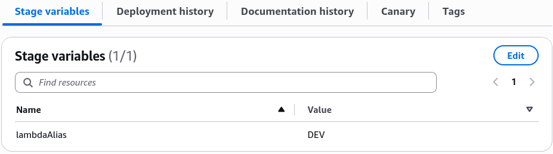
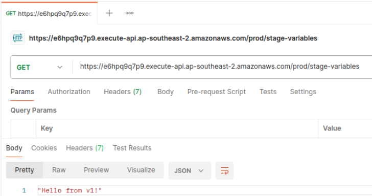

# API Gateway Stages and Deployment Hands On

Watching those real-time routing swaps execute flawlessly across separate URLs without changing a single block of base API infrastructure code is peak cloud-native engineering, bro! 👑🔀

Stephane’s lab perfectly highlights the absolute production standard for deployment orchestration. By injecting a dynamic **`${stageVariables.lambdaAlias}`** token directly onto the backend integration ARN string, you completely decouple your code delivery lifecycle from your API Gateway management plane.

---

## 🛠️ Step-by-Step Stage Variable & Alias Integration Hands On

### 1. Generating the Immutable Backend Layers

- **Step 1: Code State Mutations**
  - Author your baseline Node.js runtime handler function `api-gateway-stage-variables-get`.
  - **The Versioning Flow:** Modify the code body string to output `v1` ──► hit **Deploy** ──► under Action dropdown, select **Publish new version** to create frozen `Version 1`. Repeat this entire loop to output `v2` to lock in `Version 2`. Finally, change the body code to say `DEV` and deploy it straight to the `Latest` drafting sheet, chief.
    
- **Step 2: Establish the Alias Topology**
  - Under the Lambda function dashboard **Aliases** tab, provision three distinct gateway targets, bro:
  - Create alias **`PROD`** ──► link it strictly to immutable **`Version 1`**
  - Create alias **`TEST`** ──► link it strictly to immutable **`Version 2`**
  - Create alias **`DEV`** ──► link it directly to moving target **`Latest`**
    

---

### 2. Injecting the Dynamic Routing Token (API Gateway)

- **Step 3: Wire the Variable Suffix**
  - Create a fresh path resource called `/stage-variables` ──► add a `GET` method.
  - Target Integration ARN layout: Paste your base function ARN, but append the dynamic runtime suffix tag:

  $$\text{Integration Target} \longrightarrow \text{arn:aws:lambda:ap-southeast-2:123456789012:function:my-func:}\mathbf{\$\{stageVariables.lambdaAlias\}}$$
  

- **Step 4: Execute the Resource Policy Command (The Access Matrix) 🚨**
  - Because the API Gateway interface sees a dynamic string instead of a static function name, the console UI cannot auto-generate resource-based policy permissions for you. You have to open **AWS CloudShell** and manually run a standard `aws lambda add-permission` execution block three times down the wire to allow the gateway to hit each individual alias target:

  ```bash title="🔓 Whitelisting the PROD Alias"
  aws lambda add-permission \
    --function-name "arn:aws:lambda:ap-southeast-2:747554530150:function:api-gateway-stage-variables-get:PROD" \
    --source-arn "arn:aws:execute-api:ap-southeast-2:747554530150:e6hpq9q7p9/*/GET/stage-variables" \
    --principal apigateway.amazonaws.com \
    --statement-id 616bfcc0-0272-479f-94db-14a1a2bbc847 \
    --action lambda:InvokeFunction
  ```

  _(You duplicate this exact structural block two more times, swapping out the trailing alias string and statement ID tags for `TEST` and `DEV`.)_
  - Finally, hit the **Create method** button to lock in the new integration target.
    

---

### 3. Deploying the Distinct Environment Stages

- **Step 5: Provision Stage Context Variables**
  - Hit **Deploy API** three separate times to create three independent live runtime environments: `prod`, `test`, and `dev`.
    
  - Navigate into each individual stage dashboard ──► click the **Stage Variables** configuration tab ──► declare your key-value matching strings:
    - Inside **`prod` stage parameters**, set key `lambdaAlias = PROD`
    - Inside **`test` stage parameters**, set key `lambdaAlias = TEST`
    - Inside **`dev` stage parameters**, set key `lambdaAlias = DEV`
      

---

### 🔍 4. The Live Execution Traffic Output

Once those variables are locked in, your public endpoints map instantly to their corresponding backend code layers via your web browser or terminal curls, bro:

```text
🚀 RUNTIME STAGE PATH MAP:
   ├── https://...execute-api.../prod/stage-variables ──► Resolves to PROD Alias ──► Returns "Hello from Lambda v1", chief!
   ├── https://...execute-api.../test/stage-variables ──► Resolves to TEST Alias ──► Returns "Hello from Lambda v2"
   └── https://...execute-api.../dev/stage-variables  ──► Resolves to DEV Alias  ──► Returns "Hello from Lambda in DEV"!
```

## 

## Exam Tips

- **The Broken Resource Policy Trap:** This is a high-priority debugging scenario on the exam blueprint. If a developer sets up an API Gateway using stage variables to target multiple Lambda aliases, configures the stage variables perfectly, but gets a hard **`505 Internal Server Error`** or a `403 AccessDenied` message the exact second they hit the live URLs—look straight for the resource access layer. **The developer forgot to manually execute the `aws lambda add-permission` CLI scripts to grant API Gateway access to each individual explicit alias ARN wrapper** Whitelisting the base function name is _not_ enough; when using stage variables with aliases, each alias must carry its own explicit invoke permission on the Lambda side!
