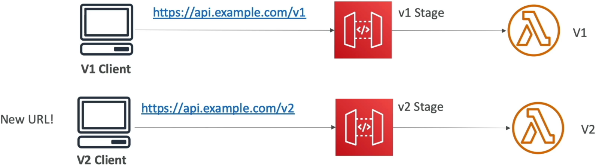
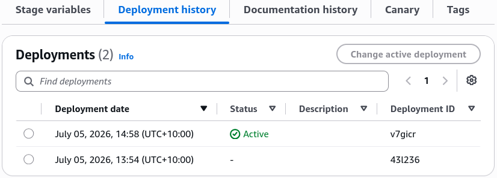
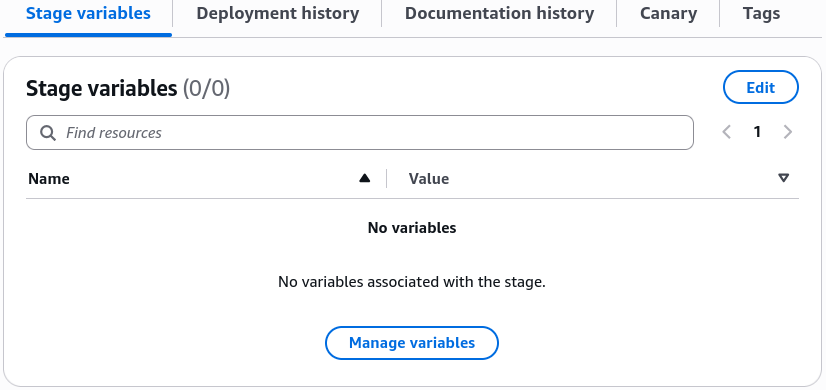
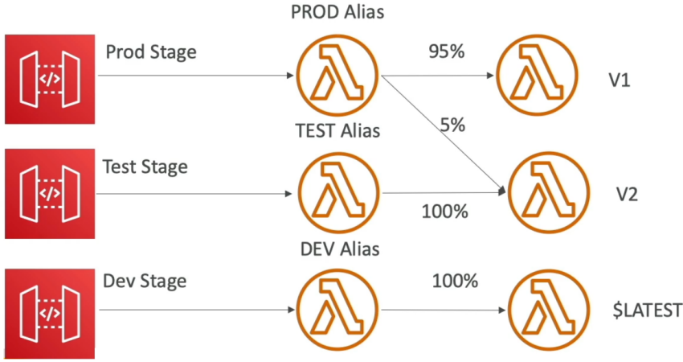

# API Gateway Stages and Deployment

Forgetting to execute a fresh infrastructure deployment after tweaking your route parameters is the absolute #1 reason developers pull their hair out wondering why their API updates aren't live. 🥋🚀

In API Gateway, your workspace configuration acts like a draft sheet. The outside world doesn't see a single change until you hit **Deploy API** and push that configuration snapshot directly into an active **Stage** (like `dev`, `test`, or `prod`).

Each stage acts as an isolated deployment environment with its own unique execution URL footprint. By leveraging **Stage Variables**, you can supercharge these environments to route traffic dynamically without ever changing your baseline resource architecture.

---

## Key Takeaways

### 🛠️ The Immutable Snapshot Architecture of Stages

When you deploy your API Gateway to a stage, AWS packages your paths, methods, and integrations into a frozen deployment ID.

- **Zero-Downtime Coexistence:** This design allows you to run a `v1` stage and a `v2` stage completely in parallel out of the exact same API Gateway instance.
  
- **Instant Rollbacks ⏱️:** Because API Gateway keeps a complete history of every deployment artifact pushed to a stage, if a buggy update leaks to production, you don't need to redeploy your code. You simply go to the stage settings, select the previous stable deployment ID from the history tree, and hit save to instantly rollback your live endpoints in milliseconds.
  

---

### 🎀 Stage Variables (Environment Variables for Your Routing Front)

**Stage Variables** are key-value string pairs that attach directly to an individual stage’s configuration profile. Instead of hardcoding static infrastructure endpoints into your API routes, you pass the dynamic variable expression token:

$$\mathbf{\$stageVariables.variableName}$$

#### 🎯 Core Production Use Cases:

1. **HTTP Backend Switching:** You can set the backend integration target of a `GET /orders` path to `http://$stageVariables.backendUrl/orders`. On your `dev` stage, the variable points to an internal staging box, while on your `prod` stage, it automatically resolves to your active production enterprise load balancer.
2. **Mapping Template Injections:** Pass custom feature flags, region identifiers, or database connection strings straight into the request context payload before it reaches your processing layers.
   

---

### 👑 The Elite Architectural Pattern: Dynamic Lambda Aliases

Hardcoding a specific, absolute Lambda function ARN right inside your API Gateway configuration is a major anti-pattern for continuous integration/continuous deployment (CI/CD) pipelines. If you do that, you have to modify your gateway settings and execute a full API deployment every time your backend code changes!

The industry-standard solution is to combine **Stage Variables** with **Lambda Aliases** to build an elegant, decoupled traffic management board.

#### 🔄 The Execution Mechanics:

- Instead of pointing your API Gateway method at a static ARN like `arn:aws:lambda:...:function:my-func`, you point it to a dynamic token string:

  $$\text{Target Integration ARN} \longrightarrow \text{arn:aws:lambda:...:function:my-func:}\mathbf{\$stageVariables.lambdaAlias}$$

- **The Stage Variable Mapping Matrix:**
  - On your **`dev` Stage**, you set the variable `lambdaAlias = "DEV"`.
  - On your **`test` Stage**, you set the variable `lambdaAlias = "TEST"`.
  - On your **`prod` Stage**, you set the variable `lambdaAlias = "PROD"`.

#### ⚡ The Operational Payoff:

Now, your API Gateway configuration is 100% frozen and static. When your development team wants to execute a **Canary Deployment** or run a Blue-Green code swap, they don't touch API Gateway at all.

They modify the **Lambda Alias configuration** on the function side, shifting the weight metrics so the `PROD` alias routes $95\%$ of incoming traffic to `Version_1` and $5\%$ to `Version_2`. Because API Gateway evaluates the alias string at runtime, the traffic splits instantly and smoothly in the field without a single API redeployment.

---

## Exam Tips

- **The Silent API Ghost Update:** If an exam prompt presents a frustrated developer who added a brand-new resource path (like `/checkout`) and verified it works in the console test tab, but keeps getting a `404 Not Found` or `Missing Authentication Token` error when curling the live URL link—look straight for the architectural root cause: **The developer forgot to execute a fresh `Deploy API` action to push the configuration snapshot into the active environment Stage.**
- **The Zero-Downtime Microservice Migration:** If a scenario mandates that an application must support an automated backend environment switch between staging and production resource fleets without altering the core API Gateway resource configurations or injecting downtime—**the absolute correct answer is to implement Stage Variables inside the API Gateway integration URI string.**
