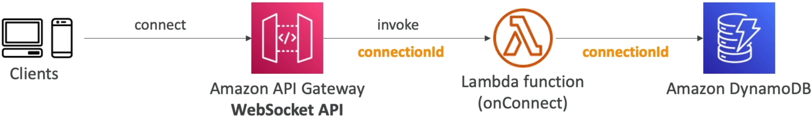
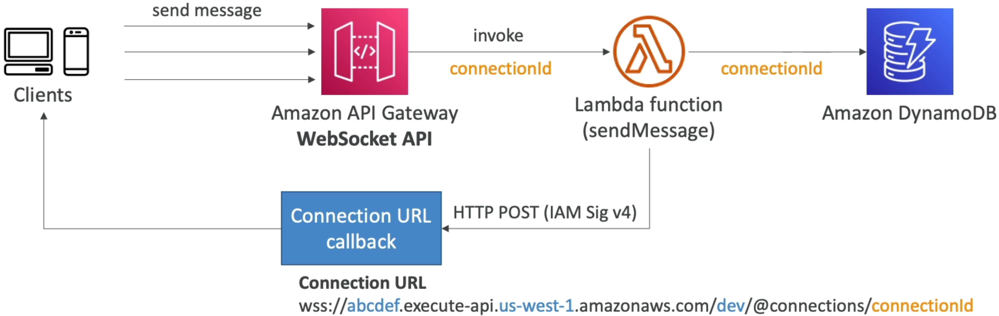
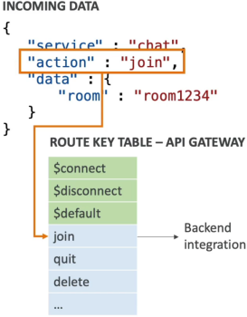

# API Gateway WebSocket API

Introducing the **API Gateway WebSocket API** pattern is how you completely abandon old-school, database-hammering HTTP long-polling loops and step straight into high-performance, real-time **Stateful Serverless Architecture**.

In a standard REST or HTTP API universe, every single exchange is stateless, client-driven, and brief—the client pings, the backend replies, and the network socket immediately vaporizes. But if you are building an interactive app—like a **live team-collaboration canvas, a real-time crypto-trading board, or a multi-room multiplayer lobby**—you need a persistent, two-way open pipeline where the server can push updates instantly down to the user _without_ waiting for a request.

---

## Key Takeaways

### 🏗️ The Anatomy of a Stateful Connection

When a browser opens a connection to a WebSocket API, the endpoint drops the standard `https://` schema prefix and initiates a protocol upgrade handshake over an encrypted web socket wire:

$$\text{Secure WebSocket Edge URI} \longrightarrow \mathbf{\text{wss://[api-id].execute-api.[region][.amazonaws.com/](https://.amazonaws.com/)[stage]}}$$

#### 💾 The State Ledger Design Pattern

Because AWS Lambda is completely stateless and spins down after handling an event execution, **the Lambda functions themselves cannot hold onto the active WebSocket sockets.** Instead, API Gateway abstracts and manages the connection layer natively at the edge.

```text
🔄 THE WEB SOCKET STATE MANAGEMENT MATRIX:
   ├── 🤝 1. Client Browser ──► Opens Pipeline ──► API Gateway (Generates unique connectionId)
   ├── 🧠 2. API Gateway ────► Invokes $connect ──► Lambda Worker Code
   └── 📊 3. Lambda Worker ───► Stores connectionId ──► Amazon DynamoDB State Table
```

To coordinate traffic routing later, your infrastructure sets up a strict three-phase lifecycle pattern utilizing three mandatory system-reserved routes:

- **`$connect` 🤝:** Fired the exact millisecond a new device mounts the pipeline. API Gateway generates a unique **`connectionId`** string token. Your backend Lambda captures this token and saves it straight into an **Amazon DynamoDB** table to track who is currently active in the room.
- **`$default` 📥:** The safety net catch-all bucket. It intercepts any incoming message payload frame that fails to match your explicitly configured custom path keywords.
- **`$disconnect` 💔:** Automatically triggered when the client closes their tab or drops network connection. Your backend Lambda intercepts this callback to purge their dead `connectionId` record straight out of your DynamoDB ledger, preventing ghost delivery runs.

  

---

### 🛰️ The Server-to-Client Push Mechanics (`@connections`)

This is a massive target area on the exam blueprint. How does an isolated backend worker code push data _back_ down to a specific active browser window completely unprompted?

AWS provisions a unique internal **Callback URL Engine** specifically for your deployed WebSocket stage:

$$\text{API Gateway Callback Endpoint} \longrightarrow \mathbf{\text{https://[api-id].execute-api.[region][.amazonaws.com/](https://.amazonaws.com/)[stage]/@connections/}}\mathbf{\text{\{connectionId\}}}$$

#### 🛠️ The Three Low-Level Callback CRUD Actions:

When your backend application tier wants to communicate with the client over standard HTTP via the **API Gateway Management API**, it signs its requests using standard **AWS SigV4 IAM credentials** and targets that exact `@connections/{connectionId}` URI string using three foundational HTTP verbs:

1. **`POST` (Push Message) 📣:** Sends a payload (up to a hard limit of **128 KB** per frame) straight down the persistent pipeline to the specific device. The browser’s native `onmessage` listener catches it instantly!
2. **`GET` (Pulse Check) 🔍:** Queries the gateway to fetch the latest network connectivity state profile of that explicit client channel.
3. **`DELETE` (Forced Boot) 🥾:** Commands API Gateway to immediately slice the TCP socket connection, forcibly disconnecting the target user from the active cluster session.



---

### 🔀 JSON Payload Payload Routing Selection

Because a WebSocket line stays permanently wide open, the client sends multiple entirely different operations down the exact same pipe. To determine which background Lambda worker should handle an incoming message frame, API Gateway uses a **Route Selection Expression**.

#### 🎯 The VTL/JSON Extraction Execution:

You configure your API Gateway properties to inspect a specific structural key property inside the incoming text payload. The industry-standard selector flag layout is:

$$\mathbf{\$request.body.action}$$

If a user sends a real-time payload down the wire looking like this:

```json
{
  "service": "gaming-lobby",
  "action": "joinRoom",
  "data": { "room_id": "nakama" }
}
```

API Gateway’s edge parser evaluates your selection expression, extracts the text string value **`"joinRoom"`**, scans your environment's custom **Route Key Table**, and instantly proxies that exact event block straight down to your dedicated `join-room-lambda` compute instance.



---

## Exam Tips

- **The Bidirectional Chat Room Scenario:** If an exam scenario presents a task to design a high-frequency **financial ticker dashboard** or a **multi-user chat portal** that demands instant, low-latency, two-way streaming updates, and explicitly requires that the architecture remains completely serverless—**look straight for API Gateway WebSocket APIs backed by Lambda and DynamoDB for storing client connection IDs.**
- **The Ghost Notification Ghost Drop:** If an application loop throws an error trying to send a notification message to an inactive device via a backend script making a `POST` request to the `@connections` callback URL, catching an ugly **`410 GoneException`** error code—the diagnostic fix is clear: **A 410 error means the client connection is dead or stale. Your code must immediately handle the exception by deleting that stale `connectionId` row straight out of your DynamoDB lookup table to clean up your session cache pools!**
