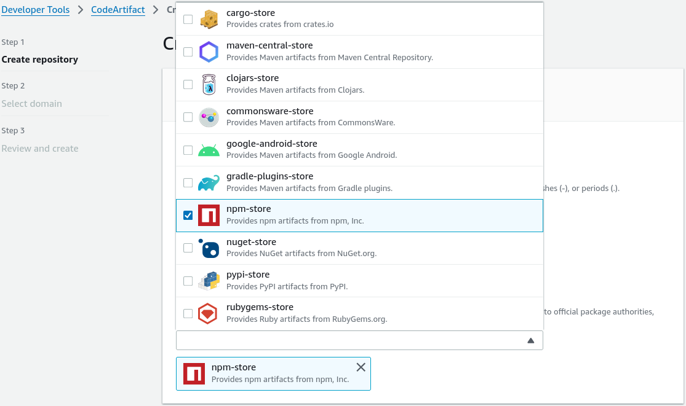
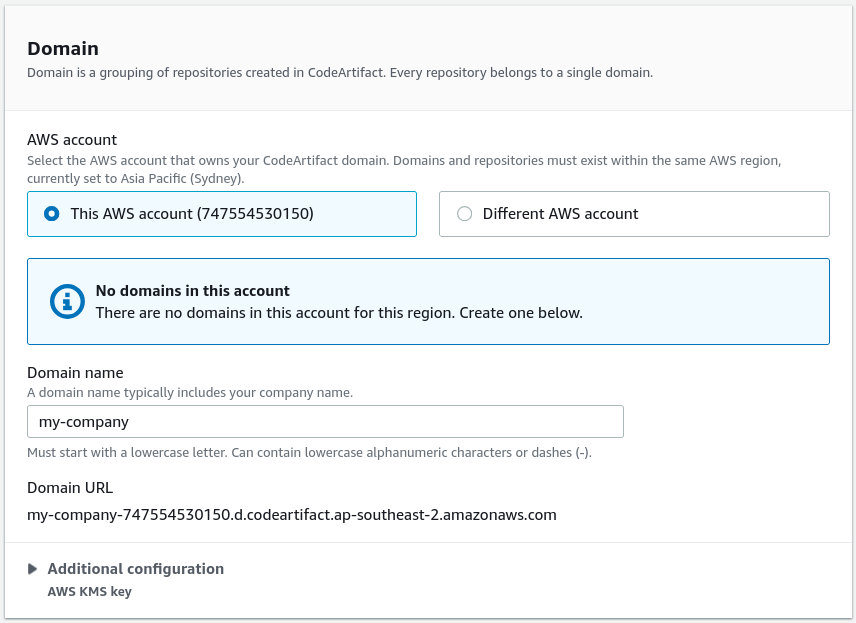
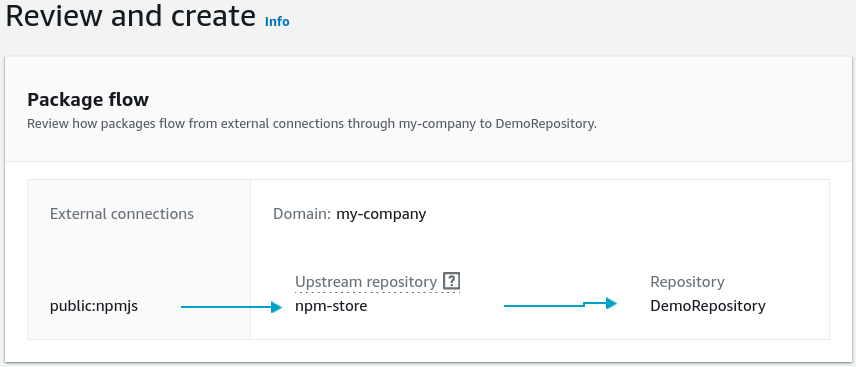
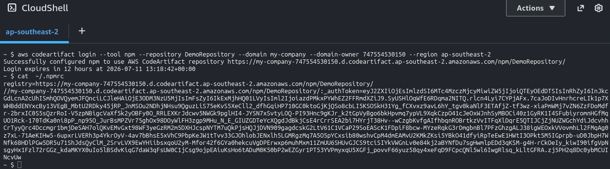
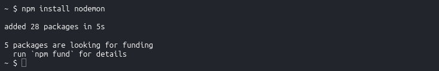
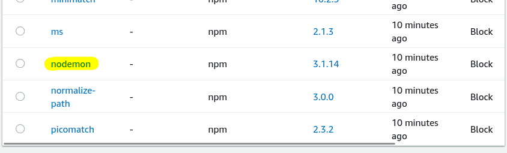
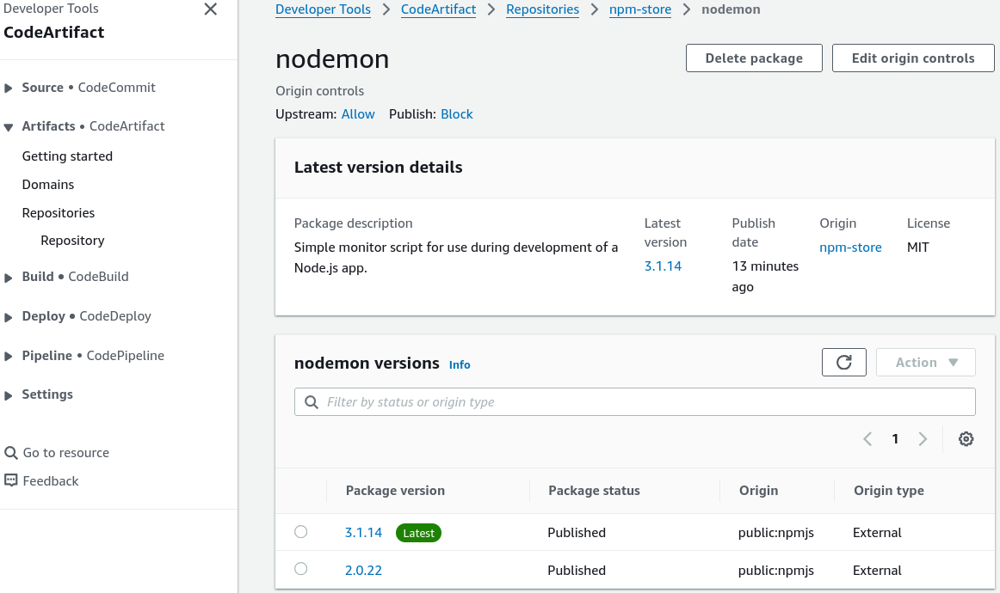
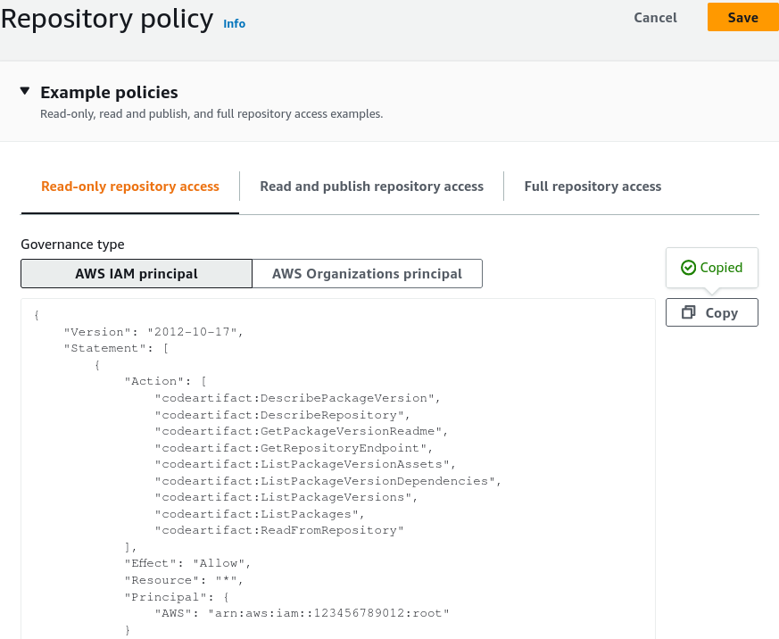
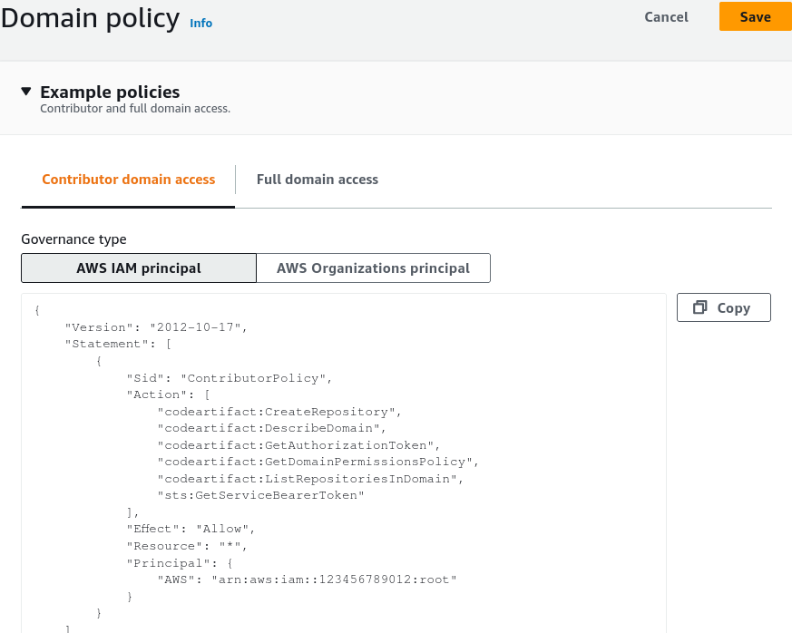

# CodeArtifact - Hands On

Stephane's lab exposes exactly how CodeArtifact intercepts standard developer dependency calls, caches packages inside a private corporate perimeter, and manages global namespace governance.

---

## Hands On

### 🏛️ 1. Orchestrating the Shared Domain & Repository

- **Launch the Workspace:** Open up the **AWS CodeArtifact** console dashboard ──► click **Create repository**.
- **Configure the Repo Identity:** Name your primary target entry point `DemoRepository`.
- **Bind the Public Proxy Pipeline:** Under the **Upstream repositories** options card, select the checkbox for **`npm-store`** (Node Package Manager). _Cloud Infrastructure Context:_ This automatically chains your private repository downstream from a managed `npm-store` cache bucket, which links directly to the public npm registry! Hit Next.  
  
- **Establish the Corporate Domain Umbrella:**
  - Under the domain assignment configuration, check **This account**.
  - Name the global organization domain block parameter: **`my-company`**.
  - Keep the security tier pinned to the default **AWS managed key** under AWS KMS for automatic, transparent data-at-rest encryption.  
    
- **Bake the Artifact Workspace:** Click Next to audit your structural mapping flow schema, and click **Create repository**. The console spins up both your custom `DemoRepository` and its upstream `npm-store` proxy engine simultaneously.  
  

---

### 📡 2. Programmatic Setup via AWS CloudShell

- **Open the Terminal Line:** Click the terminal symbol on the top console nav bar to spin up an interactive **AWS CloudShell** instance.
- **Generate the 12-Hour Access Key:** Head back to the CodeArtifact dashboard, click your `DemoRepository` profile ──► click **View connection instructions** ──► choose **`npm`** as your tool variant lane. Copy the authorization token generation script, and drop it into CloudShell:

```bash
aws codeartifact login --tool npm --repository DemoRepository --domain my-company --domain-owner 747554530150 --region ap-southeast-2
```

_DevOps Blueprint Fact:_ The login command automatically generates a short-lived 12-hour cryptographic token, injects it into your local `.npmrc` config file, and sets the `registry` endpoint to point directly to your private CodeArtifact repository.


---

### 🧪 3. Testing Ingestion, Caching, and Version Pinning

- **Fetch a Public Dependency Asset:** Command your terminal runner to pull a standard open-source library down the line:

  ```bash
  npm install nodemon
  ```

CloudShell queries your private CodeArtifact endpoint. Because the package isn't stored locally yet, the proxy engine leaps out to the public npm registry, pulls the latest edition, caches the sharded binaries permanently inside your `my-company` domain, and downloads it to your machine!  
 

- **Verify the Cache Footprint:** Head back to the console, refresh your `DemoRepository` packages list panel, and witness the magic, bro. You see the `nodemon` package along with every single internal sub-dependency library it maps to sitting cleanly in your cloud store!  
  
- **Pin an Older Target Release Version:** Simulating a legacy code requirement, force an install of an older release branch variant down the wire:

  ```bash
  npm install nodemon@2.0.22
  ```

Refresh the repository packages layout again, chief. CodeArtifact dynamically stacks your package versions side-by-side. You now hold permanent, immutable internal access to both `2.0.22` and `3.1.13` releases safely protected from any future public internet deletion drops.


---

### 🔏 4. High-Level Perimeter Governance Audit

- **Repository Resource Policies:** Inside your repo dashboard settings, check out the **Repository policy** tab. You can instantly select template blocks like _Read-only access_ or _Cross-account access_. This allows you to attach JSON resource policies to let external AWS accounts read your assets—remembering that access scales strictly at the repo boundary (principals can read all internal packages, or absolutely none).
  
- **Domain Policies:** Navigate one step up to the Domain dashboard settings pane. This is where you can inject structural policies to grant secondary accounts cross-account access to execute `codeartifact:GetAuthorizationToken` calls, creating secure organizational build hubs across your entire corporate account mesh!  
  

---

### 5. Project Clean-Up

:::tip

**WIPE OUT RUNNING FOOTPRINTS:** To ensure zero residual asset testing costs hit your account, cleanly tear down your temporary playground stack before logging off, chief:

1. Go to your Repositories list ──► select `DemoRepository` ──► hit **Delete**.
2. Select the automatically built `npm-store` upstream repo ──► hit **Delete**.
3. Click into the Domains tab layout ──► select your `my-company` domain ──► hit **Delete domain**.
   :::
