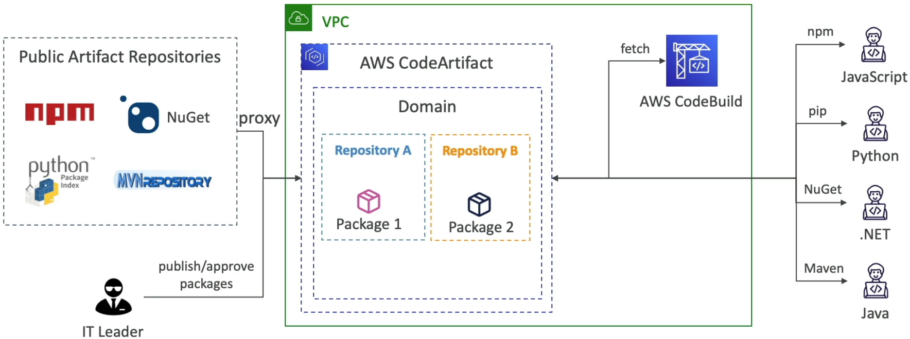
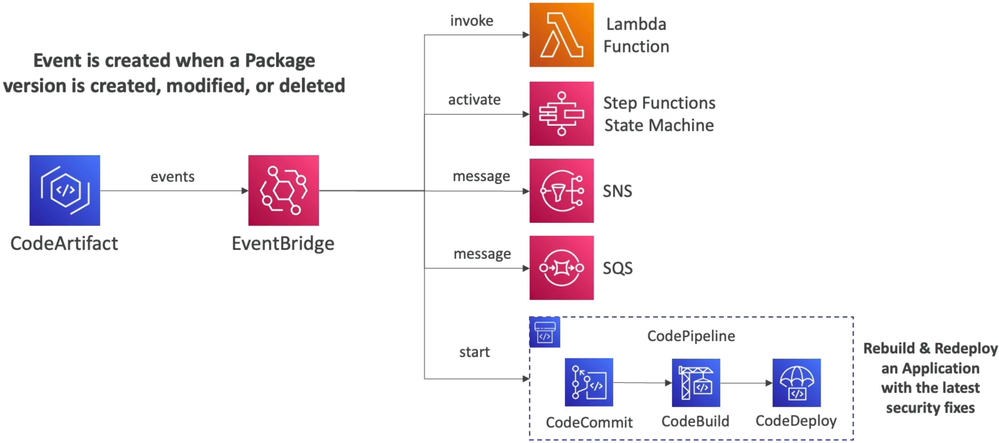
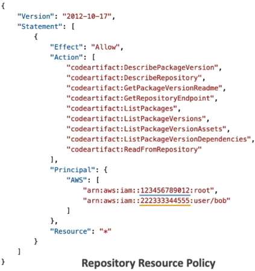

# CodeArtifact - Overview

**AWS CodeArtifact** is a fully managed, highly secure, and serverless artifact repository service designed to solve a major software engineering headache: supply chain package management.

When you build modern software, your code rarely stands alone. A JavaScript app relies heavily on hundreds of `npm` modules; a Python app pulls in `pip` packages; and a Java setup leans on `Maven` central.

If a public registry goes offline, suffers a major outage, or an open-source maintainer maliciously deletes a critical dependency package from the internet, your company's entire deployment pipeline instantly collapses. CodeArtifact steps in to proxy, cache, and secure all internal and external dependencies straight inside your AWS VPC.

---

## Key Takeaways

### 🏛️ The Domain & Repository Topology

CodeArtifact organizes your dependency architecture into two clear hierarchy layers, bro:

```text
🌐 AWS CODEARTIFACT BOUNDARY:
   └── 🏛️ DOMAIN (The Global Enterprise Umbrella)
        ├── 🔑 Shared KMS Encryption Key & Global Billing Ledgers
        ├── 📁 Repo 1: "npm-store" ──► Upstream: npmjs.com (Public Proxy)
        └── 📁 Repo 2: "pip-store" ──► Holds Proprietary Internal Corporate Code
```

- **The Domain 🏛️:** The overarching management perimeter across your company. Data deduplication happens at this level. Even if ten different development teams push or pull the exact same massive JAR or Node library across multiple separate team folders, CodeArtifact stores the asset file **exactly once per domain** to save you serious storage cash!
- **The Repository 📁:** A single polyglot folder link capable of natively hosting multiple entirely different package ecosystems simultaneously (like mixing `npm`, `pip`, `Maven`, and `NuGet` inside one named endpoint).  
  

---

### 🛡️ The Upstream Caching Proxy Engine

Instead of letting your local development rigs and on-demand **AWS CodeBuild** projects hit the open, wild public web every time they execute a package install script, you configure them to point their native package manager config clients right to CodeArtifact.

#### 🔄 The Proxy Workflow:

1. A developer runs an `npm install` command pointing to their CodeArtifact repository endpoint.
2. If CodeArtifact already holds the package library version, it hands it down instantly at ultra-low cloud network latency speeds.
3. If the library is missing, CodeArtifact uses its **External Connection** link to fetch the target asset straight out of the public registry, hands it to the caller, and **caches it permanently inside your private storage pool.**

#### 🦾 The Supply Chain Win:

Because the package is now cached internally, your pipelines stay completely immune to external internet hiccups, network blocks, or sudden package deletion events from open-source developers.

---

### 🔀 Downstream Pipelines & EventBridge Integration

CodeArtifact hooks directly into the **Amazon EventBridge** fabric to emit real-time event status updates the exact moment a package version is `Created`, `Modified`, or `Deleted`.

This allows you to create completely automated, self-healing software update workflows:


$$\text{CodeArtifact Package Update Event} \longrightarrow \text{EventBridge Rule} \longrightarrow \text{CodePipeline Auto-Triggers} \longrightarrow \text{CodeBuild Compiles \& Deploys New Image.}$$

If your security team pushes a vital, patched security internal library up to your CodeArtifact store, EventBridge intercepts that action, wakes up a listening **AWS CodePipeline**, spins up CodeBuild to re-compile your microservices using the freshly patched artifact version, and seamlessly rolls the safe update out to production automatically!

---

### 🚨 THE VITAL EXAM TRAP: Cross-Account Resource Access 🚨

This is a recurring target on the exam blueprint. Pay close attention to how permissions are partitioned over cross-account divides.

#### 🚫 The Granular Isolation Wall:

When managing permissions using CodeArtifact **Repository Resource Policies**, the system operates on a binary access scope. The core action flag—**`codeartifact:ReadFromRepository`**—can _only_ be evaluated against the overarching repository resource ARN.

:::warning
**THE POLICY BOUNDARY FACT:** You **cannot** pass a specific sub-package name ARN inside a repository policy statement to restrict access to only a couple of specific items. **A principal can either read all the packages inside a CodeArtifact repository, or absolutely none of them, chief!**
:::

#### 🛠️ The Cross-Account Handshake Strategy:

If an engineer in **AWS Account B** needs to securely pull packages out of a master repository hosted inside **AWS Account A**, you must deploy a dual-policy bridge:

1. **Repository Resource Policy:** You attach a JSON statement directly to the repository in Account A, explicitly granting `codeartifact:ReadFromRepository` permissions to the IAM identity ARN coming from Account B.  
   
2. **Domain Policy:** You _also_ must attach a domain policy in Account A allowing Account B to call **`codeartifact:GetAuthorizationToken`**, letting the external developer fetch short-lived 12-hour cryptographic access tokens to authenticate their command-line package runners natively!

---

## Exam Tips

- **The Internal Compliance Lockout:** If an exam prompt presents a scenario where a company wants to completely eliminate dependency substitution supply-chain attacks, block direct developer internet downloads, and ensure all unit tests run against audited, cached internal versions of open-source packages—**look straight for setting up an AWS CodeArtifact Domain and Repository proxy with an active External Connection.**
- **The Cross-Account Access Choice:** If a multi-choice question asks how to let an independent testing team in an external AWS account read internal artifacts—**choose the answer that applies a Repository Resource Policy granting `ReadFromRepository` access to the external account principal, while ensuring they are also granted cross-account domain permissions to generate an auth token.**
