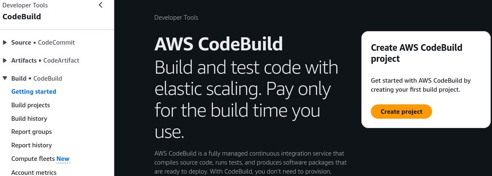
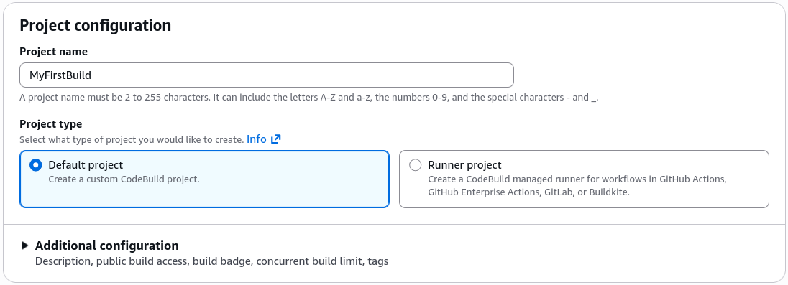
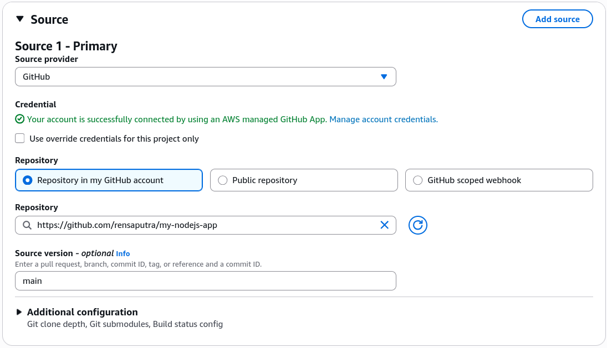
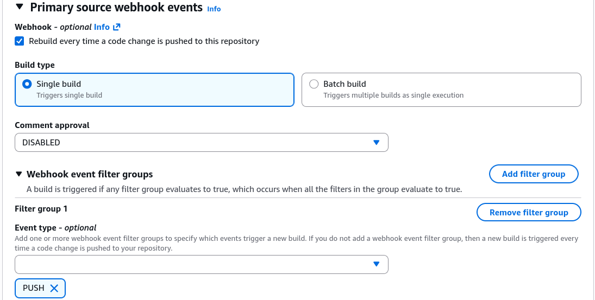
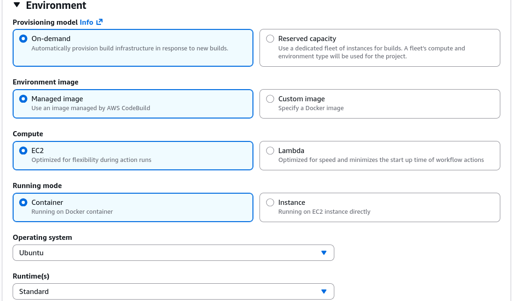
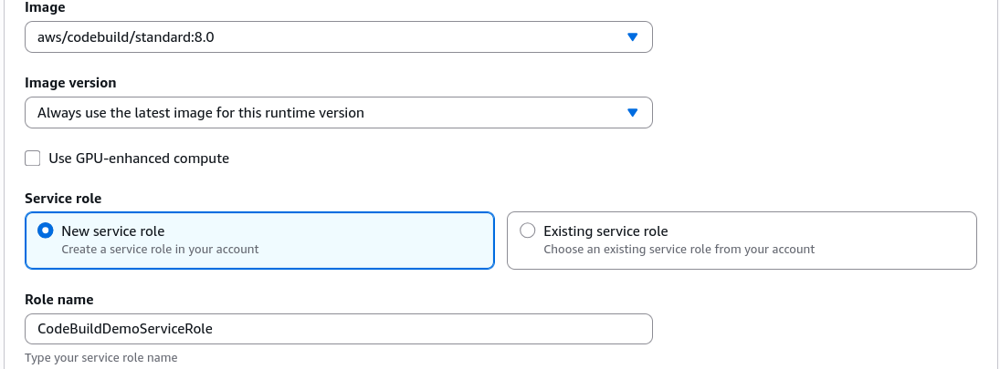
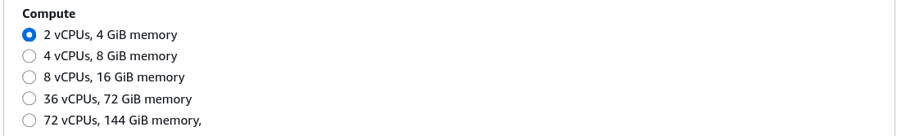
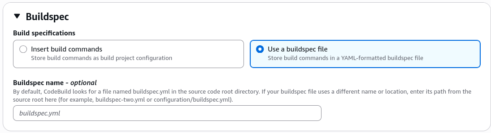
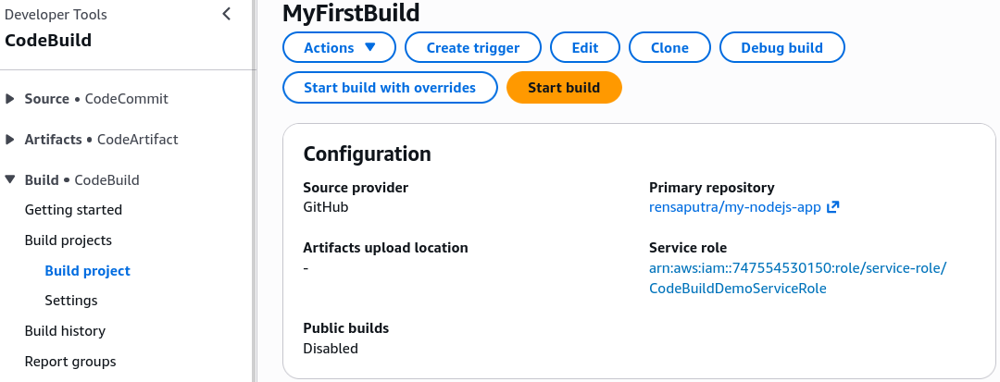
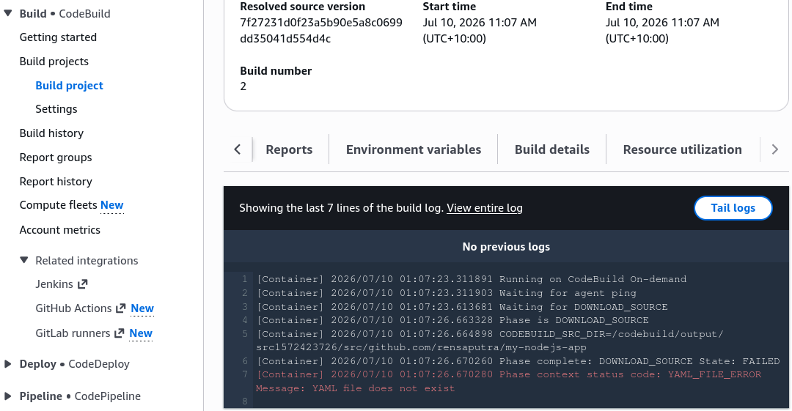

# CodeBuild Hands On Part 1

We'll be spinning up a build container project in AWS CodeBuild, connecting it to a GitHub repository, and running our first build. This is the first step in creating a fully automated CI/CD pipeline for your application.

Stephane’s walkthrough guides you through connecting your source repository using OAuth, selecting a standard Linux execution standard. The beautiful thing about CodeBuild is that it does not guess—it fails gracefully with a clear error the exact second a project configuration breaks, helping you troubleshoot instantly.

---

## Hands On

### 🔨 1. Provisioning the Core Build Canvas

- **Enter the Builder Console:** Jump into the AWS Management Console ──► pull up the **CodeBuild** dashboard panel ──► click **Create build project**.
  
- **Establish the Identity Envelope:** Provide a clear name like `MyFirstBuild`, and leave descriptions, build badges, and global tags at their default empty settings.
  

---

### 📡 2. Establishing the Source Webhook Line (GitHub Linkage)

- **Target the Code Provider:** Under the Source configuration panel, click the dropdown list and select **GitHub**.
- **The Cryptographic Authentication Handshake:** Choose the **Connect using OAuth** track ──► click the **Connect to GitHub** button. _Console Hook:_ This prompts a fresh browser OAuth popup window. Click **Authorize AWS CodeSuite** to bind your AWS account right to your Git profile.
- **Bind the App Repository:** Paste or search for your specific tracking repository folder (`my-nodejs-app`).
- **Declare the Deployment Branch:** Set the Source Version tracking parameter explicitly to the **`main`** or `master` branch.
  
- **Hook the Change Sensor (Webhooks):** Check the box to **Rebuild every time a code change is pushed to this repository** ──► set the Filter Group event type parameter strictly to **`PUSH`**, leaving Pull Request and Release rules unchecked for now, bro!
  

---

### 🐳 3. Shaping the Virtual Build Environment

- **Select the Host OS:** Under the Environment settings block, toggle the OS selection over to **Managed image** ──► pick **Ubuntu** as your Linux base.
  
- **Dial in the Curated Runtime Image:**
  - Set the Environment Runtime dropdown to **Standard**.
  - Select the latest container image version available from the list (like `aws/codebuild/standard:8.0` or newer) ──► toggle the dropdown to **Always use the latest image for this runtime version**.
- **Forge the Security Boundaries:** Choose **New service role** and name it `CodeBuildDemoServiceRole` so AWS can dynamically write the necessary backend CloudWatch and S3 permissions policies.
  
- **Additional Optimization Configurations:**
  - _The Financial Governor:_ Under additional configuration options, slash the hard runtime **Timeout** limit down from the generic 1 hour default to a tight **10 minutes** to kill runaway compile loops before they run up your bill.
  - _Compute Dimensions:_ Keep the architecture fleet pinned to the entry-level **4 GB Memory / 2 vCPU** size baseline.
    
  - _The Network Isolation Option:_ Note the **VPC selector** dropdown panel here. If your unit tests ever need to securely fetch data seeds out of an isolated RDS instance or private cluster during execution, you would link your private subnets right here.

---

### 📄 4. Declaring the Build Instruction Track

- **The Command Framework Blueprint:** Under the Buildspec settings panel, pick the selection locked to **Use a buildspec file**.
- **The Strict Filename Anchor:** Ensure the text prompt box dictates the exact runtime target name: **`buildspec.yaml`** or `buildspec.yml`.
  

---

### 🧪 5. Triggering the Initial Test Flight (The Expected Crash!)

- **Launch the Container Rocket:** Scroll all the way down to the base of the designer panel and hit **Create build project** ──► once baked, click **Start build**.
  
- **Watch the Phase Logs:** The execution plane immediately transitions from `In Progress` to `Failed`.
- **Read the Diagnostic Output:** Click into the CloudWatch build phase logs panel. The engine throws a clear error message stating: **`YAML_FILE_ERROR Message: YAML file does not exist`**.
- **The Architecture Lesson:** This failure is 100% expected. CodeBuild spun up the container successfully, but because we haven't actually written and committed our blueprint execution file to the root of our Git repository yet, the compiler engine had no choice but to drop the line.
  
