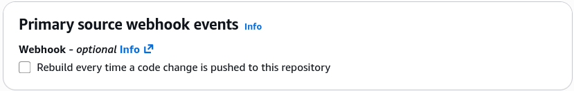
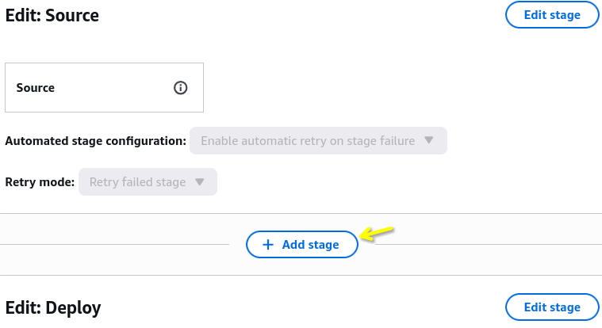
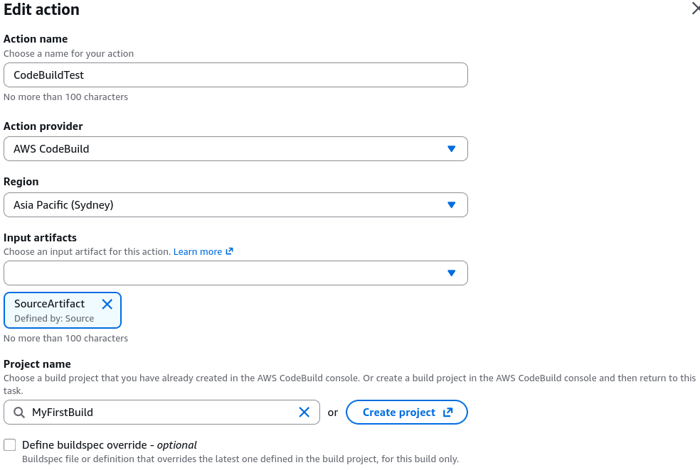
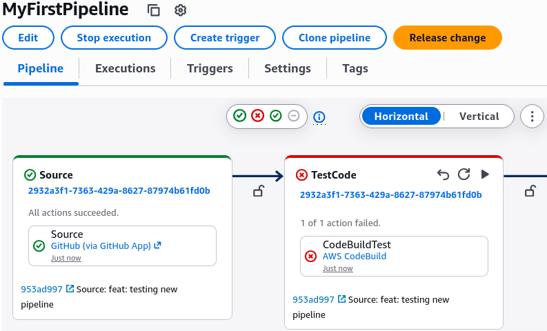
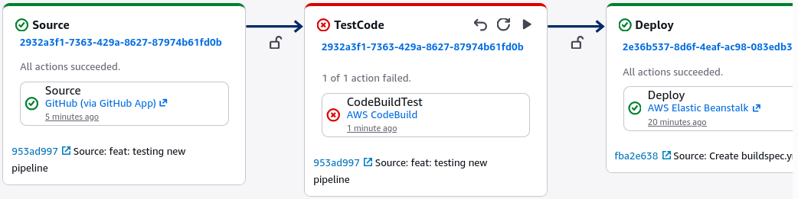
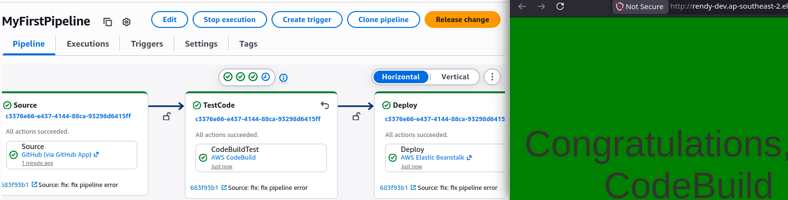
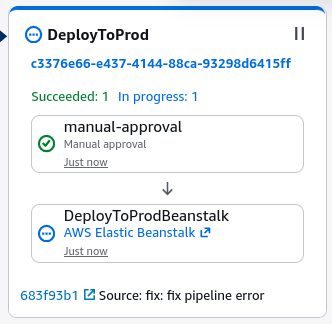

# CodeBuild Hands On Part 2

Stephane's lab demonstrates the raw power of continuous integration. If a developer accidentally deletes a mission-critical component, configuration object, or security validation rule, CodeBuild slams the gate shut instantly—leaving your production target environments safely untouched.

---

## Hands On

### 📄 1. Embedding the Core Blueprint (`buildspec.yml`)

- **Create the Control File:** Navigate straight to your GitHub repository dashboard web view ──► click **Add file** ──► select **Create new file**.
- **Anchor the Filename:** Name the file explicitly **`buildspec.yml`** at the absolute root of the repository.
- **Inject the Step Automation Logic:** Paste the following standard schema block into the code window:

  ```yaml
  version: 0.2

  phases:
    install:
      runtime-versions:
        nodejs: latest
      commands:
        - echo "installing something"
    pre_build:
      commands:
        - echo "we are in the pre build phase"
    build:
      commands:
        - echo "we are in the build block"
        - echo "we will run some tests"
        - grep -Fq "Congratulations" index.html
    post_build:
      commands:
        - echo "we are in the post build phase"
  ```

- **Sign the Delta Envelope:** Type a commit log string like `created buildspec.yml` ──► hit **Commit changes** to push the blueprint live to the `main` branch.

---

### 🔌 2. Rewiring CodeBuild to the Orchestration Pipeline

- **Dismantle the Direct Webhook:** Open your **CodeBuild console** workspace ──► click on your `MyFirstBuild` project ──► select the **Edit** configuration dropdown.
- **Isolate the Trigger Lines:** Locate the **Primary source webhook events** configuration card, uncheck the automation hooks box, and hit **Update project**. _DevOps Tip:_ Removing direct webhooks prevents Git pushes from triggering redundant, double-billed standalone runs while CodePipeline is trying to coordinate the same events.
  
- **Mount the Test Stage in CodePipeline:** Head over to the **CodePipeline console** workspace ──► click into your `MyFirstPipeline` layout ──► click the top-level **Edit** navigation button.
  
- **Splice the Flow Canvas:** Locate the visual line separating the `Source` phase and the `Deploy` phase ──► hit **Add stage** ──► name the new phase **`TestCode`**.
- **Bind the Container Runner:** Click **Add action group** inside the fresh `TestCode` block layout:
  - Set Action Name to: `CodeBuildTest`.
  - Set Action Provider to: **AWS CodeBuild**.
  - Set Input Artifacts to: **`SourceArtifact`**.
  - Set Project Name to: **`MyFirstBuild`**.
  - Set Output Artifacts to: `OutputOfTest` ──► click Done ──► scroll to the top global navigation and hit **Save**.
    

---

### 🧪 3. Running Execution Test Flight A (The Fail Simulation)

- **Inject a Broken String Line:** Go back to your GitHub file list ──► open `index.html` ──► hit edit ──► strip out the core string phrase `"Congratulations"` entirely and replace it with the text string `"Missing Text"` ──► commit the code change down to `main`.
- **Watch the Gatekeeper Execute:** CodePipeline instantly intercepts the push trigger. The source stage turns green, but the pipeline abruptly halts at the `TestCode` stage, flashing a bright red **`FAILED`** alert block.
  
- **Verify System Safety:** Click into CodeBuild's execution details logs. The container phase detail logs reveal a clear exit error code: **`COMMAND_EXECUTION_ERROR Message: Error while executing command: grep -Fq "Congratulations" index.html. Reason: exit status 1`**.
- **The Win Check:** Because CodeBuild forcefully exited with a failure flag, CodePipeline killed the release track immediately. If you check your live Dev or Prod Elastic Beanstalk domains, they remain completely secure and unchanged on their previous operational green layouts!
  

---

### 🏆 4. Running Execution Test Flight B (The Automated Resolution)

- **Repair the Baseline Asset:** Head right back to your GitHub repository editor panel ──► reopen `index.html` ──► rewrite the text parameter line to say **`"Congratulations, CodeBuild"`** ──► seal the commit envelope down to your tracking branch.
- **Witness the Auto-Healing Pipeline:** The cloud webhook triggers a fresh, brand-new execution block immediately:
  1. The `Source` phase zips the update down into the S3 artifact store.
  2. The `TestCode` step fires up an isolated container, scans the code, finds the whitelisted keyword, and flags a passing **Green Succeeded** banner, chief!
  3. The pipeline flows gracefully down to the `Deploy` phase, updating your lower dev environment to display the updated feature line dynamically.  
     
  4. The pipeline parks cleanly at the `DeployToProd` step, waiting for your manual approval review before updating the public fleet.  
     
