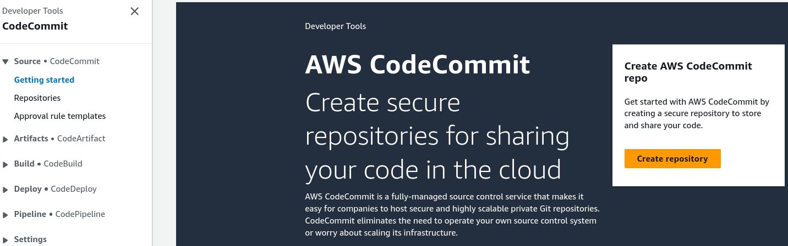
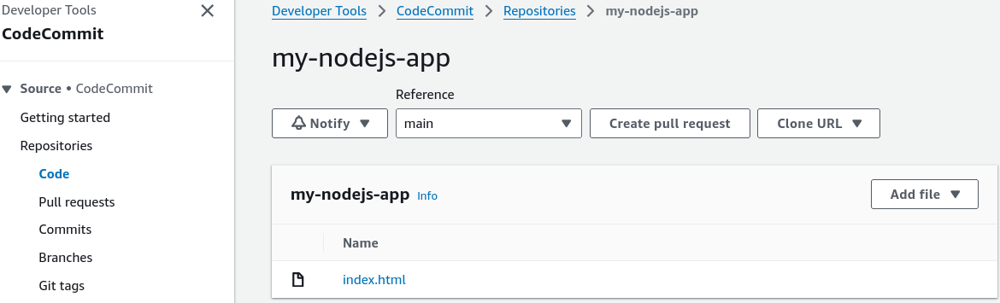
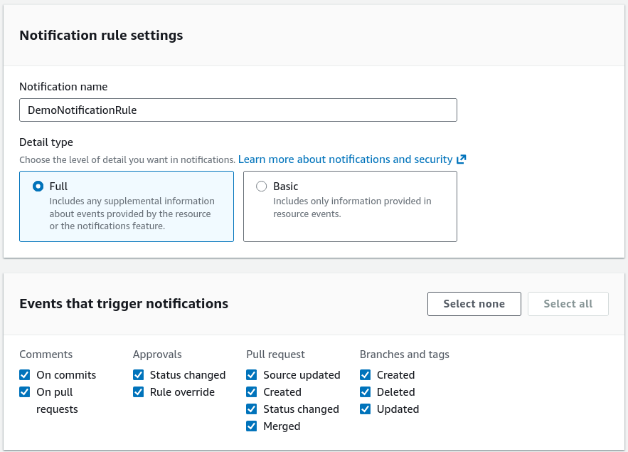
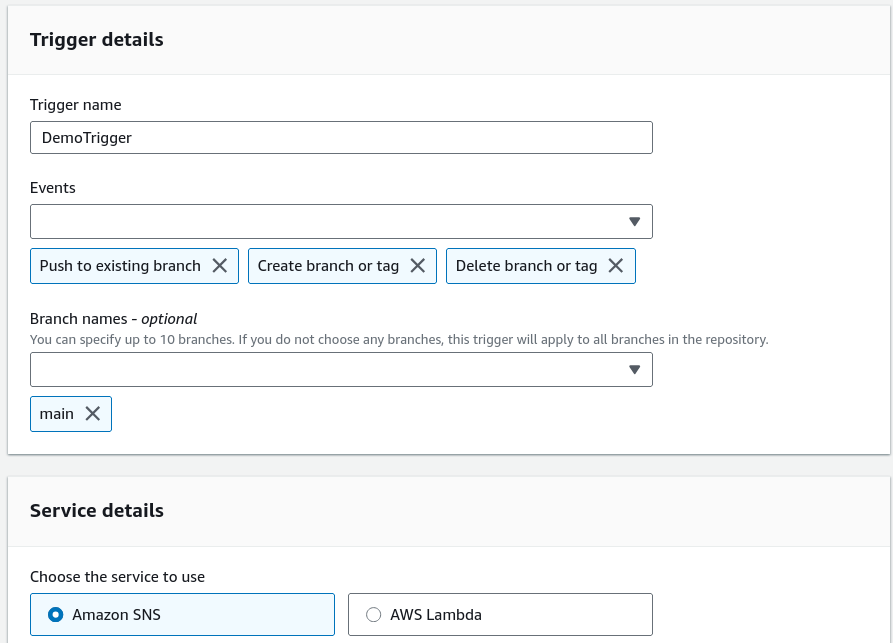

# CodeCommit Hands On Part 1

Stephane’s walkthrough shows you exactly how to manipulate the repository dashboard, drop files in via the UI, and map out automated background notification alerts using Amazon SNS.

---

## Hands On

### 📁 1. Creating the Code Repository Runway

- **Launch the Terminal Console:** Open the AWS Management Console and pull up the **CodeCommit** workspace (which houses CodeCommit, CodeBuild, CodeDeploy, and CodePipeline under a single sidebar umbrella).
  
- **Provision the Repo:** Hit **Create repository**, give it a clean name like `my-nodejs-app`, and click create.
- **The Identity Connection Catch:** The landing page reveals your primary connection string routes: **HTTPS, SSH, or HTTPS GRC**. _Console Hook:_ If you don't see the SSH connection tab available, it means you're logged into the AWS console using the unsecure Root account instead of a properly configured, isolated **IAM User**, chief!

### 📝 2. Committing Files Directly via Web UI

- **Upload Your Baseline Code:** Inside the code view pane, click **Add file** ──► select **Upload file**.
- **Stage Your Asset:** Choose a standard file target (like an `index.html` layout file).
- **Sign the Git Commit Envelope:** Provide your Author Name (e.g., `Rendy`), add an Email Address, and type a clean commit message like `initial commit`.
- **Bake the Artifact:** Click **Commit changes**. CodeCommit automatically generates a unique, immutable cryptographic **Commit ID** and spins up your default primary tracking branch, named **`main`**.
  

### 🎛️ 3. Establishing Automated Event Gatekeepers

CodeCommit packs two powerful management tools inside the **Settings** sidebar to track background infrastructure mutations, bro:

#### 📣 Track A: Notification Rules (The Global Ledger)

- **The Intent:** Designed to log high-level pull requests or developer coordination movements directly to an SNS topic or Slack/Ms.Teams workspace.
- **The Playbook Steps:**
  - Navigate to **Settings** (left sidebar) ──► click **Notifications** ──► hit **Create notification rule**.
  - Name it `DemoNotificationRule` and toggle the Detail Type to **Full** to capture complete execution attributes.
  - Check the box to **Select all events** (captures master branch switches, code pull request approvals, deletes, and tag updates).
  - Create or select an target **Amazon SNS Topic** (AWS applies the mandatory `codestar-notifications-*` namespace filter automatically) and hit submit to bind the rule.
    

#### ⚡ Track B: Repository Triggers (The Core Code Hooks)

- **The Intent:** Purpose-built to respond natively to direct code events—like a hard `push to an existing branch`. This is exactly how you automatically fire up external build environments or ping Lambda functions when code changes!
- **The Playbook Steps:**
  - Go to **Settings** ──► click **Triggers** ──► hit **Create trigger**.
  - Name it `DemoTrigger` and set the event targets strictly to **Push to existing branch**.
  - Declare the exact tracking target branch parameter name: **`master`**.
  - Select **Amazon SNS** as your service destination, link it directly to your existing communication topic ARN, and hit save.
    

---

## Exam Tips

- **The Code Review Governance Loop:** Remember for multi-choice scenarios that CodeCommit natively handles **Pull Requests** and **Approval Rule Templates**. If a question asks how to mandate that at least two senior developers must digitally sign off on a piece of code before it is allowed to merge into production—you don't write custom script logic. You configure an Approval Rule Template and bind it right to your master branch!
- **The Root Account SSH Absence:** Pay close attention to that console warning! If you log in using your main AWS Root account, the **SSH Keys** upload dashboard will be completely missing from your security profile credentials tab. AWS blocks this on purpose. You must always use a dedicated IAM User to map your cryptographic terminal handshakes.
