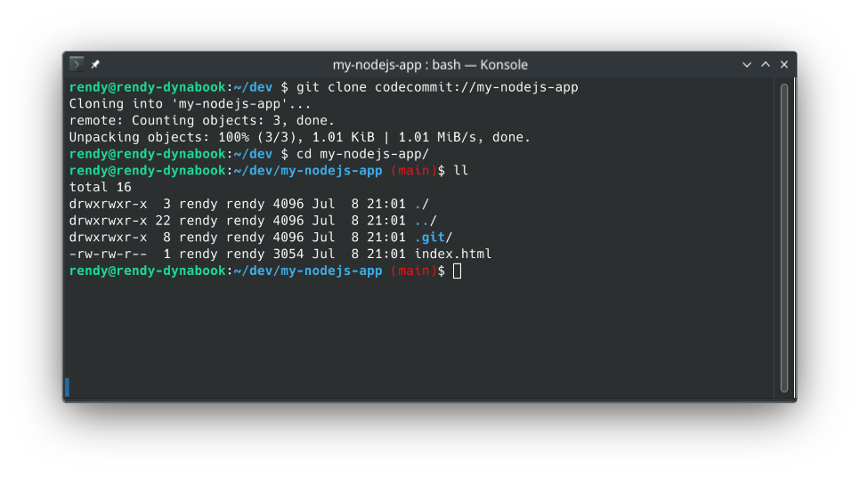
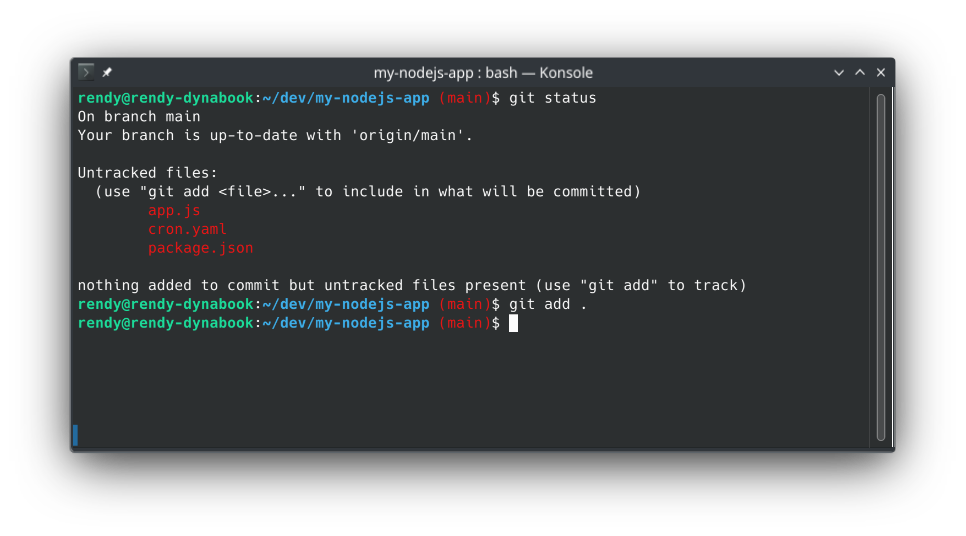
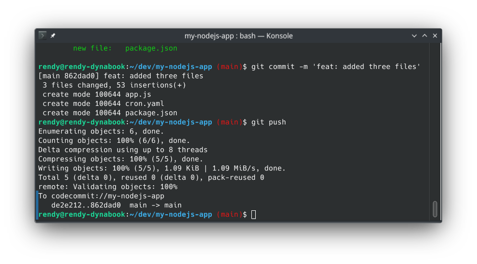
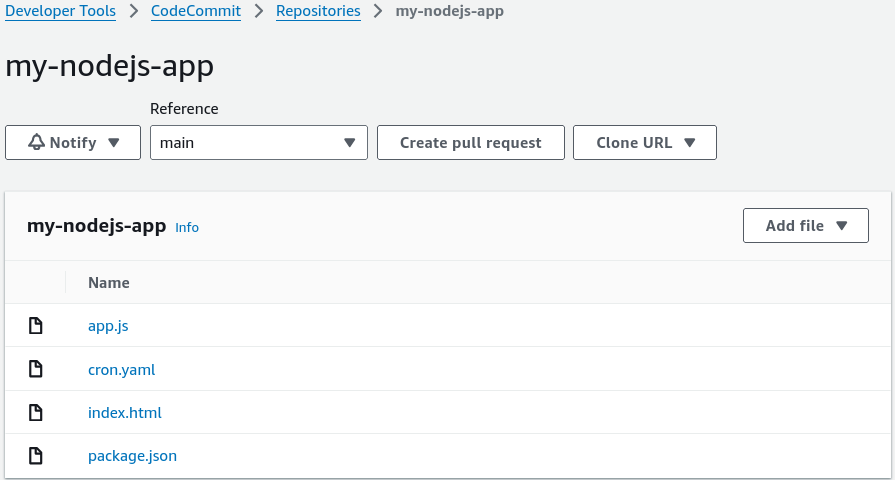

# CodeCommit Hands On Part 2

Using **AWS CloudShell** allows us to skip annoying local SSH or credential helper setups entirely since it carries pre-baked AWS credentials right inside the shell runtime environment. However, I'll be using my local terminal that has been pre-configured with the **AWS CLI**, **Git** and **Python** installed.

---

## Hands On

### 📡 1. Prepping the Cloud Environment

- **Grab the Repository Pointer:** Inside your CodeCommit console dashboard, click on your `my-nodejs-app` repository ──► locate the **Clone URL** dropdown menu on the top right ──► copy the **HTTPS (GRC)** endpoint link.
- **Fire Up Compute:** Click the terminal icon on the top global navigation bar to spin up a live **AWS CloudShell** container.
- **Inject the Git Helper Extension:** Run the standard pip installer to set up the dedicated Python protocol wrapper:

```bash
# If you're on Debian/Ubuntu you may need to install pipx first to avoid conflicts with the system Python
# sudo apt update && sudo apt install pipx -y && pipx ensurepath && source ~/.bashrc && pipx install git-remote-codecommit
pip install git-remote-codecommit
```

- **Clone Down the Source Tree:** Use standard Git syntax with the custom `codecommit://` protocol string helper to pull down your repo assets:

```bash
git clone codecommit://my-nodejs-app
```

- **Enter the Runway Folder:** Run `cd my-nodejs-app` and execute an `ls` block to verify that your console-uploaded `index.html` file is sitting cleanly in your environment workspace.



---

### 📂 2. Staging New Code Assets

- **Add Source Code Files:** Add your `app.js`, `cron.yaml`, and `package.json` files to the local working directory.
- **Audit Your Working Tree:** Run `git status` to verify that Git spots all three new files sitting in your workspace as **untracked** items.
- **Index the Delta Changes:** Tell Git to stage and start tracking every single one of those fresh local files:

```bash
git add .
```



---

### 🔏 3. Sealing the Commit and Launching to the Cloud

- **Introduce Yourself to Git:** Before your local environment will let you seal a Git envelope, you must populate your local commit identity profile boundaries:

```bash
git config user.email "rendy@aws.com"
git config user.name "rendy"

```

- **Lock in the Local Snapshot:** Execute a standard commit call to wrap your staged changes into an immutable local block string:

```bash
git commit -m "feat: added three files"

```

- **The Critical Push Delivery:** Clear out your terminal buffer and execute the magic push script to ship your local commits straight up to the AWS cloud:

```bash
git push
```



---

### 🔍 4. Verifying Success at the Perimeter

- **Refresh the Dashboard Layout:** Head right back over to your AWS CodeCommit management console web browser tab and hit refresh.
- **The Win Check:** Your repo tree now cleanly displays all four core application structural assets (`index.html`, `app.js`, `cron.yaml`, and `package.json`) sitting beautifully inside the cloud.


