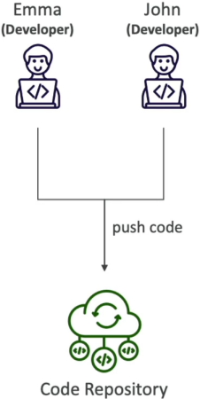
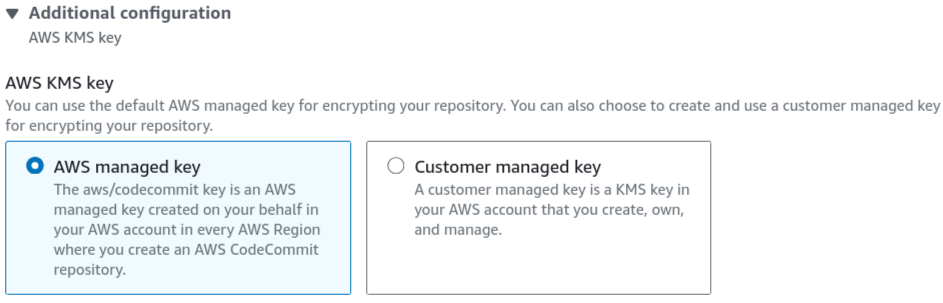

# CodeCommit Overview

Version control isn't just about saving your file history so you don't lose work—it’s the absolute engine room of team collaboration and disaster recovery. If a bad bug slips past your checks and drops production at 2:00 AM, you don't scramble to manually edit files on a server, chief. You check the git tree, locate the breaking commit, run a fast `git revert`, and watch your automated pipeline heal the system in minutes.

---

## Key Takeaways

### 🏗️ The Secure Private Git Backbone

If you are already familiar with platforms like GitHub or GitLab, you will pick up CodeCommit's core concepts instantly. It speaks pure, standard Git. You run the exact same `git clone`, `git push`, and `git pull` workflows you use every single day.

But where it completely changes the game is **how it sits inside your AWS ecosystem**:

- **The Compliance Shield:** Your code doesn't live on an external third-party server network. It stays locked inside the AWS storage perimeter, making it a gold standard for highly regulated enterprise architectures (like finance, government, or defense contracts).
- **Zero Infrastructure Overhead:** There is no repo storage size ceiling. It scales elastically under the hood whether you are hosting 10 megabytes of scripts or hundreds of gigabytes of massive application source files.

---

### 🔐 Deep Security & Authentication Architecture

This is where CodeCommit leaves standard external Git providers in the dust. It completely throws out custom standalone user databases and maps authentication directly to **AWS Identity and Access Management (IAM)**.

#### 📡 Data Transit & Encryption Controls

- **In Transit:** Every single connection pushed over the wire is encrypted using standard **HTTPS** or **SSH** tunnels.
- **At Rest:** The exact second your pack file hits AWS storage, **AWS KMS (Key Management Service)** steps in and automatically encrypts your data using custom customer-managed or AWS-managed keys.

#### 🔏 The Authentication Channels

To authenticate your local terminal or local IDE with the cloud repo, you choose between two primary tracks:

1. **SSH Keys:** You generate a standard cryptographic keypair on your local machine, navigate to your active IAM User dashboard, upload your public key string, and use your generated SSH Key ID as your username wrapper.
2. **HTTPS Git Credentials:** You go into your IAM User console tab, hit the security credentials section, and generate an explicit, isolated static username and password pair specifically for Git connections.

#### 🔀 The Cross-Account AssumeRole Pattern

If a developer working in **AWS Account B** needs to pull or push code to a mission-critical master repository hosted over in **AWS Account A**, you never share static login keys or SSH files. That is a massive security risk.

Instead, you create an IAM Role inside Account A that grants access permissions to CodeCommit, and give Account B permission to execute the **`sts:AssumeRole`** API call. The developer runs a fast profile configuration change on their local machine, grabs short-lived temporary security tokens on the fly, and securely interacts with the repo across the cloud account divide.

---

## Exam Tips

- **The Strict AWS Perimeter Constraint:** If an exam scenario presents a strict compliance mandate stating that an application's source code contains highly sensitive proprietary IP, and legally forbids the data from ever traversing the public internet or living on an external third-party Git SaaS platform—**the undisputed correct answer is to host the repository inside AWS CodeCommit** You can couple it with **Amazon VPC Endpoints** to ensure your developer traffic never even touches the open web when pulling code down to your private corporate networks.
- **The Unified Governance Principle:** Remember for multi-choice questions that CodeCommit lets you manage repository read/write access using the exact same **IAM Policies and Roles** you use to control access to S3 buckets or EC2 instances. You maintain a single, clean central source of truth for your entire cloud security posture.

### Practice Test

**Question 1**: An organization recently began using AWS CodeCommit for its source control service. A compliance security team visiting the organization was auditing the software development process and noticed developers making many git push commands within their development machines. The compliance team requires that encryption be used for this activity.

How can the organization ensure source code is encrypted in transit and at rest?

- [ ] Use AWS Lambda as a hook to encrypt the pushed code
- [ ] Enable KMS encryption
- [ ] Use a git command line hook to encrypt the code client side
- [ ] Repositories are automatically encrypted at rest

Correct Answer

- [ ] Use AWS Lambda as a hook to encrypt the pushed code
  - **Explanation**: This is not needed as CodeCommit handles it for you.
- [ ] Enable KMS encryption
  - **Explanation**: You don't have to. The first time you create an AWS CodeCommit repository in a new region in your AWS account, CodeCommit creates an AWS-managed key in that same region in AWS Key Management Service (AWS KMS) that is used only by CodeCommit.
- [ ] Use a git command line hook to encrypt the code client side
  - **Explanation**: This is not needed as CodeCommit handles it for you.
- [x] Repositories are automatically encrypted at rest
  - **Explanation**: Data in AWS CodeCommit repositories is encrypted in transit and at rest. When data is pushed into an AWS CodeCommit repository (for example, by calling git push), AWS CodeCommit encrypts the received data as it is stored in the repository.  
    

