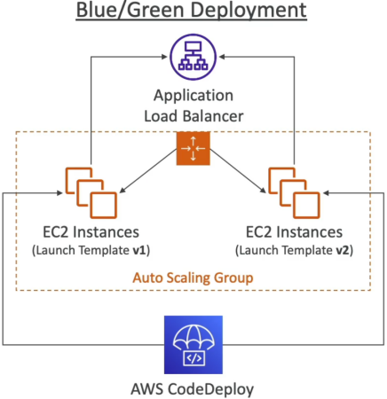

# CodeDeploy for EC2 and ASG

Scaling CodeDeploy to handle an **Amazon EC2 Auto Scaling Group (ASG)** is where you transition from managing individual standalone boxes to orchestrating a highly available, self-healing elastic cloud fleet.

---

## Key Takeaways

When you hook CodeDeploy right up to an ASG, you unlock massive automated leverage. Let’s deep dive into the mechanics of **In-Place** vs. **Blue/Green** deployments at this scale, look at how the Auto Scaling lifecycle handles fresh compute nodes, and expose a vital architectural rollback fact that the DVA-C02 examiners absolutely love to trick developers on.

### 🏗️ ASG Deployment Tracks: In-Place vs. Blue/Green

When your target group points to an active Auto Scaling Group, how your deployment maps across the cluster depends entirely on your risk posture:

#### 🔄 Track A: In-Place Updates (The Resource Re-user)

CodeDeploy systematically marches across your existing running ASG instances using your configured speed settings (like `HalfAtATime` or `OneAtATime`). It knocks out an instance, tears down version 1, drops in version 2 via the local agent, runs validation hooks, and puts it back in service.

- **The Elastic Win 🛡️:** This is a major engineering win—if your ASG automatically spins up a **brand-new EC2 instance mid-deployment** (due to a sudden traffic surge or a metric scaling policy alarm), **CodeDeploy automatically hooks right into the ASG lifecycle, intercepts the boot, and pushes your active deployment revision to that new box before it ever starts taking user traffic!**

#### 🟢 Track B: Blue/Green Updates (The Immutable Switch)

Instead of touching your live, functional production servers, CodeDeploy steps back and takes an immutable, zero-downtime approach:

1. CodeDeploy reads your original ASG blueprint and automatically provisions **a completely separate, duplicate green Auto Scaling group** running your brand-new launch templates.
2. CodeDeploy deploys version 2 right onto these fresh green nodes.
3. The Elastic Load Balancer (ELB) begins a controlled traffic fall-over, gracefully redirecting active client loops away from the old blue target groups straight onto the green pool.
4. **The Cleanup Clock 🕒:** You get to explicitly configure a standby timer threshold. You specify exactly how long the old blue ASG should stay alive in a muted state (letting you run quick sanity audits) before CodeDeploy commands the cloud to automatically terminate the old blue servers completely.  
   

---

### 🚨 THE VITAL EXAM TRAP: Core Rollback Mechanics 🚨

This is a high-priority, guaranteed target area on the exam blueprint. Pay close attention to how CodeDeploy processes a system recovery.

You can configure CodeDeploy to trigger an automated rollback based on two distinct event types:

- **`DEPLOYMENT_FAILURE`:** A script exits with an error code or a host fails health checks.
- **`DEPLOYMENT_STOP_ON_ALARM`:** A connected **CloudWatch Alarm** (like your HTTP `5XX` error rate metric monitor) flashes bright red mid-deployment.

#### 🚫 The Common Misconception:

Many developers falsely believe that when a rollback executes, CodeDeploy takes the broken instances and run some sort of stateful "system restore" or "git undo" mechanism to cleanly revert the local filesystem backwards in time. **That is completely wrong**

#### 🛠️ The Real Cloud Execution Reality:

When an auto-rollback triggers, CodeDeploy treats it as a completely brand-new, independent **Roll-Forward deployment of your last known good revision, bro!**

```text
💥 DEPLOYMENT CRASHES AT STEP 3 ──► CLOUDWATCH ALARM TURNS RED 🚨
                                         │
 ┌───────────────────────────────────────┴───────────────────────────────────────┐
 ▼ WHAT DEVELOPERS THINK HAPPENS:                                                ▼ WHAT ACTUALLY HAPPENS:
 🔄 "System Undo" the files backwards in time. (WRONG!)                        🚀 CodeDeploy schedules an entirely NEW, fresh deployment.
                                                                                 📦 It grabs the older, frozen V1 zip package from S3.
                                                                                 📥 It deploys it cleanly across the fleet as a fresh release!

```

CodeDeploy allocates a brand-new unique Deployment ID, fetches the older, frozen version 1 bundle zip file right back out of your Amazon S3 artifact bucket, and systematically executes a fresh installation across your instances to overwrite the broken state. It's a new rollout of a proven artifact.

---

## Exam Tips

- **The Automated Self-Healing ASG Strategy:** If an exam prompt introduces an architecture running behind an ALB and an Auto Scaling Group, and demands that any newly launched automated scale-out instances must instantly match the exact application version currently serving production traffic without human intervention—**ensure the ASG is directly bound as the environment target configuration inside your CodeDeploy Deployment Group settings.**
- **The Safe Canary Rollback Boundary:** If a scenario presents a rule requiring that if a new code rollout triggers user-facing processing drops, the system must immediately abort and shift 100% of user traffic back to the safe state—the answer is to **pair a CodeDeploy Blue/Green deployment configuration with a CloudWatch Alarm monitoring application error metrics, enabling the native Auto-Rollback checkmark inside the deployment group panel.**
