# CodeDeploy Hands On

Stephane’s walkthrough exposes a critical architectural truth: CodeDeploy doesn't just copy files blind; it relies on strict cryptographic IAM trust boundaries, background operating system runtime dependencies, and precise metadata filters to locate your virtual machines.

---

## Hands On

### 🔐 1. Forging the Dual IAM Security Pillars

Before you touch a single server or deployment console, you must build the underlying identity handshake gates, chief:

- **The Service Control Gate (Role A):** Open the **IAM Console** ──► go to **Roles** ──► hit **Create role**.
  - Select **AWS service** ──► choose **CodeDeploy** ──► select the use case variant matching **CodeDeploy (Standard/EC2)**.
    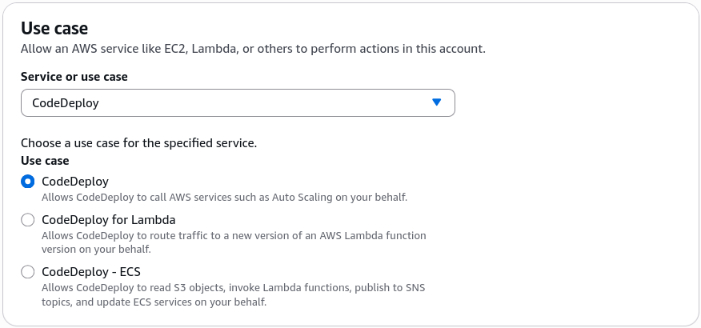
  - Name the role explicitly: `CodeDeployServiceRoleForEC2` and click create. (This grants the background CodeDeploy orchestrator permission to inspect your infrastructure boundaries.)
- **The Host Storage Fetch Gate (Role B):** Hit **Create role** yet again ──► select **AWS service** ──► choose **EC2**.
  - Under the permissions search bar, look for and attach **`AmazonS3ReadOnlyAccess`** to the role.
  - Name this role: `EC2RoleForCodeDeploy` and click create. (This allows your virtual machines to securely reach out and pull deployment zips straight down from your S3 back-buckets!)
    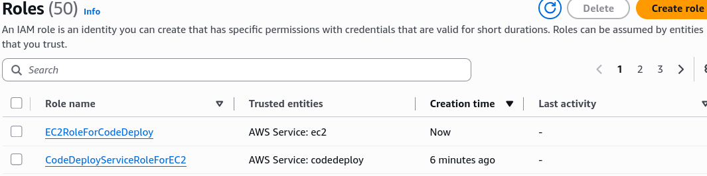

---

### 🏎️ 2. Provisioning the Target Infrastructure Fleet

- **Launch the Virtual Box:** Navigate straight to the **Amazon EC2 console** dashboard ──► click **Launch instance**.
- **Set the Host Specs:** Name it `DemoWebServer` ──► keep the baseline OS pinned to standard **Amazon Linux** ──► leave the instance size configuration on **t3.micro**.
- **Open the Network Inbound Perimeters:** Under Network Settings, check the box to **Allow SSH traffic** AND check the box to **Allow HTTP traffic from the internet**.
- **Launch the Node:** Click Launch instance (add a key pair if you have it handy or you can use CloudShell to connect later).
  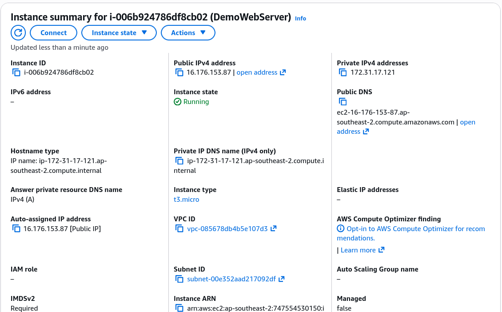
- **🚨 THE CRITICAL METADATA TAG AND SECURITY PATCH:** To ensure CodeDeploy can find and operate this node, you must perform two rapid administrative tweaks inside your active instances view panel:
  1. **Attach the Storage Fetch Identity:** Check the box next to your instance ──► click **Actions** ──► **Security** ──► **Modify IAM role** ──► drop down the list, select **`EC2RoleForCodeDeploy`**, and hit Save.
  2. **Attach the Group Target Tag:** Click on your running instance details ──► go to the **Tags** tab ──► hit **Manage tags** ──► append a custom tracking tag: Set the Key to **`Environment`** and set the Value strictly to **`Development`** ──► hit Save.

---

### 🛠️ 3. Bootstrapping the Host Engine (The CodeDeploy Agent)

- **Establish a Live Terminal Line:** Click into your active `DemoWebServer` instance dashboard layout ──► hit the top-level **Connect** button ──► select the **EC2 Instance Connect** tab ──► click **Connect** to pop open a live web terminal session.
- **Execute the Bootstrap Instructions:** Run these sequential Linux scripts down the wire to spin up the background runtime dependencies:

  ```bash
  # Installing CodeDeploy Agent
  sudo yum update
  sudo yum install ruby

  # Download the agent (replace the region)
  wget https://aws-codedeploy-eu-west-3.s3.eu-west-3.amazonaws.com/latest/install
  chmod +x ./install
  sudo ./install auto
  sudo service codedeploy-agent status
  ```

- _The Succeeded Check:_ The terminal will flash a bright active status payload showing a tracking **Process ID (PID)**. Your server is officially armed and listening for cloud deployment runs.
  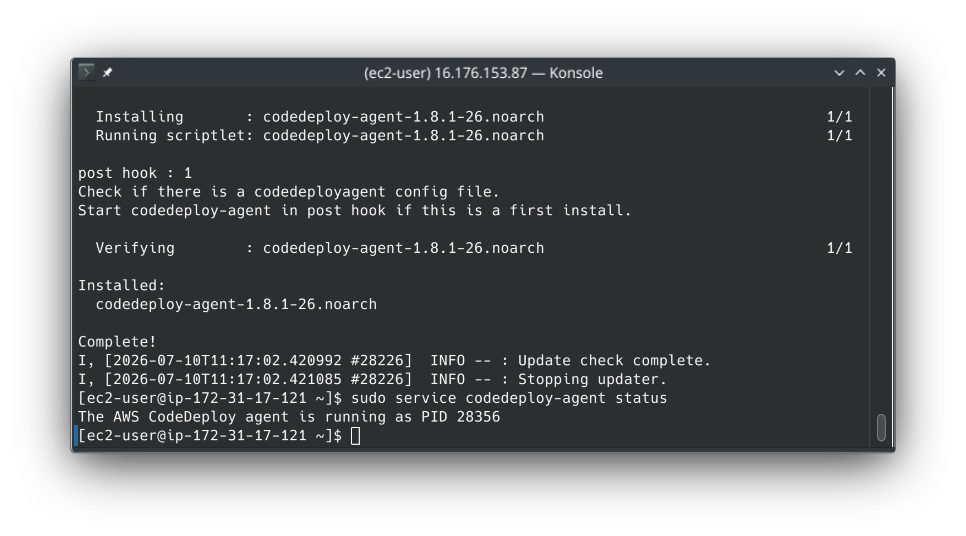

---

### 📂 4. Staging the Deployment Blueprints inside Amazon S3

- **Create the Deployment Silo:** Open the **Amazon S3 console** ──► click **Create bucket** ──► give it a globally unique descriptor like `rendy-code-deploy-demo-bucket`. _Critical Rule:_ Ensure your S3 bucket matches the exact identical **AWS Region** housing your EC2 and CodeDeploy environments, or the network handshake fails.
- **Upload the Application Revision Bundle:** Drop your compiled application zip archive (e.g., [SampleApp_linux.zip](./assets/SampleApp_Linux.zip)) straight into the bucket.
- **The AppSpec Custom Hook Blueprint 📄:** Under the hood, your unzipped application revision folder contains a mission-critical tracking file at its absolute root named **`appspec.yml`**. This file dictates the exact directory file copies and handles custom shell script triggers inside sequential **Lifecycle Event Hooks**:
  - `BeforeInstall`: Spins up custom scripts to pre-install dependencies (like configuring an Apache `httpd` web server engine).
  - `Install`: CodeDeploy maps and copies files out of your zip artifact straight down into the target host directory path (e.g., `/var/www/html`).
  - `ApplicationStart`: Triggers scripts to execute a graceful boot loop on your service stack.
  - `ApplicationStop`: Fires scripts to gracefully stop your service stack before a new deployment run.
- **Grab the Data Pointer:** Click on your uploaded zip object inside the S3 dashboard and copy its unique **S3 URI** path string to your clipboard.

---

### 🎛️ 5. Creating the CodeDeploy Control Group

- **Initialize the Application App Scope:** Head back over to the **CodeDeploy console** workspace ──► click **Applications** ──► hit **Create application** ──► name it `DemoApplication` ──► set the Compute Platform dropdown parameter strictly to **`EC2/on-premises`**.  
  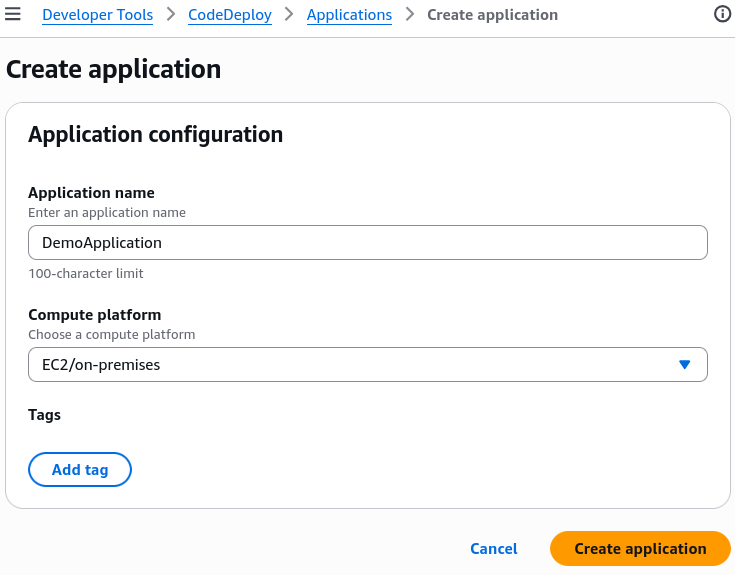
- **Forge the Target Deployment Group:** Click into your newly created application profile ──► click **Create deployment group**:
  - Name the group target: `DevelopmentInstances`.
  - Set the Service Role dropdown to your pre-staged: **`CodeDeployServiceRoleForEC2`**.
  - Set the Deployment Type selection to: **`In-place`**.  
    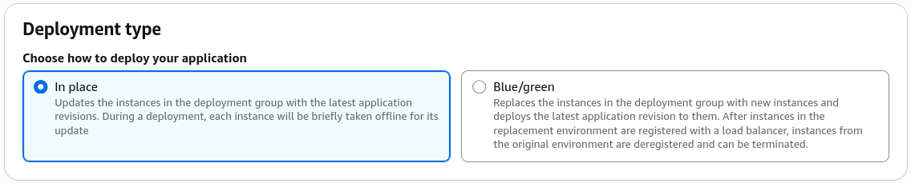
  - Under Environment Configuration, check the box for **`Amazon EC2 instances`**.
  - _The Metadata Filtering Step:_ Under the tag group parameters, set the Key to **`Environment`** and set the Value to **`Development`**. The console will instantly scan your active cloud fleet and update its readouts to state: **`1 unique matched instance found`**.  
    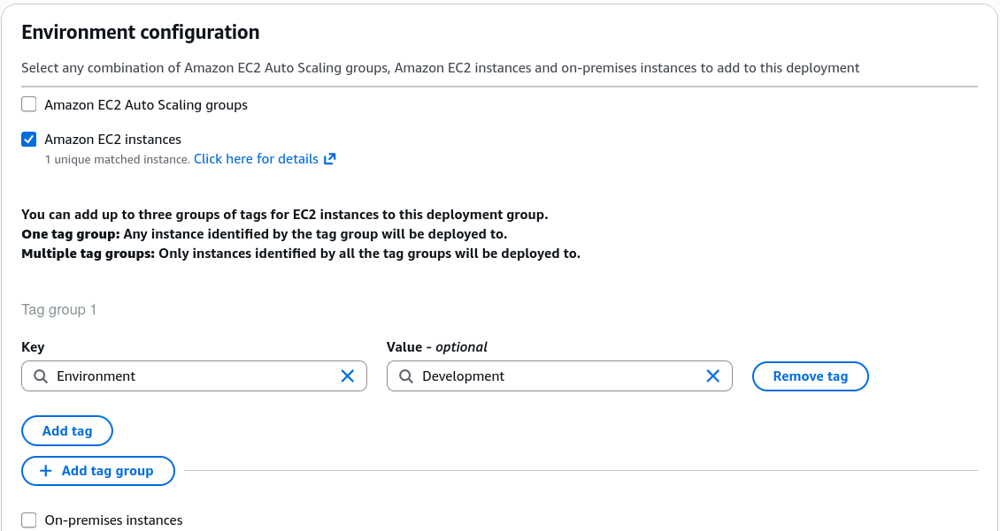
  - Set Agent Installation options to: **Never**.
  - Set Deployment Configuration options to: **`CodeDeployDefault.AllAtOnce`**.
  - Uncheck the box to Enable Load Balancing (since we are proxying straight to a single standalone server for this sandbox testing run) ──► click **Create deployment group**.  
    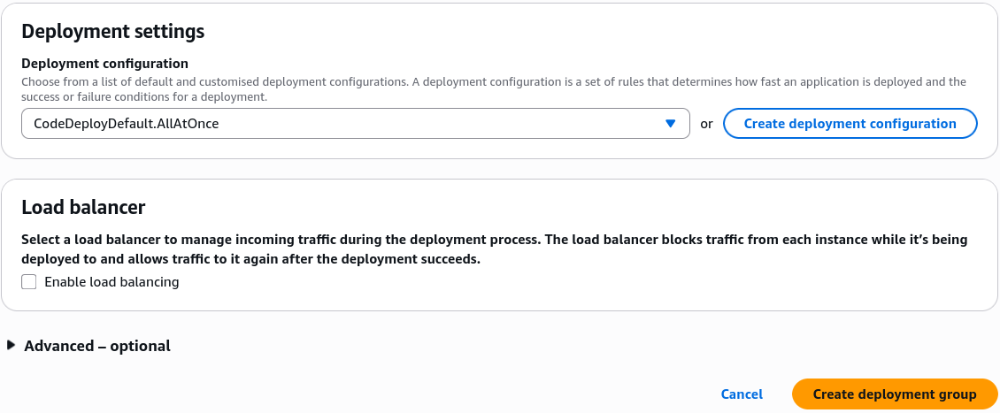

---

### 🚀 6. Triggering the Deployment Rocket Launch

- **Fire the Code Payload:** Inside your active deployment group view panel, look to the actions row on the top right and click **Create deployment**.
- **Reference the Target Build Archive:** Keep the settings pointed to your `DevelopmentInstances` group ──► set the Revision Type dropdown to **My application is stored in Amazon S3** ──► paste your copied **S3 URI** path string right into the tracking target box ──► click **Create deployment**.  
  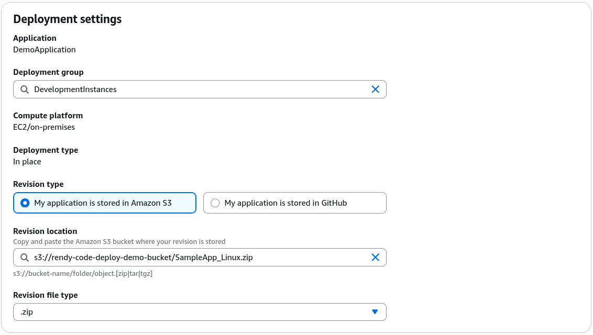
- **The Live Diagnostics Rollout:** The deployment transitions instantly to an active execution timeline. Click **View events** to watch the background CodeDeploy agent systematically grab your zip bundle, fire your installation lifecycle hook scripts, drop the files, and boot your Apache server.  
  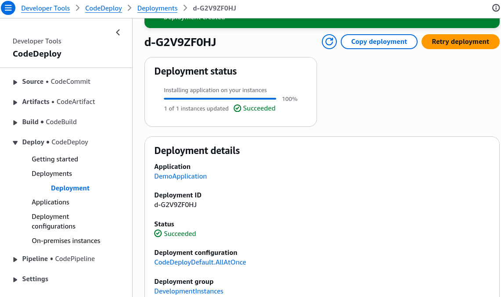
- **The Victory Lap Check 🏆:** Copy the raw public IP address of your EC2 instance node from the dashboard, paste it into a fresh browser URL line prefixing it with a raw `http://` call, and hit enter. The page loads instantly with a glorious banner text stating: **"Congratulations! This application was deployed using AWS CodeDeploy"**.  
  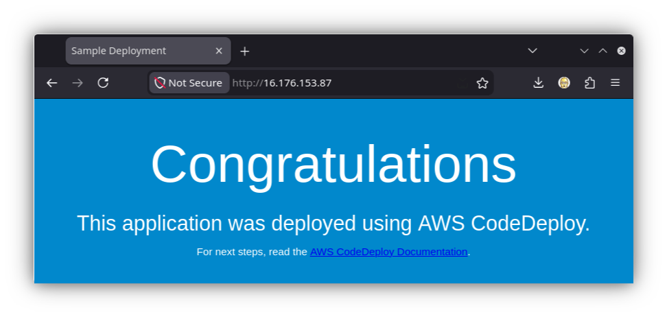

---

### 🛑 7. Absolute Final Clean-Up Reminder

:::tip
Do not forget to head right back over to your **Amazon EC2 dashboard console**, select your running `DemoWebServer` test box, hit instance state, and click **Terminate instance**. This instantly wipes out the virtual box and stops all background AWS compute billing meters completely.
:::
