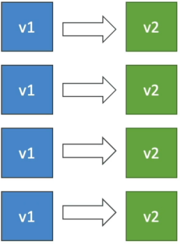
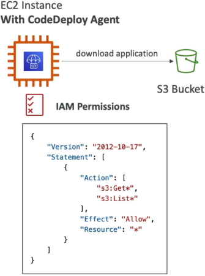
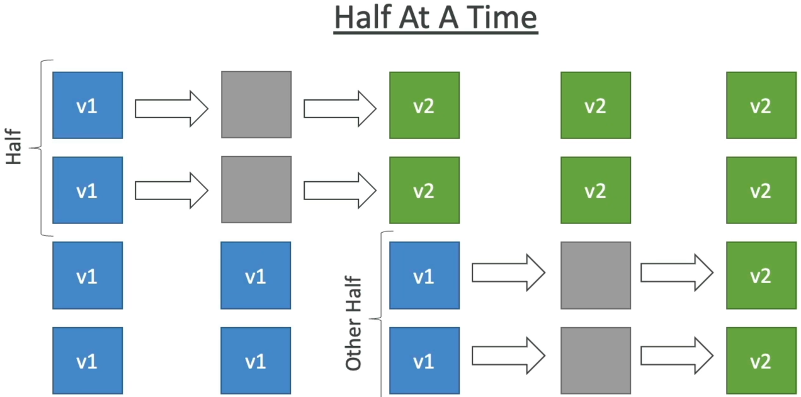
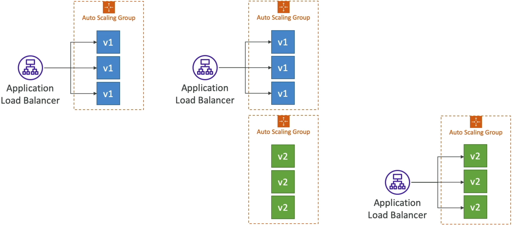
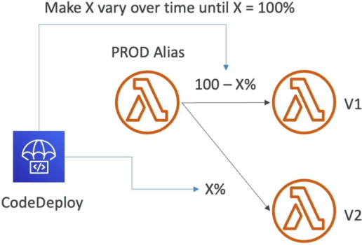
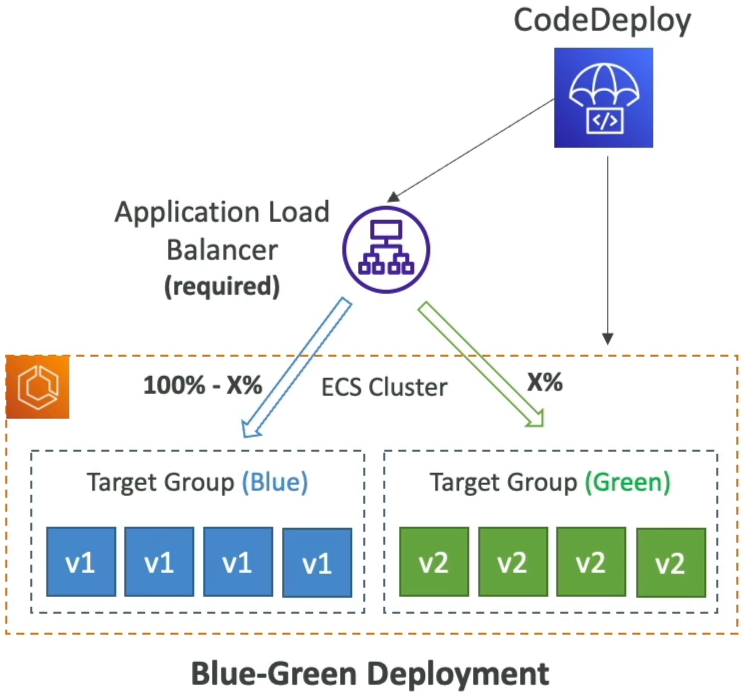

# CodeDeploy Overview

CodeDeploy is the heavy-lifting automated release engine of the AWS CI/CD suite. It handles taking a compiled code bundle (or a fresh container specification) and cleanly distributing it across your infrastructure. Whether you are running classic EC2 instance pools, cutting-edge serverless Lambda endpoints, or modern Dockerized ECS containers, CodeDeploy tracks the health of your rollout and forces an **automatic structural rollback** the exact millisecond a system alarm starts flashing.



---

## Key Takeaways

### 🏗️ The Deployment Frameworks & AppSpec Configuration

Just like CodeBuild can't move without a `buildspec.yml` file, CodeDeploy relies entirely on a dedicated configuration file that must live explicitly at the absolute root of your source tree:

:::note
The deployment configuration file MUST be named exactly "appspec.yml" (for EC2/On-Premises) or "appspec.yaml" (for Lambda/ECS) and sit at the root of your code directory, bro!
:::

The way this file behaves depends completely on the target platform hosting your application layer:

```text
🚀 THE THREE CODE-DEPLOY TARGET LANES:
   ├── 🏎️ 1. EC2 / On-Premise ──► Requires the CodeDeploy Agent + talks directly to an S3 Revision bucket.
   ├── 🧠 2. AWS Lambda ────────► Executes rapid, managed traffic-shifting under a dedicated function Alias.
   └── 🐳 3. Amazon ECS ────────► Swaps task definitions using an ALB traffic shift across two Target Groups.
```

---

### 🏎️ Lane A: EC2 & On-Premises Instances

To deploy code to Virtual Machines, you must meet a strict prerequisite: every target server must have the background **CodeDeploy Agent** installed and running. You can automate this installation easily using **AWS Systems Manager (SSM)**.

The EC2 instance profile must carry explicit IAM permissions to fetch raw zip archive files—known as an **Application Revision**—straight out of your pipeline's central Amazon S3 bucket.  


#### 🔀 In-Place vs. Blue/Green Styles

- **In-Place Deployment:** CodeDeploy uses the background agent to stop the app on your existing servers, overwrite the files, and restart the service.
- _The Speed Settings:_ You choose your traffic impact:
  - `AllAtOnce`: Fast, but drops your entire cluster offline (Max downtime.).
  - `HalfAtAtTime`: Upgrades exactly 50% of your fleet while the remaining 50% serves traffic.
    
  - `OneAtATime`: High availability, updates servers sequentially, but takes the longest time.
  - `Custom`: Define your own %.
- **Blue/Green Deployment:** CodeDeploy or an Auto Scaling Group provisions an entirely brand-new duplicate fleet of servers running version 2 side-by-side with your original fleet. The Application Load Balancer shifts traffic to the new servers, and the old fleet gets torn down.
  

---

### 🧠 Lane B: AWS Lambda (Serverless Traffic Shifting)

When dealing with serverless functions, CodeDeploy doesn't touch servers—it manages the atomic routing weights of an **AWS Lambda Alias** (like a pointer variable named `PROD`).

You can configure three precision traffic-shaping algorithms to safely move your users from version 1 over to version 2:

```text
⏱️ SERVERLESS SHIFTING STRATEGIES:
   ├── 📈 Linear: Increases traffic by exact intervals over time (e.g., 10% every 3 minutes until 100%).
   ├── 🦜 Canary: Drops a tiny sample fraction (e.g., 10% traffic) onto version 2 for a test window (e.g., 5 minutes).
   │              If no errors fire, it slams the remaining 90% over all at once!
   └── ⚡ AllAtOnce: Instantly flips 100% of live production traffic onto your new code.
```



---

### 🐳 Lane C: Amazon ECS (Container Task Swapping)

For **Amazon ECS**, CodeDeploy operates **strictly in Blue/Green mode**. It utilizes an Application Load Balancer fronting two completely independent backend **Target Groups**:

- **Target Group 1 (Blue):** Points to your active version 1 Docker containers.
- **Target Group 2 (Green):** Provisions your brand-new version 2 task definitions.

Once the green container fleet passes its baseline container health checks, CodeDeploy hooks into the ALB layer and initiates the exact same traffic-shifting algorithms used in the Lambda lane (Linear, Canary, or AllAtOnce) to smoothly transition network traffic from the blue group over to the green container group.


---

## Exam Tips

- **The Lambda Error Rollback Guardrail:** If an exam prompt presents a team deploying a critical serverless backend, and demands a solution that automatically rolls back to version 1 if the new version 2 Lambda drops any runtime errors during its 10-minute traffic-shift window—**look straight for coupling CodeDeploy Canary/Linear routing with a CloudWatch Alarm monitoring Lambda `Errors`! You bind the alarm directly to the CodeDeploy deployment group settings, and it will violently abort and reverse the traffic routing if triggered**
- **The Missing EC2 File Drift Trap:** If a question describes an EC2 instance deployment that keeps freezing up or throwing a hard `Deployment Failed` code right at the start of a run—check the instance state. **Ensure the background CodeDeploy Agent is actually running, and verify that the EC2 Instance IAM Role carries explicit `s3:GetObject` read permissions to grab the application revision package from the S3 deployment bucket.**
