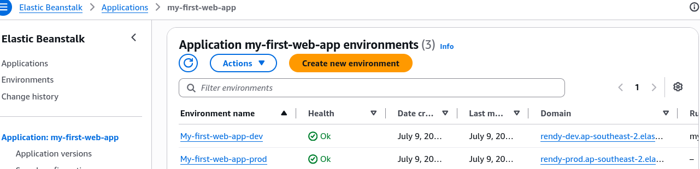

# CodePipeline - Hands On - Prerequisite

To show you how an enterprise continuous delivery pipeline can gracefully march updates across different isolation environments, Stephane’s lab has us spin up **two separate, running Elastic Beanstalk environments** inside a single application umbrella. One serves as our rapid `Dev` playground, and the other mimics our high-stakes, client-facing `Prod` system.

---

## Hands on

### 🌐 1. Provisioning Environment Tier A (The Dev Playground)

- **Launch the Control Center:** Open up your AWS Management Console, search for **Elastic Beanstalk**, and click **Create application**.
- **Establish the Corporate Umbrella:** Name the application `my-first-web-app` or something clean like `my-first-web-app-Beanstalk`.
- **Select the Engine Platform:**
  - Set the Environment Tier to: **Web server environment**.
  - Set the Managed Platform to: **Node.js**.
  - Keep the Platform Version defaults at their latest stable release values.
- **Dial in Low-Cost Capacities:** Set the application code setting to **Sample application**, and switch the capacity preset over to **Single instance** to keep the running footprint inside the free tier pool.
- **The Review Shortcut:** Click **Next** through the networking and security access cards (you can completely skip setting up an EC2 key pair for this testing run). Hit **Skip to review** ──► scroll to the bottom ──► click **Submit**.
- **The Succeeded Check:** Wait a few minutes while the cloud orchestrates your EC2, Auto Scaling, and S3 resources until the status ring shines a bright, healthy **Green**.

---

### 🚨 2. Provisioning Environment Tier B (The Production Target)

- **Mount the Sibling System:** Back inside your active Elastic Beanstalk application dashboard workspace, locate the actions panel on the top right and click **Create new environment**.
- **Differentiate the Workspace Target:** Select **Web server environment**, and name this secondary cluster explicitly: **`prod`**.
- **Match the Platform Configs:** Re-apply the exact same runtime environment variables: Select **Node.js**, choose the latest image version, and click **Sample application**.
- **Push the Build Live:** Click **Next** ──► click **Skip to review** ──► scroll to the bottom and hit **Submit**.
- **The Completed Setup Check:** Once this second process bakes cleanly, you now have two independent target domains up and running over the live web, chief!

  

---

### 🛑 3. The Absolute Essential Clean-Up Notice

:::warning
**THE PROVISIONED CHARGE WARNING:** Elastic Beanstalk automates provisioned server compute infrastructure. Even though we are running micro-tier configurations, **you are being billed 24/7 for the background EC2 instances as long as these environments stay alive.** The moment we wrap up the CodePipeline labs at the end of this module, remember to head straight back to your environments dashboard, hit actions, and select **Terminate environment** to freeze all background billing meters completely.
:::
