# CodePipeline - Hands On

We'll be creating out first multi-stage automated enterprise pipeline. Seeing those rolling environment updates march forward while a strict manual gatekeeper guards your production cluster is the absolute golden standard of modern DevOps engineering.

---

## Hands on

### 🎛️ 1. Orchestrating the Core Control Blueprint

- **Initialize the Pipeline Runway:** Launch the **CodePipeline** console workspace ──► click **Create pipeline** ──► choose **Build custom pipeline** and name it `MyFirstPipeline` ──► leave the execution mode set to **Queued**.
- **The Service Role Privilege Handshake:** Select **New service role** to let AWS automatically generate the foundational IAM permissions envelope.
- **🚨 THE CORE PRODUCTION ELEVATION PATCH:** Before proceeding, you must ensure the pipeline can actually talk to your target servers. Open the newly generated pipeline service role in the IAM console ──► hit **Attach policy** ──► search for and append **`AWSElasticBeanstalkAdministratorAccess`** directly to the role. _Console Hook:_ If you skip this critical step, the pipeline will pull your code but throw a hard permissions collision the exact microsecond it tries to touch your Beanstalk clusters.
  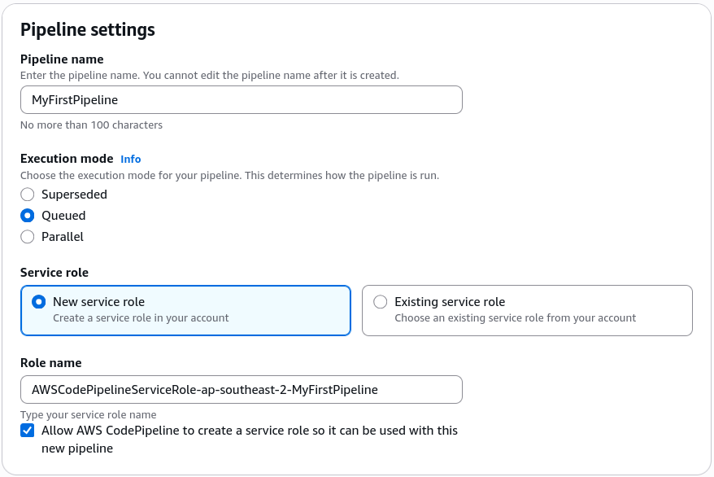

---

### 📁 2. Securing the Inbound Pipeline Hook (Source Step)

- **Target the Source Provider:** Set the Source Step action provider dropdown to **GitHub (via Github App)**.
- **Establish the Secure Web Access Tunnel:** Click **Connect to GitHub** ──► name your pipeline connection asset `MyGitHubConnection` ──► hit authorize to approve the native AWS Connector handshake.
  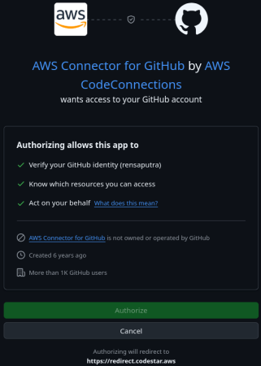
- **Configure App Scopes:** Click **Install a new app** ──► select your target personal/corporate GitHub workspace account ──► select your repository target (`my-nodejs-app`) ──► click connect to flip the connection status to **Available**.
  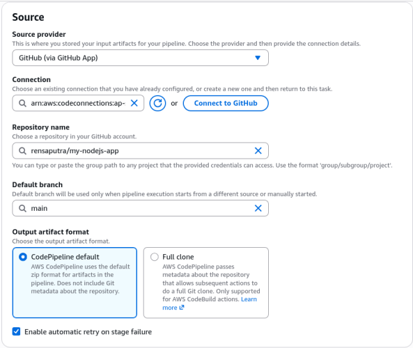
- **Establish the Change Filter Trigger:** Select your primary tracking branch (e.g., `main` or `master`) ──► verify that the output format uses the **CodePipeline default** schema ──► confirm that a native push filter rule is assigned to watch your target branch.
  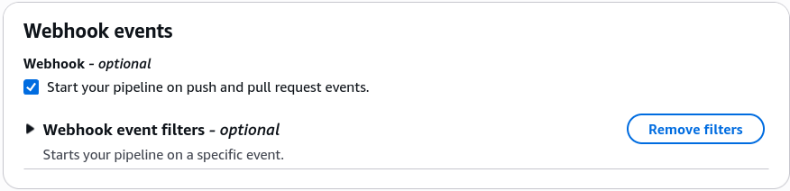
- **Bypass the Initial Compilation Step:** For this simple web layout, click **Skip build stage** and **Skip test stage**to jump straight over the deploy stage for now.

---

### 🚀 3. Hooking Up Lower-Tier Deployments (Dev Stage)

- **Target the Deploy Provider:** Set the Deployment provider dropdown strictly to **AWS Elastic Beanstalk**.
- **Lock in the Dev Target Environment:** Select your global application container umbrella name ──► choose your baseline playground workspace identifier (`dev` or your standard active environment) ──► hit Next ──► click **Create pipeline**.
  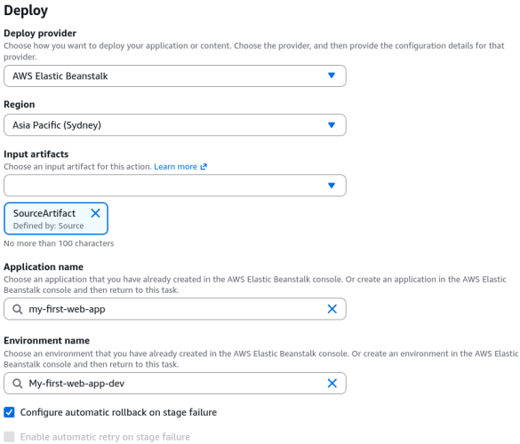
- **The Automated Delivery Execution:** The moment the setup wizard closes, CodePipeline instantly wakes up, executes a background API call to extract your repository code zip file, stores it as an **Input Artifact inside an underlying S3 bucket**, and pushes it directly down to your Dev Beanstalk instance to turn the background server page a clean blue layout.
  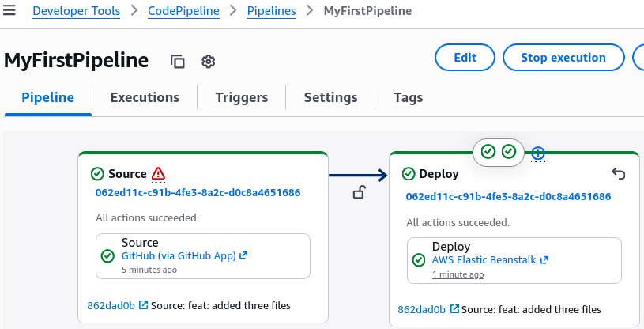

---

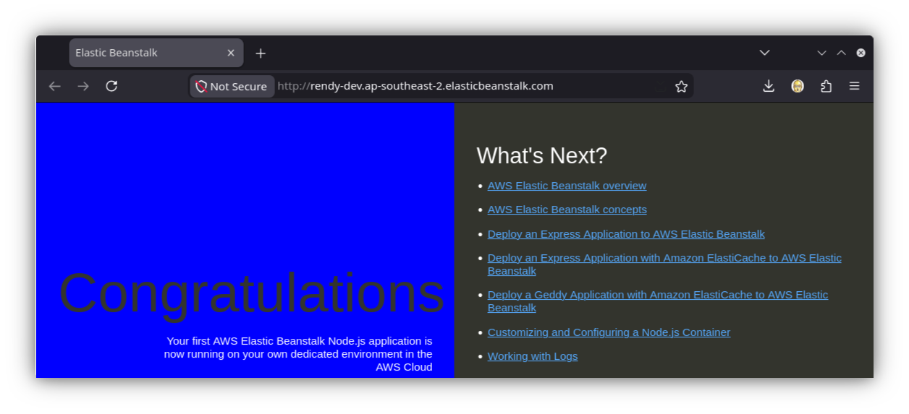

---

### 🛡️ 4. Hardening the Edge Line with Multi-Stage Progression (Prod Stage)

- **Enter the Layout Designer:** Inside your active pipeline view panel, hit the top-level **Edit** configuration utility ──► scroll to the bottom of the canvas ──► click **Add stage** ──► name this secondary target block **`DeployToProd`**.
  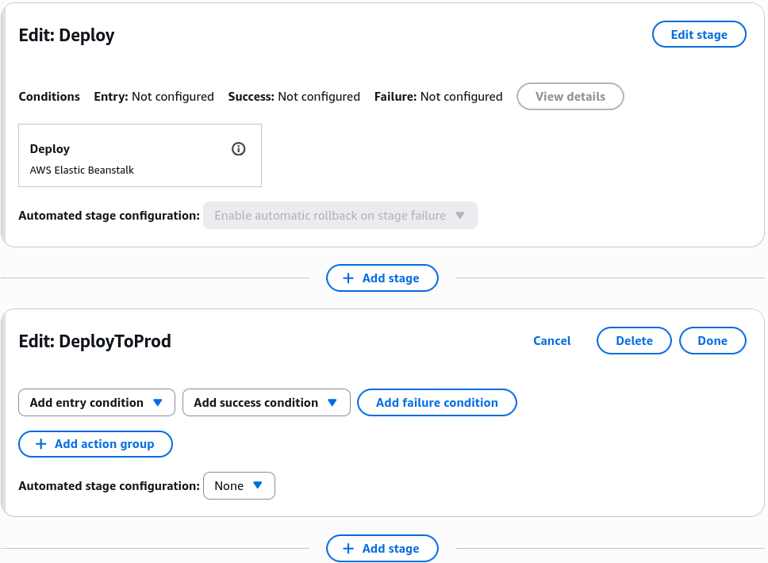
- **Action Group A: The Sentry Gatekeeper (Manual Approval):**
  - Click **Add action group** inside the fresh stage block.
  - Set the Action Provider dropdown explicitly to **Manual approval** ──► name the rule block `manual-approval`.
  - Leave the notification variables at their default empty values (or link an explicit SNS ARN for email alert tracking) ──► click Done.
- **Action Group B: The Production Rocket Launch (Sequential Deploy):**
  - Click **Add action group** directly beneath the manual approval slot to link a sequential dependency.
  - Set the Provider to **AWS Elastic Beanstalk** ──► name it `DeployToProdBeanstalk`.
  - Declare the explicit Input Artifact target point: **`SourceArtifact`** (pulls the exact frozen code zip asset right out of the S3 store bucket).
  - Switch the environment parameter target pool explicitly over to **`prod`** ──► click Done ──► scroll to the top global nav and hit **Save**.
    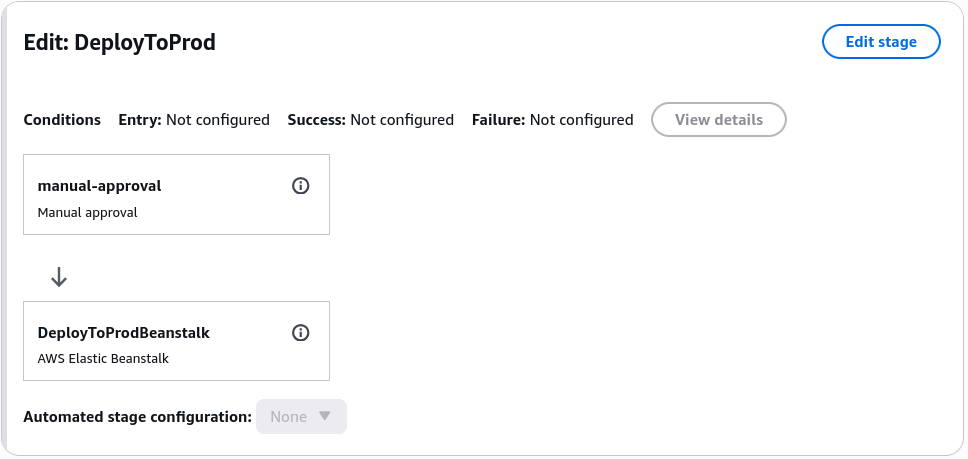

---

### 🧪 5. Executing the Full Lifecycle Rollout Test

- **Trigger a Code Delta Shift:** Head over to your source code repository, edit your `index.html` file layout, change the background color parameter string from `blue` over to **`green`**, and commit the delta payload straight to your tracking branch.
- **Phase 1 Execution (Dev Rollout):** CodePipeline intercepts the push hook immediately. The Source block passes green, and the Dev stage auto-deploys, turning your development environment domain instant green.
  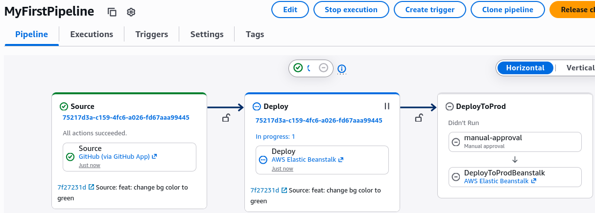
- **Phase 2 Halting State (The Perimeter Lock):** The execution pipeline hits the `DeployToProd` stage and abruptly freezes, throwing a yellow alert badge stating **Approval Review Required**. The production web page stays safely stuck on its old green layout, bro.
  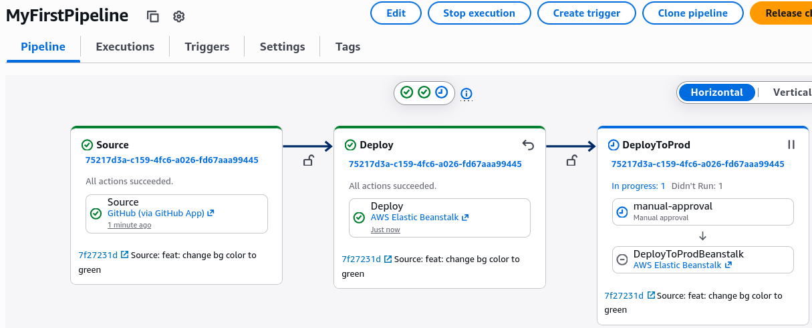
- **Phase 3 Pushing to the Wild (The Production Release):** Review your dev environment, verify the green layout looks flawless, click **Review** on the pipeline badge, type your deployment logs like _"Looks good in green!"_, and hit approve.
  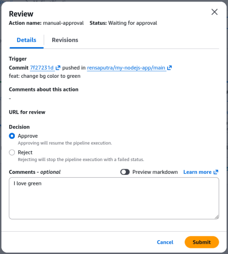
- **The Win:** The manual lock clears out, the sequential Beanstalk deploy action triggers, and your production servers gracefully roll over to display your brand new green page to the public web.
  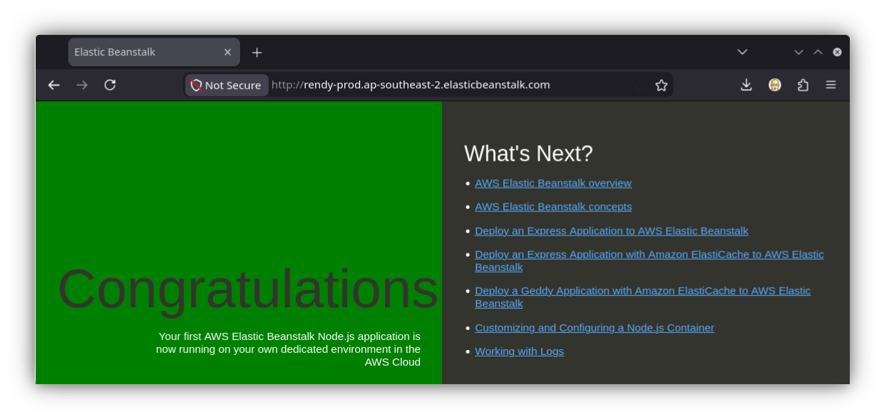

---

## Exam Tips

- **The Artifact Persistence Model:** Notice how your production deploy action references the exact same raw `SourceArtifact` string, chief. This guarantees that **the exact identical compiled binary payload that was verified inside your Dev sandbox is what flies into Production**, avoiding any code mismatch drift between environments.
- **Sequential Delivery Architecture:** Remember for scenario questions that multiple action groups stacked vertically inside a single pipeline stage block will run **sequentially**, demanding that the previous condition completely resolves with a success code before triggering the next line item.
