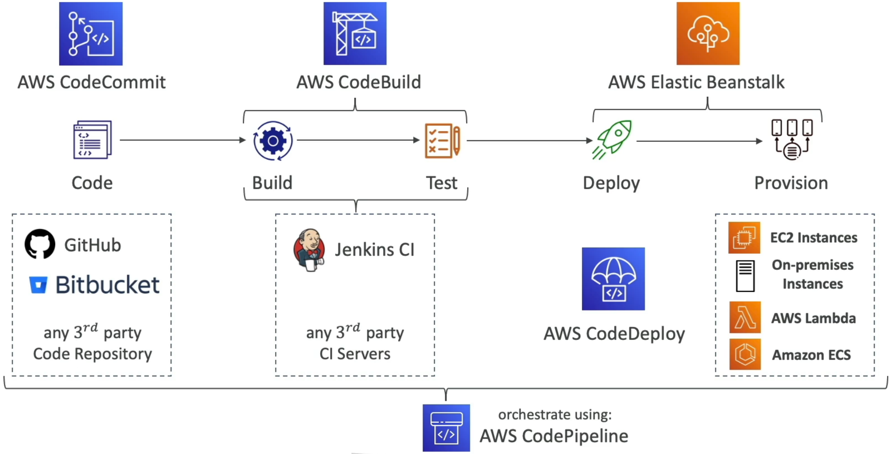

# CodePipeline Overview

Welcome to the centralized nervous system of your DevOps strategy. **AWS CodePipeline** is the absolute master conductor that takes all your independent serverless tools—your source trees, compiler runtimes, and deployment targets—and strings them together into a flawless, automated delivery machine.

Instead of forcing your developers to manually pass files along, watch code runners, or type script hooks, CodePipeline visually maps out your release stages. It watches your repositories like a hawk, captures code state transitions, and seamlessly pushes data down the line with zero friction.

## 

## Key Takeaways

### 🏗️ The Stages & Actions Matrix

A pipeline is organized into structural blocks called **Stages** (e.g., `Source`, `Build`, `Staging`, `Production`). Inside each stage, you declare individual **Actions** that can run either **Sequentially** (one after another) or in **Parallel** (simultaneously to save pipeline execution time, bro).

You can pull from a wide array of native and third-party action blocks:

- **Source:** CodeCommit, Amazon S3, Amazon ECR, GitHub, or Bitbucket.
- **Build & Test:** AWS CodeBuild, Jenkins, Device Farm, or TeamCity.
- **Deploy:** AWS CodeDeploy, Elastic Beanstalk, AWS CloudFormation, Amazon ECS, or Amazon S3.
- **Control Overrides 🛑:** You can insert a **Manual Approval Action** right before your production stage. The pipeline halts completely, shoots an SNS email notification to your team lead, and waits for a physical click review before rolling the update out to your live users!

---

### 📦 Under the Hood: The Artifact Store Pipeline

This is an absolute milestone architectural concept for the exam. **How do your pipeline steps pass code files to each other behind the scenes?**

AWS CodeBuild and AWS CodeDeploy do _not_ query CodeCommit or GitHub directly during a pipeline run. Instead, CodePipeline uses **Amazon S3 as its centralized transient Artifact Store.**

```text
🔄 THE CODEPIPELINE DATA BUS MATRIX:
   ├── 📁 1. Developer pushes code ──► Hits CodeCommit Repo
   ├── 🎛️ 2. CodePipeline pulls zip ─► Drops it into S3 Bucket as an "Input Artifact"
   ├── 🔨 3. CodeBuild grabs zip ────► Compiles binaries inside container via S3 fetch
   └── 📦 4. CodeBuild outputs zip ──► Pushes compiled binary back to S3 as an "Output Artifact"
```

Every single step reads from the previous step's **Input Artifact** and writes to its own **Output Artifact** straight inside that dedicated, encrypted S3 bucket. If you delete that underlying artifact bucket, your entire pipeline immediately breaks.

---

### 🛠️ Pipeline Diagnostic & Troubleshooting Playbook

When your pipeline execution throws a red block or freezes up, the DVA-C02 blueprint expects you to know exactly which diagnostic tool to query:

#### 🚨 Scenario A: Insufficient Permissions (The IAM Fix)

- **The Bug:** The pipeline throws a hard error stating it `Could not access the CodeCommit repository` or fails to spin up a build step.
- **The Triage:** Check the **CodePipeline Service Role**. CodePipeline needs explicit IAM permissions to list S3 bucket keys, call `sts:AssumeRole` across separate builder tracks, and read repository states. If the service role is missing these blocks, execution drops instantly.

#### 📊 Scenario B: Automated Failure Alerts (The EventBridge Fix)

- **The Bug:** Your engineering team wants to get an instant email alert or Slack ping the exact second a production deployment action enters a `FAILED` or `CANCELLED` state.
- **The Triage:** You target CodePipeline state changes using **Amazon EventBridge**. You write a rule listening for `CodePipeline Pipeline Execution State Change` events filtering on `status: ["FAILED"]`, and map the target output straight to an Amazon SNS topic or AWS Chatbot terminal!

#### 🔍 Scenario C: Auditing Blocked API Calls (The CloudTrail Fix)

- **The Bug:** Your pipeline is dropping security validation handshakes, and you need a granular audit log tracking exactly _which_ API method block is throwing hidden access denials behind the scenes.
- **The Triage:** Pull up **AWS CloudTrail**. It maintains an immutable audit ledger of every single AWS API call executed by the CodePipeline service role, mapping out the exact IAM identity payload and failure signature blocks.

---

## Exam Tips

- **The Transient Storage Dependency:** If a test question asks why a newly created pipeline is instantly crashing during its compilation stage, and states that an engineer cleared out some old, unmanaged storage assets earlier in the day—**look straight for the S3 Artifact Bucket.** If someone manually purges or modifies the permissions on the central S3 bucket assigned as the pipeline's artifact store, the data pipeline completely collapses.
- **The Cross-Account Delivery Wall:** If an enterprise scenario requires a pipeline hosted in a `Dev` AWS Account to deploy code straight to an S3 bucket or EC2 fleet hosted over in a completely separate `Production` AWS Account—remember the security handshake: **You must configure a Customer-Managed KMS Key to encrypt the pipeline artifacts, grant the Production account cross-account access to the Dev S3 artifact bucket, and let CodePipeline execute an `sts:AssumeRole` call to use a deployment role inside the Production tier.**
