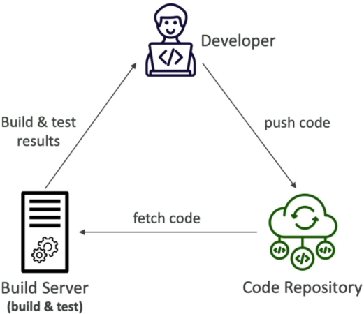
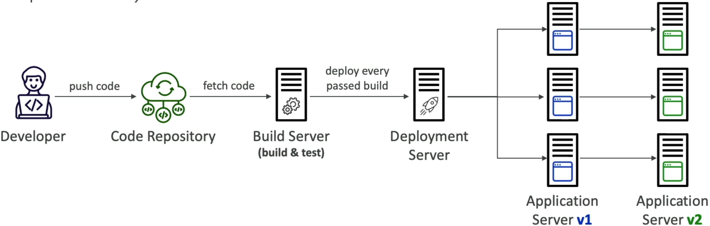
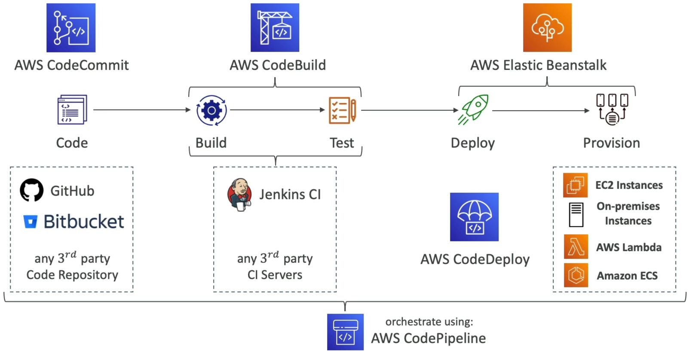

# Introduction to CICD in AWS

Breaking down the baseline philosophy of CI/CD is where we drop the chaotic "cowboy coding" habits and step straight into world-class enterprise software delivery loops.

Stephane nails it in the lecture: doing deployments manually is a recipe for straight disaster. If you have to manually zip up files, run ad-hoc scripts from your local terminal, or tweak files directly inside the AWS Console, it's not a matter of _if_ you will break production, it's a matter of _when_. All it takes is one missing environment variable or a local mismatch in your runtime version to bring down your whole app footprint.

---

## Key Takeaways

### 🏗️ Continuous Integration (CI): The Automated Shield 🛡️

**Continuous Integration** is all about shifting your code-testing and validation steps as far left as humanly possible, bro. Instead of waiting months to merge code blocks, developers push small, incremental feature branch updates straight to a shared source repo multiple times a day.

#### 🔄 The Automated Feedback Loop:

1. You execute a simple `git push origin feature-branch` from your terminal.
2. A centralized **Build Server** (like **AWS CodeBuild** or Jenkins) instantly catches that hook event.
3. The server provisions an isolated container, pulls down your branch code, installs the dependencies, and fiercely executes your entire array of unit tests, syntax linters, and security scanners.

#### ⚡ The Operational Win:

If a buggy code block or a broken test leaks through, the build server immediately flashes red and flags the error back to the developer within minutes. Because you catch the regression instantly, you fix it instantly—saving your team from tracing deep runtime anomalies days or weeks later down the track.



---

### 🚀 Continuous Delivery (CD): The Rapid Delivery Line

Once your code sails through the CI checkpoint with a clean, passing green checkmark, the **Continuous Delivery** phase steps in to automate the deployment mechanics across your distinct environment stages.

#### 🔀 The Progression Pipeline:

```text
🔨 CI Green Build ──► 📂 DEV Stage ──► 🔬 TEST Stage ──► 👥 STAGING (Pre-Prod) ──► 🚨 PROD Stage (With Manual Approval)
```

#### 🎯 Core CD Delivery Models:

- **Continuous Delivery:** The build artifact automatically marches through your lower staging environments flawlessly. However, pushing the final configuration into the live, customer-facing **Production** stage requires a controlled **Manual Approval** gatekeeper action (like clicking an approve button in CodePipeline) before the deployment executes. **This is the industry standard for enterprise risk mitigation.**
- **Continuous Deployment:** The ultimate, extreme automation track. There are zero manual gates, chief. If your code passes every single test suite in the pipeline, it flies automatically into active production without human intervention.



---

### 🚨 VITAL DVA-C02 UPDATE: The CodeCommit Plot Twist! 🚨

If you are looking at older study materials or practice tests, they will tell you that AWS CodeCommit is being phased out or de-emphasized. **Forget that old noise.**

While AWS briefly closed sign-ups for new customers back in 2024, the global developer community spoke up loud and clear about how essential its deep, native IAM permissions, VPC endpoints, and serverless security boundaries are for regulated enterprise environments.

As of **late 2025, AWS officially returned CodeCommit to full General Availability for all new and existing accounts!** They are actively backing the service, adding fresh features (like Git LFS support in early 2026), and expanding regional deployments.

For your DVA-C02 exam day, **CodeCommit is 100% active, viable, and testable** alongside modern third-party source connections like GitHub and Bitbucket!

---

## Exam Tips

- **The Velocity vs. Stability Battle:** If an exam prompt presents a scenario where a development team wants to deploy multiple rolling code updates to production up to 5 times a day safely, while reducing manual configuration drift errors and finding code bugs within minutes of writing them—**look straight for a unified CI/CD architecture leveraging an automated pipeline tool.**
  
- **The Orchestration Blueprint:** Always remember the distinct separation of duties inside the cloud-native tool suite:
  - **Source:** CodeCommit / GitHub (Stores the blueprints).
  - **Build/Test:** CodeBuild (Runs the test runners and outputs the compiled artifacts).
  - **Deploy:** CodeDeploy / Elastic Beanstalk (Rolls the code onto live servers).
  - **Orchestration:** CodePipeline (The central nervous system linking every phase together).
