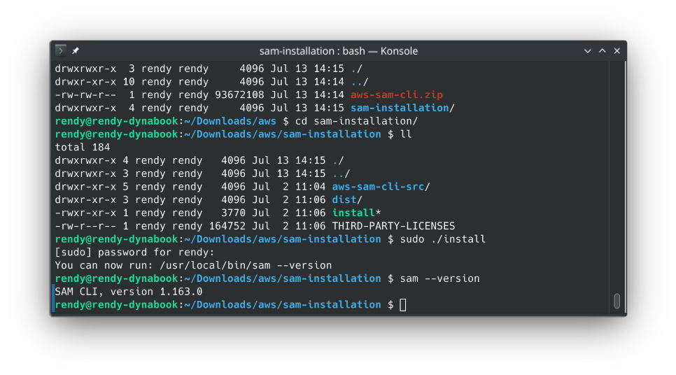
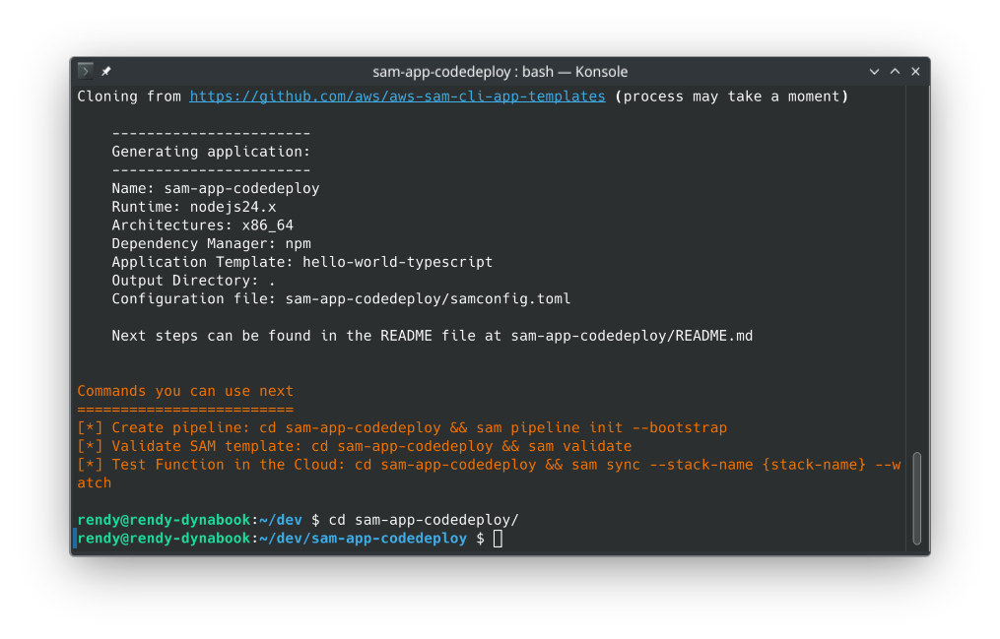
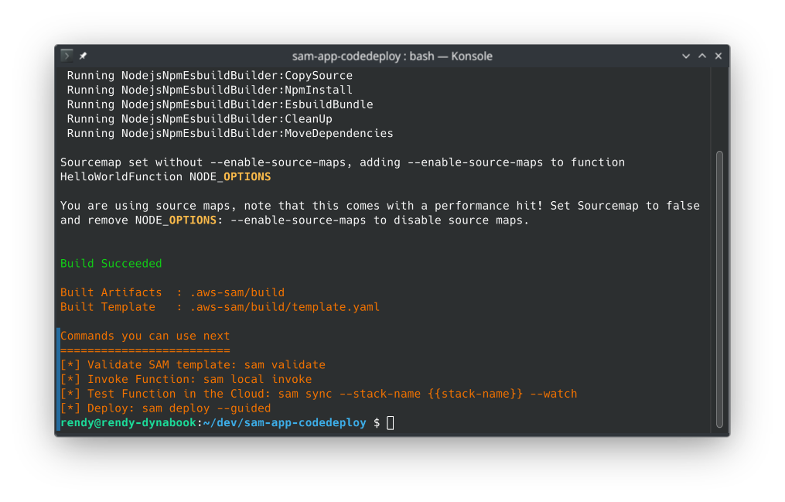
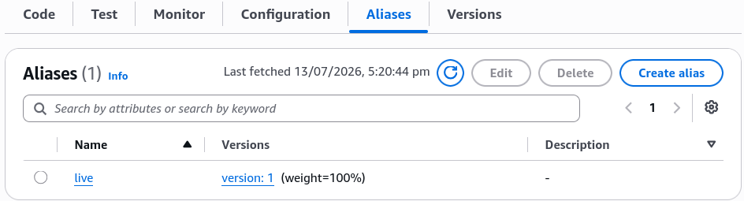
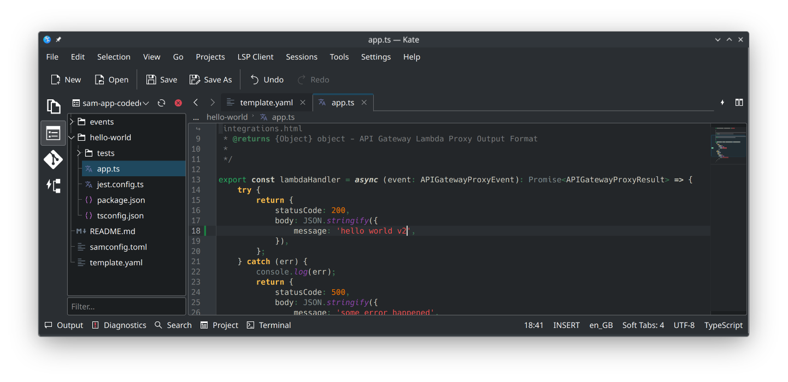
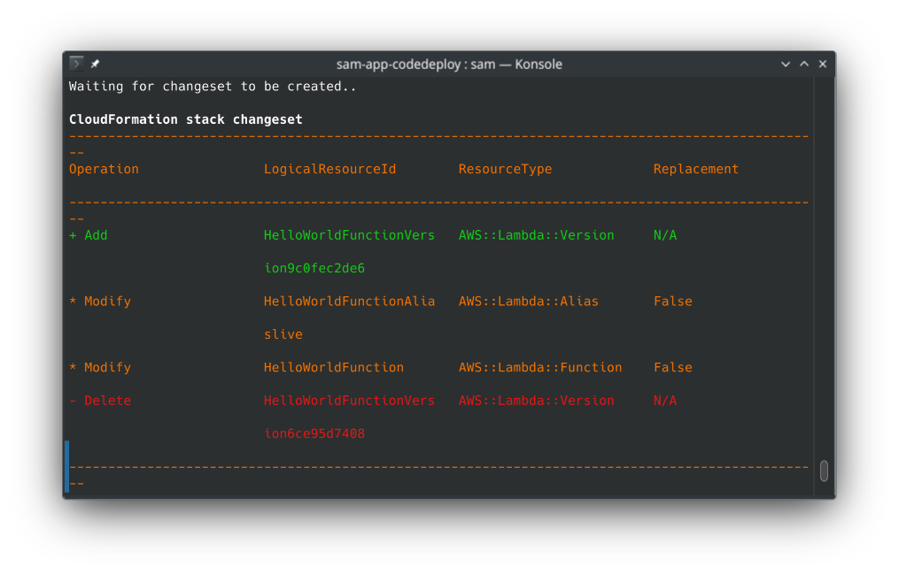
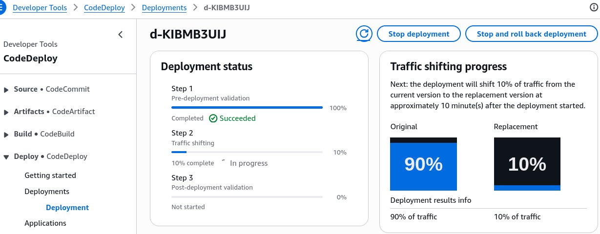
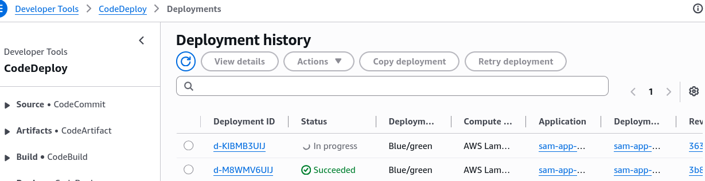
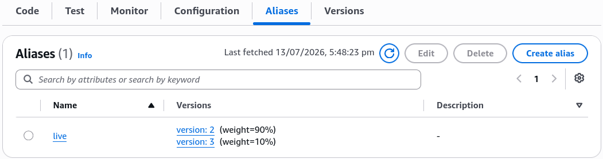
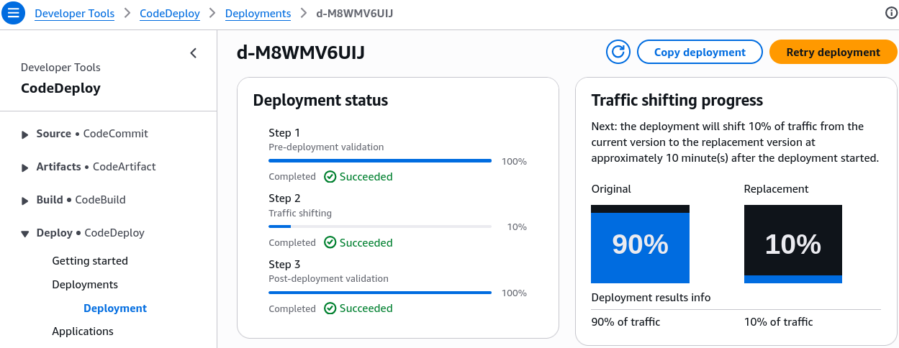

# SAM with CodeDeploy

Integrating **AWS CodeDeploy** natively right inside your **AWS SAM** serverless design canvas is how you achieve absolute black-belt master status in enterprise engineering.

Stephane’s walkthrough drops a massive truth bomb: you don't need to manually configure external webhooks or stand up separate CodeDeploy target architectures just to execute a safe release block for serverless functions. By embedding a tight `DeploymentPreference` key block directly inside your `AWS::Serverless::Function` layout properties, the underlying SAM transformation macro engine automatically wires up full, state-tracked **Serverless Traffic-Shifting Aliases** behind the scenes.

---

## Key Takeaways

- **`AutoPublishAlias`** is the secret sauce that tells SAM to stop pointing your function directly at an ephemeral `$LATEST` code state. Instead, it generates an immutable, incremental function **Version** block on every push and binds a dedicated routing pointer tag named **`live`** right over it.
- **`DeploymentPreference`** is the configuration block that defines the CodeDeploy rolling strategy, including the type of deployment (e.g., Canary, Linear and AllAtOnce) and associated settings.
- **`Alarms`** is the optional configuration array that binds CloudWatch Alarm resources to your deployment. If any of the alarms trigger during a traffic shift, CodeDeploy automatically rolls back the release to the previous version.
- **`Hooks`** is the optional configuration array that binds custom Lambda functions to your deployment. You can run a Lambda function before traffic shifts to validate the new version, and you can run a Lambda function after traffic shifts to validate the new version in production.
  - **`PreTraffic`** is the hook that runs before traffic shifts. If it fails, the rollout aborts immediately.
  - **`PostTraffic`** is the hook that runs after traffic shifts. If it fails, the rollout aborts immediately.

## Hands On

### 🖥️ 0. Local CLI Setup

In the previous hands-on, we were using SAM CLI inside CloudShell. For this hands-on, we will be using local CLI to build and deploy the application. Here is how I set up in my **Linux machine**:

- **Download the package:** Grab the zip for your architecture (e.g., `x86_64` or `arm64`)
  ```bash
  curl -L "https://github.com/aws/aws-sam-cli/releases/latest/download/aws-sam-cli-linux-x86_64.zip" -o "aws-sam-cli.zip"
  ```
- **Unzip the package:**
  ```bash
  unzip aws-sam-cli.zip -d sam-installation
  ```
- **Run the install script:**
  ```bash
  sudo ./sam-installation/install
  ```
- **Verify the installation:**
  

### 🏗️ 1. Initialise a template SAM project

Let's initialise a new SAM project using the `hello-world` template:

- Start by running `sam init` and select the following options:
  - **Template Source:** Choose `1` (**Quick Start Template**).
  - **Template Variant Setup:** Choose **`1`** (**Hello World Example** template option).
  - **Runtime Engine Lane:** Select the latest stable Node.js option (like Node.js 24 or newer).
  - **Project Naming:** Type `sam-app-codedeploy` and smash enter.  
    

### 📜 2. The Architectural Blueprints (`template.yaml`)

To command SAM to use CodeDeploy for zero-downtime canary or linear rolling releases, you inject a specialized declaration map beneath your function’s core configuration properties:

```yaml
HelloWorldFunction:
  Type: AWS::Serverless::Function
  Properties:
    Handler: app.lambdaHandler
    Runtime: nodejs24.x
    CodeUri: hello_world/
    AutoPublishAlias: live # 🧠 CRITICAL STEP 1: Spawns the named routing Alias!
    DeploymentPreference:
      Type: Canary10Percent10Minutes # 🎛️ CRITICAL STEP 2: Sets the CodeDeploy speed configuration lane
      Alarms:
        - !Ref MyFunctionErrorsAlarm # 🚨 OPTIONAL: Binds CloudWatch rollback triggers
      Hooks:
        PreTraffic: !Ref PreTalkLambda # 🔬 OPTIONAL: Custom validation scripts before shifting traffic
```

- **`AutoPublishAlias: live` 🧠:** This parameter tells SAM to stop pointing directly to an ephemeral `$LATEST` code state. Instead, it generates an immutable, incremental function **Version** block on every push and binds a dedicated routing pointer tag named **`live`** right over it.
- **`DeploymentPreference` 🎛️:** This declares your CodeDeploy rolling strategy. You pass standard native algorithms like `Canary10Percent10Minutes` or `Linear10PercentEvery3Minutes`.

---

### 🔨 2. Staging the Baseline Release (Version 1)

- **Compile the Local Tree:** Jump into your fresh root directory space and execute the compiler wrapper:

  ```bash
  sam build
  ```

  

- **Launch the Guided Installation Profile:** Ship the initial structural blueprint up to the cloud by running:

  ```bash
  sam deploy --guided
  ```

_The Cloud Execution Reality:_ On this very first initial run, because there is no previous version to pivot away from, CodeDeploy skips the traffic-shifting wait period entirely. It builds your IAM execution roles, sets up the API Gateway route filters, deploys function Version 1, and assigns 100% of the network weight to the `live` alias pointer instantly.  
 

---

### 🧪 3. Simulating a Live Version 2 Update (The Canary Shift!)

- **Trigger a Code Delta Shift:** Open your function source logic file (`hello_world/app.ts`) inside your editor terminal pane, edit the return string dictionary text body parameter from `"hello world"` over to a fresh layout value like **`"hello world v2"`**, and hit save.  
  
- **Repackage the Code Artifacts:** Re-run the local compiler to zip your updated script changes:

  ```bash
  sam build
  ```

- **Execute the Cloud Update Hook:** Push the changes back up to CloudFormation by firing:

  ```bash
  sam deploy --guided
  ```

- **Watch the Changeset Intercept:** The terminal streams out the changeset breakdown list. You will visually spot a modification flag targeting your named Lambda function Alias resource. Confirm the update prompt with a sharp **`y`** (Yes)!  
  

---

### 🔍 4. Auditing Live Shifting Mechanics in Real Time

The exact millisecond CloudFormation pushes the changeset down the wire, the active release baton is seamlessly handed off straight to the **CodeDeploy console tier.**


Open your AWS Management Console in another tab and audit the underlying changes live:

- **The CodeDeploy Cockpit:** Pull up the **CodeDeploy dashboard**. You will spot a live, actively running `Blue/Green` deployment record. Click the Deployment ID to look at the granular execution status card!  
  
- **The Weight Matrix Shift:** Head over to your Lambda function dashboard qualifiers tab and drop down the alias properties. You will see both **Version 1 (Old Blue)** and **Version 2 (New Green)** sitting active side-by-side, split precisely at **90% / 10% weights**.  
  
- **The 10-Minute Perimeter Sandbox:** For exactly 10 minutes, only 10% of global web requests hitting your endpoint will route down the fresh v2 code pipeline, while 90% stay safely served by v1.
- **The Auto-Healing Shield:** If your connected CloudWatch Alarm catches a sudden spike in application processing errors or throws a red status flag at any point during this 10-minute window, CodeDeploy kills the release instantly, terminates v2, and snaps the alias weights back to 100% on v1—protecting your users from bugs completely automatically!
- **The Succeeded Completion:** Once the 10-minute clock finishes rolling with zero errors, the lifecycle status turns a clean **Passing Green**. CodeDeploy rolls the remaining traffic over, updating your `live` alias pointer to lock 100% of network traffic straight onto Version 2.  
  

---

## Exam Tips

- **The Validation Hooks Sequence:** Remember for scenario questions that SAM lets you define two custom Lambda functions to validate code states: **`PreTraffic`** (runs tests _before_ the traffic shift begins; if it fails, the rollout aborts immediately) and **`PostTraffic`** (runs tests _after_ traffic hits 100% to run final production checkouts, chief!).
- **The CloudWatch Rollback Binding:** If an exam prompt introduces a DevOps team that needs to enforce automated rollback logic for serverless code updates based specifically on API Gateway latency spikes or Lambda error rates—**ensure you declare the exact CloudWatch Alarm resource names directly inside the `Alarms:` configuration array block under the function's `DeploymentPreference` block within the `template.yaml` file.**
