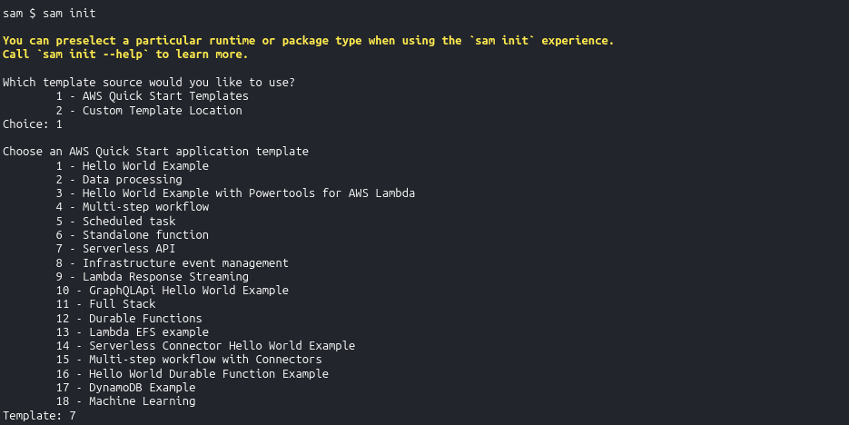
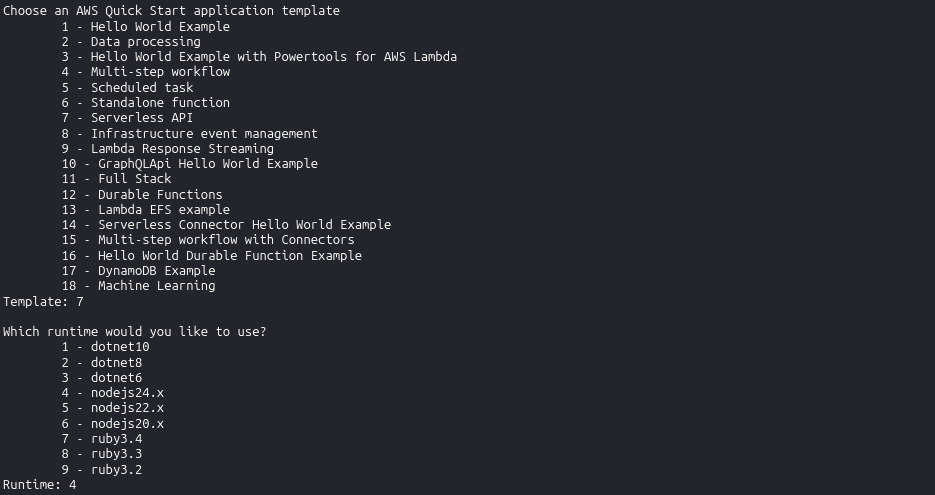
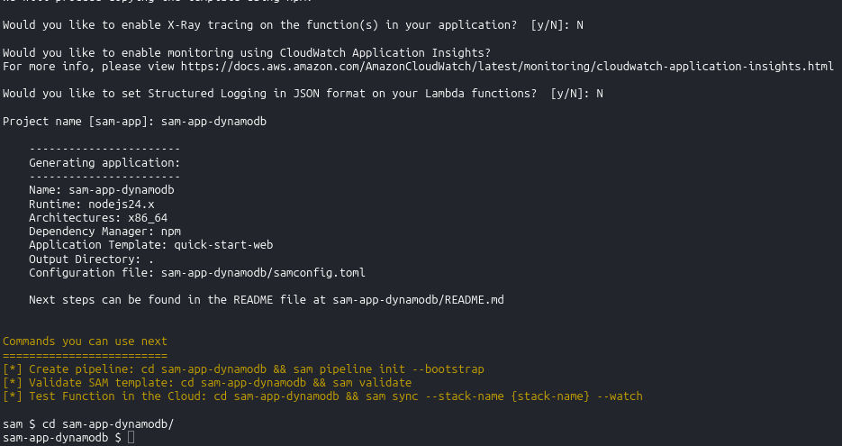

# SAM with DynamoDB - Hands On

Dropping a full-blown CRUD database backend straight into your serverless API array using just a few clean lines of YAML is exactly how we scale enterprise applications like absolute cloud architects.

Stephane’s walkthrough shines a massive spotlight on the real engineering magic of the SAM framework: **Policy Templates** and **SimpleTable abstractions**. Instead of manually coding 40 lines of explicit IAM JSON statements full of granular Actions and Resource strings just to let a function write to a database, SAM condenses that whole mess down to a tiny, elegant key-value configuration pair.

---

## Hands On

### 🐿️ 1. Initializing the Scalable REST Architecture

- **Spawn the Project Matrix:** Open your active **AWS CloudShell** panel ──► run the initialization layout wrapper command:

  ```bash
  sam init
  ```

  

- **Navigate the API Template Options:** Select the following configuration handles to stage a Node.js-based database stack:
  - Template Source: Choose `1` (**Quick Start Template**).
  - Template Variant Setup: Choose **`7`** (**Serverless API** template option).
  - Runtime Engine Lane: Select the latest stable JavaScript option (like Node.js 24 or newer).
  - Project Naming: Type `sam-app-dynamodb` and smash enter.  
    
- **Enter the Canvas Runway:** Jump straight inside your newly provisioned directory tree: `cd sam-app-dynamodb`.  
  

---

### 📜 2. Dissecting the `template.yaml` Power-ups

When you open up the generated template configuration, notice the two game-changing serverless primitives that replace massive chunks of classic legacy CloudFormation infrastructure boilerplate:

#### 🧠 Feature A: Scoped Scaffolding via SAM Policy Templates

Look at how the template handles security rights for the GET and POST Lambda functions:

```yaml
Policies:
  - DynamoDBCrudPolicy:
      TableName: !Ref SampleTable
```

- _The Architecture Win:_ This is the legendary **`DynamoDBCrudPolicy`** template block. Behind the scenes during execution, the SAM macro transformer automatically inflates those two basic lines into an explicit, highly secure IAM policy containing exactly the scoped CRUD parameters needed (`GetItem`, `PutItem`, `Scan`, `Query`, etc.) bounded strictly to your table resource—enforcing the **Principle of Least Privilege** with absolute zero configuration sweat.

#### 📊 Feature B: The `AWS::Serverless::SimpleTable` Primitive

Scroll to the base of the template file to spot your database instance instantiation statement:

```yaml
SampleTable:
  Type: AWS::Serverless::SimpleTable
  Properties:
    PrimaryKey:
      Name: id
      Type: String
    ProvisionedThroughput:
      ReadCapacityUnits: 2
      WriteCapacityUnits: 2
```

- _The Architecture Win:_ This single abstract resource construct tells the cloud engine to spin up a fully managed **Amazon DynamoDB table**. It sets up a standalone primary partition key index and dials in your baseline read/write provisioned capacity values effortlessly.

---

### 💻 3. Local Docker Testing Mastery (The Ultimate Dev Loop)

While CloudShell does not run a local Docker daemon background engine to execute localized containers, you need to lock down how this execution pipeline works for your local environment machine loops.

Inside your project root directory sits an **`events/`** folder containing mock JSON payloads (like `put_item.json` or `get_all_items.json`). By pulling the project down to a local laptop running a standard Docker backend, you unlock three elite local simulation operations:

- **`sam local invoke getAllItemsFunction --event events/get_all_items.json`** 📥: Spawns a localized Docker instance of the Lambda container, injects your mock event JSON data payload straight down its runtime pipe, and prints out the exact execution log array right inside your terminal window.
- **`sam local start-api`** 🛰️: Fires up a local mock web server bound right onto **localhost port 3000**. You can throw active `curl` scripts or Postman test queries directly at your local machine endpoints. SAM catches the route, executes the corresponding code logic inside a local container container on the fly, and responds instantly!
- **The Velocity Payoff:** This allows you to completely author, test, and debug your application logic, route filters, and script bugs completely offline—without spending a single penny on active cloud compute or waiting on CloudFormation stack update limits.

---

### 🛑 4. The Clean-Up Operations Anchor

:::warning
**THE SAVINGS WATCH DOG:** If you chose to push this template live to the cloud using `sam deploy --guided` to watch your API endpoints and DynamoDB tables build live, never forget to purge the stack immediately when your test run concludes, bro! Clear the slate instantly by firing:

```bash
sam delete
```

This completely destroys the CloudFormation layout stack, terminates the API endpoints, wipes out the table shards, and keeps your monthly AWS billing ledger locked down to absolute zero!
:::
