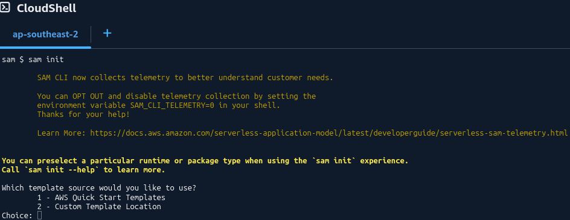
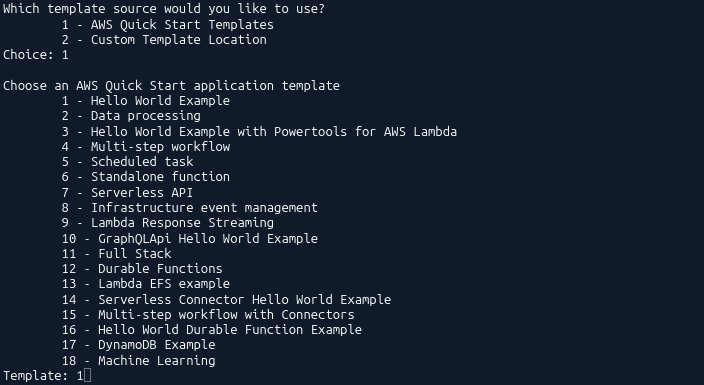
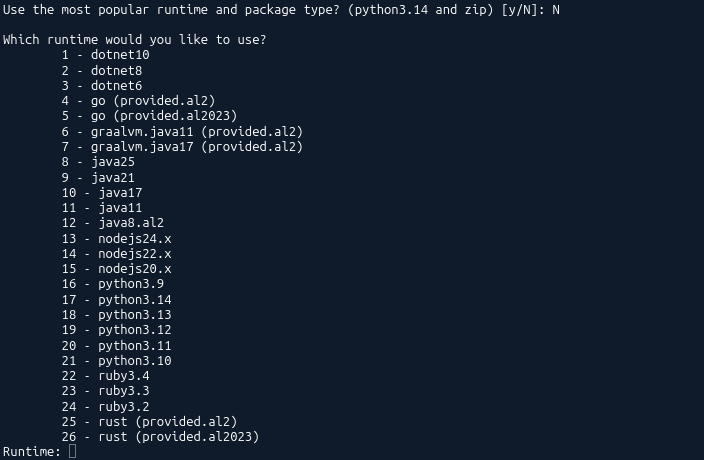
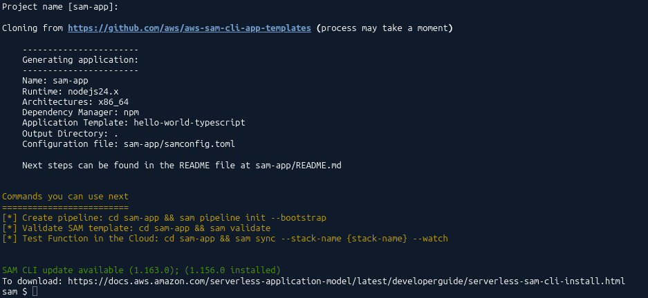
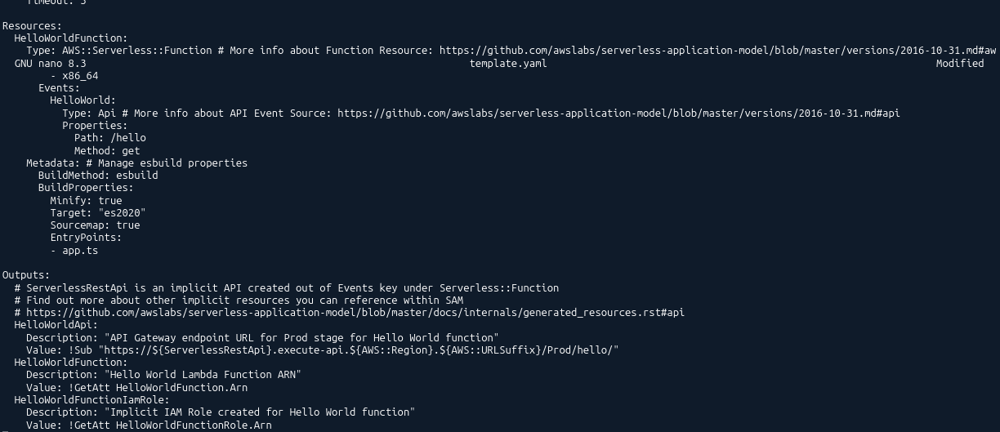
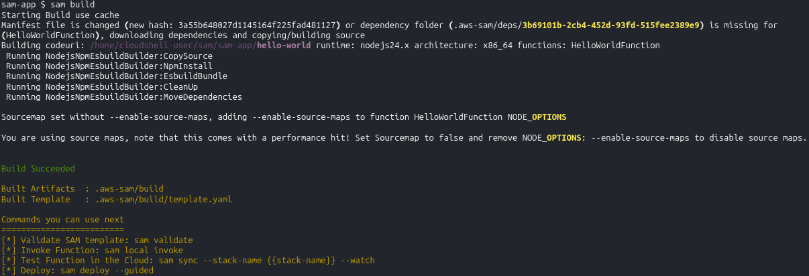
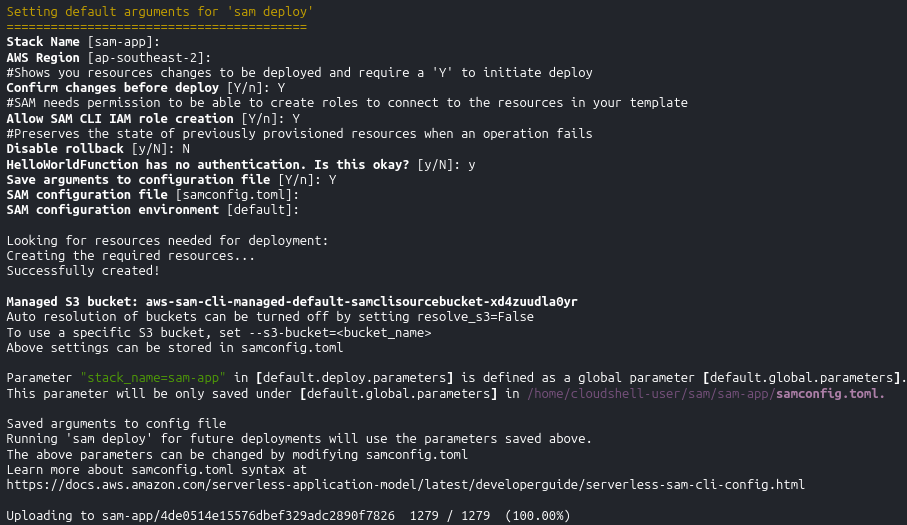
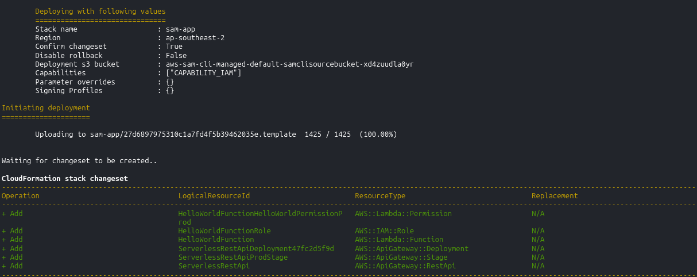
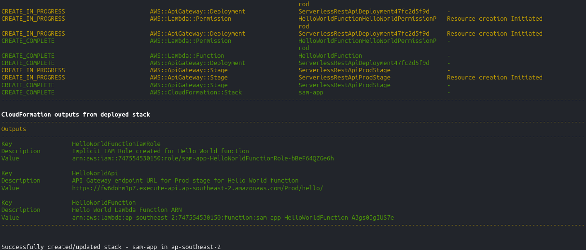

# SAM - Hands On

Running our very first native serverless template compilation inside **AWS CloudShell** is an absolute milestone play, bro! 🐿️⚡ The beautiful thing about CloudShell is that it ships with both the **SAM CLI** and standard Docker runtime layers completely pre-baked, meaning you don't have to fiddle around with annoying local environment PATH variables just to compile your infrastructure blueprints.

---

## Hands On

### 🐿️ 1. Initializing the Project Blueprint

- **Kick Off the Shell Engine:** Hit the CloudShell icon on the top universal console navigation bar to initialize your terminal runtime wrapper.
- **Spit the Init Command:** Launch the interactive configuration wizard by entering `sam init`.  
  
- **Navigate the Options Matrix:** Select the following menu choices to stage the template:
  - Template Source: Choose `1` (**Quick Start Template**).
  - Template Architecture: Choose `1` (**Hello World Example**).  
    
  - Runtime Lane: Select your target programming runtime (e.g., Python with a zip packaging format). I choose `nodejs24.x and zip` for this example.  
    
  - Telemetry Switches: Toggle options like X-Ray tracing, CloudWatch Insights, and JSON formatting to `N` (No) to keep the baseline resource testing stack clean.
  - Project Naming: Type `sam-app` and hit enter.  
    
- **Enter the Runway Directory:** Move into your fresh project canvas folder: `cd sam-app`.

---

### 📄 2. Auditing the Core App Structural Assets

Run an `ls` or file scan to inspect the three mission-critical files that make up your application stack:

- **`hello_world/app.ts` 🧠:** The operational backend logic. It contains a standard execution handler method that takes a JSON inbound payload and returns a clean HTTP status wrapper carrying the message string: `"hello world"`.
- **`samconfig.toml` 🎛️:** Holds your persistent CLI execution properties, deployment parameter hooks, bucket routes, and global variables.
- **`template.yaml` 📜:** The holy grail template. It features the mandatory **`Transform: AWS::Serverless-2016-10-31`** header macro string and provisions an `AWS::Serverless::Function` resource. Under its `Events:` configuration card, it dynamically hooks up an API Gateway `Api` GET trigger route natively!  
  

---

### 🔨 3. Fixing Runtime Drift and Compiling (`sam build`)

- **Fixing NPM Authentication Issue:** When you try to run `sam build` after following the previous CodeArtifact Hands-On, you may encounter an error like this:

  ```bash
  Error: npm ERR! code E401
  npm ERR! 401 Unauthorized - GET https://registry.npmjs.org/@aws-sdk%
  ```

  - You need to delete the registry entry in your `.npmrc` file. Run the following command to remove it:

  ```bash
  sed -i '/registry=https:\/\/registry.npmjs.org/d' ~/.npmrc
  ```

- **Execute the Compiler Container:** Spin up your local build runner:

  ```bash
  sam build
  ```

  _The Succeeded Check:_ The compiler creates a hidden local workspace directory named `.aws-sam/build/`, compiles your code assets, down-selects your dependencies, and prepares your final CloudFormation blueprint stack!  
   

---

### 🚀 4. Triggering the Cloud Rocket Launch (`sam deploy`)

- **Engage the Guided Installation:** Execute the deployment command with the active guided wizard flag:

  ```bash
  sam deploy --guided
  ```

- **Answer the Pipeline Prompts:** Roll through the deployment questions like a true pro, chief:
  - Stack Name: Keep the default (`sam-app`).
  - AWS Region: Keep your baseline regional default.
  - Confirm changes before deploy: Toggle to **`Y`** (Yes).
  - Allow SAM CLI IAM role creation: Toggle to **`Y`** (Yes) to let the system generate access policies.
  - Disable Rollback: Toggle to **`N`** (No) to keep auto-recovery armed.
  - HelloWorldFunction may not have authorization defined, Is this okay?: Toggle to **`Y`** (Yes) to keep the testing endpoint open to the web.
  - Save arguments to configuration file: Toggle to **`Y`** (Yes).
    
- **Approve the ChangeSet:** SAM automatically zips your assets, pushes them to a secure background S3 storage bucket, and prints out a visual CloudFormation ChangeSet list detailing the precise resources it's about to build. When prompted with `Deploy this changeset? [y/N]:`, smash that **`y`** key.  
  

---

### 🏆 5. Verifying the Live Production Endpoint



- **Capture the URL Output:** Once the stack completion logs finish rolling, the terminal prints out a clean **Outputs** card displaying your live, active production API Gateway endpoint string. Copy that URL!
- **Hit the Live Web:** Execute a rapid API call from your terminal over the live web:

  ```bash
  curl <YOUR_COPIED_API_GATEWAY_URL>
  ```

- **The Victory Check:** The terminal instantly prints out the JSON response: **`{"message": "Hello World"}`**.

You just provisioned a full-stack, secure serverless compute architecture with path-based API Gateway routing filters using only a few basic commands.
