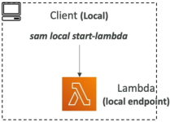
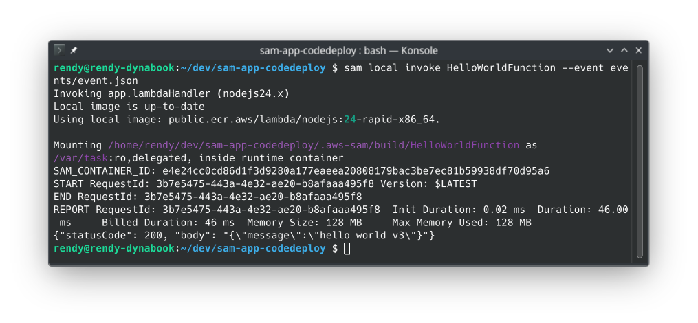
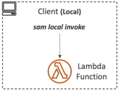
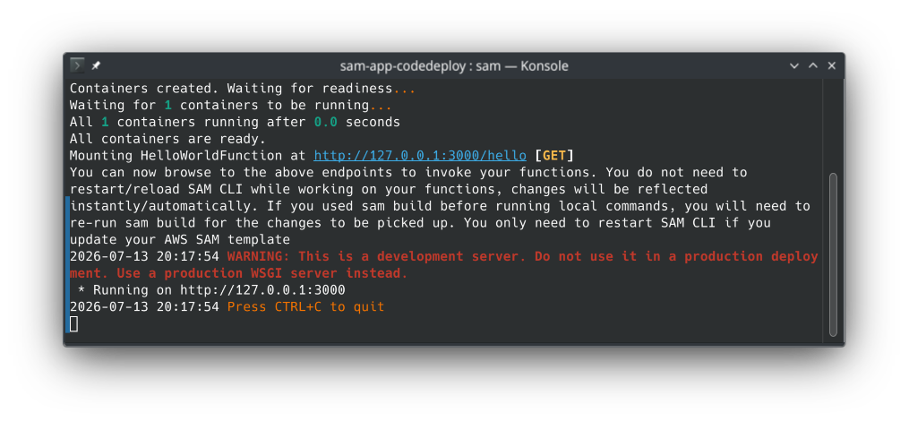
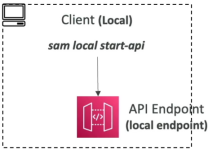
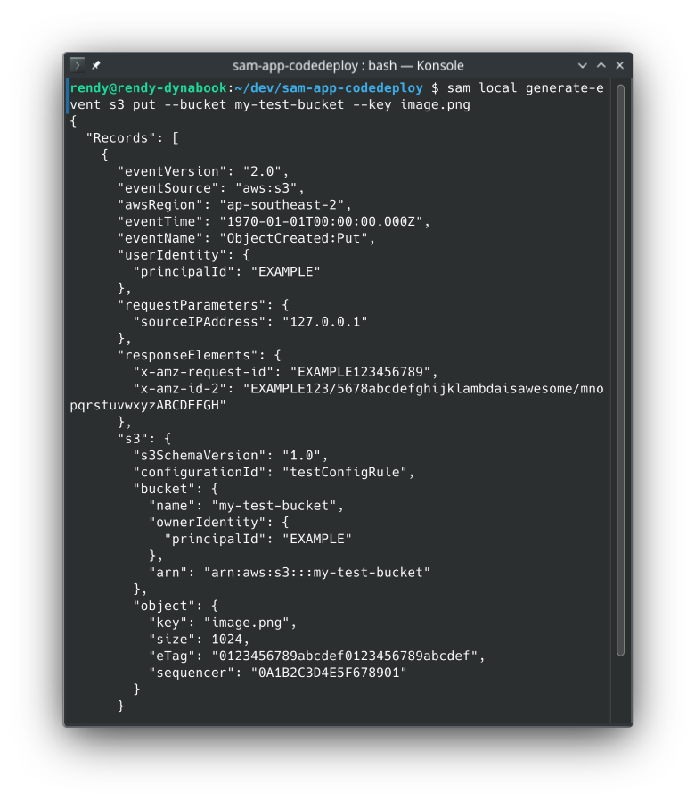
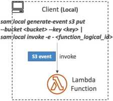

# SAM - Local Capabilities

🎛️ Local simulation power is how we completely eliminate the lag of waiting for cloud builds just to test a minor code delta. The **SAM CLI** uses Docker under the hood to perfectly mimic the real AWS execution runtime, allowing you to thoroughly validate your logic right from your machine.

Here is the easy-to-follow terminal playbook for **SAM Local Capabilities**:

### 🧠 1. Isolated Lambda Emulation Loops

- **The Persistent Endpoint Daemon (`sam local start-lambda`)**:
  - Fires up a local HTTP server that emulates the actual AWS Lambda service framework.
  - Exposes a localized, running endpoint string (usually on port `3001`) that stays alive in the background.
  - _The Dev Win:_ Perfect if you want to point automated testing suites, integration runner scripts, or local testing tools directly at a simulated Lambda target environment without hitting the live web.  
    

- **The Single-Shot Execution (`sam local invoke`)**:
  - Launches an on-demand Docker container instance of your function, processes a specific payload, logs out the exact runtime metrics, and immediately terminates the container.
  - _Credential Mapping Handshake:_ If your function hits live AWS cloud resources (like querying a remote DynamoDB table or reading from a production S3 bucket), you must append the profile flag to pass your terminal keys down:

  ```bash
  sam local invoke MyFunction --event events/event.json --profile my-dev-profile
  ```

  

  ***

  

---

### 🛰️ 2. Web API Gateway Simulation (`sam local start-api`)

- **The Mock Server Setup:** Spawns a localized HTTP mock web environment (running by default on `http://127.0.0.1:3000`) that reads your `template.yaml` routing filters.
- **The Live Hot-Reloading Engine:** If you go into your source files and change the JavaScript, Python, or Go logic, **SAM automatically hot-swaps the execution code paths on the fly, chief!** The next time you hit the route using `curl` or Postman, you instantly pull the fresh logic code without needing to restart the terminal process or run another manual compilation loop!  
  
  ***
  

---

### 🖨️ 3. Mock Data Payload Generation

- **The Payload Synthesis Engine (`sam local generate-event`)**:
  - Allows you to instantaneously generate perfect, structured sample JSON event definitions for any native AWS event source right inside your command terminal.
  - Supports a massive list of cloud event providers: `s3`, `apigateway`, `sns`, `kinesis`, `dynamodb`, `sqs`, and more.
- **The Terminal Pipe Workflow:** Instead of writing complex JSON schemas from scratch, you synthesize the data format on the fly and pipe the string right into your function handler:

  ```bash
  sam local generate-event s3 put --bucket my-test-bucket --key image.png | sam local invoke MyFunction
  ```

  

  ***

  

---

## Exam Tips

- **The Offline Debugging Blueprint:** If an exam prompt presents a serverless development team that has limited or strictly restricted internet access, or needs to aggressively reduce AWS usage bills while building out a heavily customized microservice mesh—**look straight for deploying `sam local start-api` combined with `sam local generate-event` to simulate entire API Gateway HTTP path models and Lambda executions locally inside Docker.**
- **The Live Code Reload Catch:** Remember for scenario questions that while `sam local start-api` handles hot-reloading code changes instantly, **if you update your core structural infrastructure parameters inside your `template.yaml` file (like changing an environment variable key or switching memory sizes), you must drop out of the terminal process and execute a fresh `sam build` command to repackage the configuration framework.**
