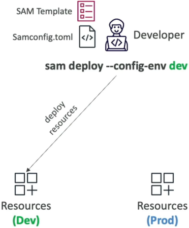

# SAM - Multiple Environments

Shifting your serverless deployment engine over to a native multi-environment strategy is how you achieve absolute professional-grade separation of concerns.

---

## Key Takeaways

When you are scaling a serverless architecture, passing raw environment variables or different target S3 buckets manually via long-winded CLI commands for your `dev` and `prod` accounts is highly error-prone and a total buzzkill for your velocity.

AWS SAM completely solves this by leveraging a single, central project configuration asset sitting cleanly at the root of your directory tree: **`samconfig.toml`**.

### 🏗️ The Anatomy of Multi-Environment `samconfig.toml`

Instead of keeping one generic `[default]` profile section inside your TOML configuration block, you can shindig separate, named environment sections side-by-side.

The exact layout block mapping follows a strict structural hierarchy: `[env_name.command_name.parameters]`. Check out how clean this file looks when partitioning your target environments, bro:

```toml title="samconfig.toml"
version = 0.1

# 🛠️ THE DEVELOPMENT BOUNDARY PRESETS
[dev.deploy.parameters]
stack_name = "sam-app-dev"
s3_bucket = "company-sam-artifacts-dev-bucket"
region = "ap-southeast-2"
confirm_changeset = false
capabilities = "CAPABILITY_IAM"
parameter_overrides = "Environment=\"development\" DatabaseMaxCapacity=\"2\""

[dev.sync.parameters]
watch = true # 🕒 Enables real-time file watching for local development

# 🚨 THE HIGH-STAKES PRODUCTION BOUNDARY PRESETS
[prod.deploy.parameters]
stack_name = "sam-app-prod"
s3_bucket = "company-sam-artifacts-prod-bucket"
region = "ap-southeast-2"
confirm_changeset = true    # 🛡️ Forces an explicit ChangeSet verification step in prod!
capabilities = "CAPABILITY_IAM"
parameter_overrides = "Environment=\"production\" DatabaseMaxCapacity=\"64\""

[prod.sync.parameters]
watch = false
```



- **`parameter_overrides` 🎛️:** This is your core leverage point. You inject different parameter values straight down into your master `template.yaml` file based on the profile targeted, enabling things like scaling up database units or injecting dev vs. prod endpoint domains seamlessly.

---

### 🚀 Executing Target Releases over the Wire

Once your TOML file is baked, you no longer have to type out long, explicit bucket routes or regional flags. You target your environments instantly using a single, mission-critical flag: **`--config-env`**.

Open up your command terminal loop and fire the target preference script straight down the line:

```bash
# Launching the rapid Sandbox release loop!
sam deploy --config-env dev

# Rolling out the heavy-lifting, audited Production fleet!
sam deploy --config-env prod

```

#### ⚡ The Execution Reality:

The exact microsecond you execute that script, the SAM CLI queries `samconfig.toml`, instantly matches the corresponding environment keyword block, automatically maps your parameter overrides, and coordinates a smooth CloudFormation update. This makes it dead simple to tie these commands right into an automated CI/CD pipeline track (like GitHub Actions or AWS CodePipeline).

---

## Exam Tips

- **The Blueprint Flag Match 🚨:** Watch out for scenario identification prompts on the exam. If a question introduces a development squad that needs to coordinate deployment parameters across distinct environments (like custom staging tags or separate artifact buckets) without multiplying their YAML codebase files, **look straight for the answer that utilizes a centralized `samconfig.toml` paired explicitly with the `sam deploy --config-env <environment_name>` command execution flag.**
- **The Parameter Ingestion Flow:** Keep in mind that parameter variables declared inside your TOML's `parameter_overrides` string must align with matching `Parameters:` entries declared right inside your root `template.yaml` file so CloudFormation can successfully bind the values to your serverless functions and tables at stack runtime!
