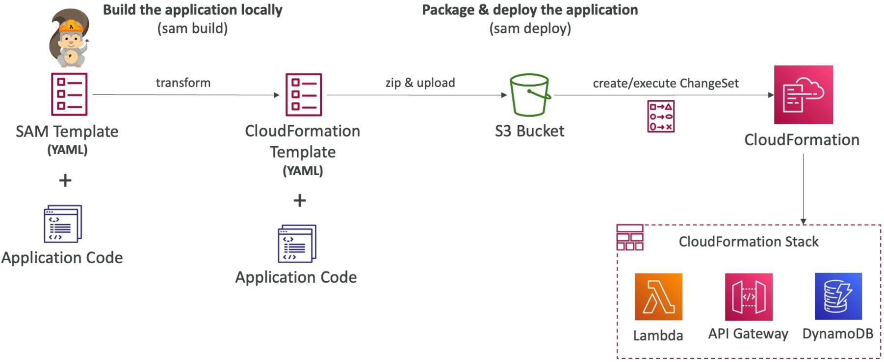
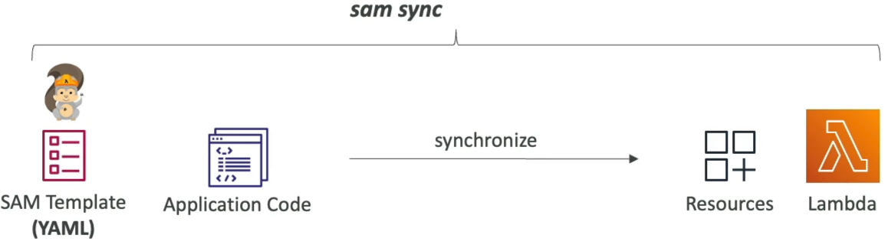

# SAM Overview

Introducing **AWS SAM (Serverless Application Model)** is where we stop treating serverless infrastructure like a chaotic, multi-hundred-line CloudFormation chore and start packaging apps.

---

## Key Takeaways

SAM is an open-source framework designed specifically for developing, testing, and deploying serverless architectures. It lets you write clean, dense YAML templates using high-level abstractions, which the AWS cloud engine automatically expands into massive, fully fleshed-out **AWS CloudFormation** blueprints behind the scenes.



### 🏗️ The Shorthand Architecture

Every valid SAM template is a CloudFormation file at its core, but it kicks off with a mandatory compiler header macro declaration right at line one, bro:

$$\text{Transform: AWS::Serverless-2016-10-31}$$

This header tells CloudFormation: _"Yo, intercept this file and parse my SAM constructs before building the stack!"_ You get three powerful serverless primitive shortcuts that eliminate massive blocks of standard boilerplate JSON/YAML:

- **`AWS::Serverless::Function` 🧠:** Provisions an AWS Lambda function, establishes its execution runtime, handles environment variable mapping, and _natively generates the entire underlying IAM execution role_ automatically!
- **`AWS::Serverless::Api` 🛰️:** Establishes full Amazon API Gateway REST/HTTP endpoints with clean path routing filters.
- **`AWS::Serverless::SimpleTable` 📊:** Provisions a highly optimized, scalable Amazon DynamoDB table focused strictly on single primary-key index schemas with zero configuration noise.

---

### 🚀 The Serverless Deployment Pipeline

When you are ready to ship your code up to the cloud, the **SAM CLI** streamlines your operations into a high-velocity execution pipeline:

```text
🛠️ THE AWS SAM LAUNCH RAMP:
   ├── 🔨 1. sam build   ──► Validates code, resolves npm/pip/Maven dependencies, creates localized build trees.
   └── 🚀 2. sam deploy  ──► Automatically zips artifacts, uploads them to an S3 bucket, executes a ChangeSet!
```

- **`sam build` 🔨:** Code analysis stage. It pulls your template, inspects your code manifests (like `package.json` or `requirements.txt`), down-selects your dependencies, and stages the compiled artifacts inside a hidden local `.aws-sam/` environment tree.
- **`sam deploy` 🚀:** The production launcher. _Architectural Fact:_ In modern versions of the CLI, **`sam deploy` implicitly executes the historical `sam package` command under the hood!** It automatically zips up your local source binaries, pushes the zip blobs into a target **Amazon S3 artifact bucket**, swaps your template's local file paths with secure public S3 URI pointers, and fires a CloudFormation **ChangeSet execution loop** to safely transition your live cloud infrastructure.

---

### 🏎️ Development at Ludicrous Speed: SAM Accelerate

If you're writing code loops and testing them interactively, waiting several minutes for a full CloudFormation stack update change set to process every time you edit a single line of a Lambda function is an absolute momentum killer. **SAM Accelerate** completely vaporizes that latency.



By executing a specialized background daemon script in your local dev terminal:

$$\text{sam\ sync\ --watch}$$

SAM hooks straight into your working directory and monitors your local codebase for file updates in real time.

#### ⚡ The Bypassing Logic Matrix:

- **Code-Only Changes (Fast Path) 🧠:** If you modify the internal JavaScript, Python, or Go logic inside your Lambda function code file _without_ changing your YAML infrastructure properties, **`sam sync --watch` completely bypasses CloudFormation entirely.** It hits the direct **AWS Lambda Service API** (`UpdateFunctionCode`) over the wire, hot-swapping your code payload directly into the live cloud environment in fractions of a second!
- **Infrastructure Changes (Standard Path) 🏗️:** If you go into your template and alter an active property (like shifting memory dimensions or appending a fresh DynamoDB table component), the watch engine catches the structural change and automatically invokes a standard CloudFormation update loop in the background to safely keep your environment synced.

#### Examples

- `sam sync` (no options) → Synchronize code and infrastructure.
- `sam sync --code` → Synchronize code changes without updating infrastructure (bypass CloudFormation, update in seconds).
- `sam sync --code --resource AWS::Serverless::Function` → Synchronize only all Lambda functions and their dependencies, ignoring other resources like DynamoDB tables or API Gateway endpoints.
- `sam sync --code --resource-id HelloWorldLambdaFunction` → Synchronize only the single Lambda function with the logical ID `HelloWorldLambdaFunction` in your template.
- `sam sync --watch` → Monitor for file changes and automatically synchronize when changes are detected. If change includes configuration, it uses `sam sync`, otherwise it uses `sam sync --code`.

---

## Exam Tips

- **The Velocity vs. Latency Optimization:** If an exam scenario introduces a developer who is actively testing a serverless application consisting of dozens of connected Lambda functions, and complains that running `sam deploy` after every minor bug fix is killing their velocity—**look straight for the answer recommending `sam sync --watch` (SAM Accelerate) to hot-swap internal code code-bases directly via the Lambda service APIs, bypassing slow CloudFormation stack updates**
- **The Syntax Verification Catch:** Always keep an eye out for code snippet identification questions. If a question asks how to ensure an infrastructure file is interpreted cleanly as a Serverless Application template rather than a standard legacy CloudFormation script, **the undisputed marker is checking for the presence of the `Transform: AWS::Serverless-2016-10-31` macro statement right at the header top line!**
