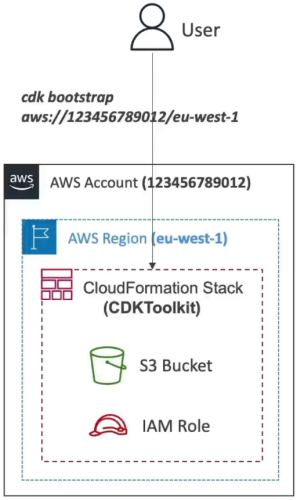
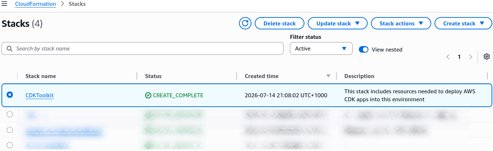

# CDK - Commands & Bootstrapping

Let's explore the important commands to know when working with the AWS Cloud Development Kit (CDK) and understand the concept of bootstrapping an environment. These commands are essential for managing your CDK applications and deploying them to AWS.

---

## 🛠️ The Core CDK CLI Command

When you are authoring an infrastructure stack, these are your daily-driver terminal tools:

- **`cdk init` 🏗️:** The blueprint generator. Spawns a clean, localized project boilerplate setup in your programming language of choice (like `cdk init app --language typescript`).
- **`cdk synth` 🔮:** The compiler. Takes your code files, parses your loops and methods, and instantly outputs the massive, raw CloudFormation YAML/JSON template. **This is where you catch your syntax bugs locally.**
- **`cdk diff` 🔀:** The radar scan. Safely audits the structural deltas between your active local code workspace and the running stack configuration currently deployed live in the cloud. It prevents you from accidentally nuking a live database block.
- **`cdk deploy` 🚀:** The rocket launcher. Pushes your synthesized template straight to the CloudFormation engine over the wire to provision or update live assets.
- **`cdk destroy` 🛑:** The cleaner. Sweeps through your stack and completely tears down the cloud resources to keep your monthly AWS bill locked at absolute zero.

---

## 🏗️ The Deep-Dive: What is Bootstrapping?

This is a milestone concept for the DVA-C02 exam. In the world of the CDK, an **AWS Environment** is explicitly defined as a distinct combination of a specific **AWS Account ID** and an **AWS Region** (e.g., Account `123456789012` in `ap-southeast-2`).



Before the CDK CLI can deploy a single microservice container or storage bucket into a new target environment, the environment must be initialized. You fire this process down the line by executing:

$$\mathbf{cdk\ bootstrap\ aws://ACCOUNT\_ID/REGION}$$

```text
🌎 TARGET ENVIRONMENT (ACCOUNT & REGION MESH)
   └── 🚀 cdk bootstrap ──► Deploys a CloudFormation Stack named "CDKToolkit"
                               ├── 📁 1. Amazon S3 Bucket (Houses zipped code assets & Docker images)
                               └── 🔑 2. IAM Execution Roles (Grants CloudFormation deployment trust boundaries)

```



### 🚨 The Exam-Critical Error Trap:

If a multi-choice prompt presents a developer who built a flawless CDK stack, but their very first attempt to run `cdk deploy` against a brand-new region throws a hard CloudFormation error stating **`Policy contains a statement with one or more invalid principal`**—**this is the ultimate missing-bootstrap indicator, chief!**

Because you haven't bootstrapped the region yet, the underlying deployment helper IAM roles simply do not exist in that environment. The stack generation fails instantly because the template is trying to assign resource trust rules to an IAM principal ARN that AWS cannot resolve.

---

## Exam Tips

- **The Blueprint Pre-Flight Check:** If an exam prompt presents a large enterprise DevOps squad that wants to enforce a strict security policy requiring all cloud resource templates to be thoroughly scanned by an external compliance checking tool _before_ anything is pushed live to the cloud—**look straight for the answer that calls `cdk synth` to generate the raw text templates completely offline.**
- **The Multi-Region Multi-Account Architecture:** If a scenario outlines a deployment pipeline that keeps dropping hard initialization errors while trying to deploy a CDK stack across secondary staging accounts—**ensure your pipeline scripts execute a `cdk bootstrap` call explicitly targeting every single destination Account and Region combination prior to scheduling the main release runner loops.**
