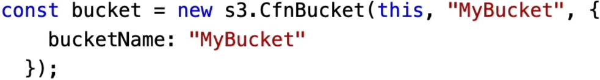
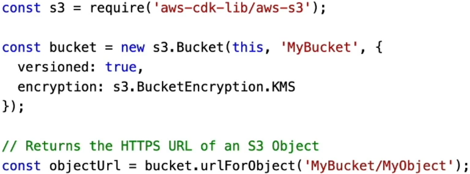
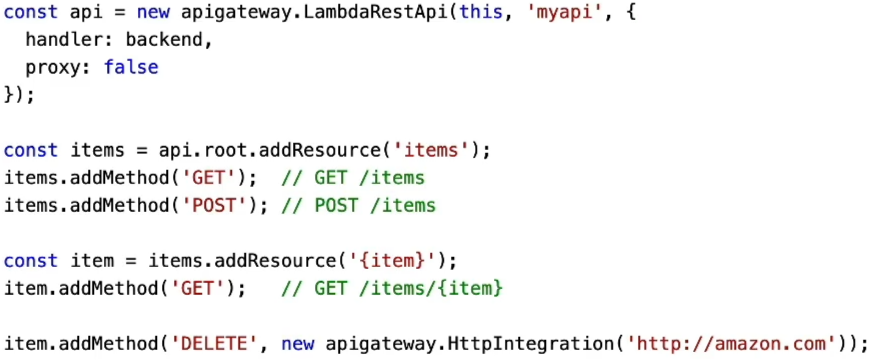

# CDK - Constructs

Understanding the matrix of **CDK Constructs** is how you transition from just copy-pasting code templates to architecting massive, secure cloud blueprints like an absolute legend! 🔮🧱

Constructs are the fundamental building blocks of the CDK. They encapsulate everything the engine needs to synthesize your final declarative CloudFormation stacks. Whether you need to deploy a standalone storage bucket or orchestrate a massive, auto-scaling container cluster wrapped in dynamic security zones, you use constructs to package that logic up cleanly.

---

## Key Takeaways

Let’s unpack the three explicit layers of CDK Constructs and check out how the community-driven **Construct Hub** ties it all together.

### 🧱 The Three Levels of Construct Abstraction

AWS partitions the Construct Library into three distinct layers, moving from raw granular control up to elite, ready-to-roll architectural blueprints:

#### 🔎 Layer 1: CFN Resources (The Direct Mapping)

These are the lowest-level primitives in the CDK universe. They represent an exact, 1:1 mirror image of raw CloudFormation resources.

- _The Marker:_ **You know it's an L1 construct the exact microsecond you see it prefixed with `Cfn**`(e.g.,`new s3.CfnBucket()`).
- _The Mechanics:_ It strips out all the coding magic. You must manually declare every single mandatory property and handle boilerplate configurations exactly like you would in a classic YAML or JSON text template. It's the ultimate migration tool if you just want to translate old templates into code line-for-line without changing how they behave.  
  

#### 🧠 Layer 2: AWS Intent (The Smart Default Engine)

This is where the real power of object-oriented infrastructure kicks in. L2 constructs represent AWS resources but operate at a higher level of intent (e.g., `new s3.Bucket()`).

- _Convenient Defaults:_ AWS engineers have pre-baked these components with highly secure, production-ready defaults and boilerplates. You don't have to guess or manually write out obscure properties just to turn on versioning or KMS database encryption.
- _Programmatic Shorthand Methods:_ L2 constructs expose powerful, high-level helper functions. Instead of wrestling with complex arrays to set up data storage expiration rules, you simply execute a clean line like **`bucket.addLifecycleRule()`**, and the CDK handles all the raw underlying CloudFormation plumbing automatically!  
  

#### 🚀 Layer 3: Patterns (The Full Architecture Stack)

These are high-level compositional structures called **Patterns**. Instead of representing a single isolated service, an L3 construct maps a collection of multiple related resources engineered to achieve a specific systemic task.

- _The Rest API Example:_ Declaring a `LambdaRestAPI` pattern automatically provisions the Amazon API Gateway endpoint infrastructure, hooks up the target backend Lambda functions, maps the HTTP method routes, and binds the execution integrations with zero manual friction.
- _The Container Fleet Example:_ Using an ECS pattern like an `ApplicationLoadBalancedFargateService` can be a total nightmare to write out in raw YAML. But with the CDK, you just fill in the basic compute sizing blanks. The pattern dynamically deploys an Application Load Balancer, provisions a secure ECS cluster, hooks up the listener routing rules, and configures the target security groups automatically on the fly, bro!  
  

---

### 🌐 Scaling Out with Construct Hub

If the native AWS library isn't fast enough for your deployment velocity, you can tap straight into the **Construct Hub**.

The Construct Hub acts as a massive open-source registry that aggregates cloud constructs created not just by official AWS teams, but also by major third-party vendors and the global open-source CDK developer community. If your team needs to rapidly deploy complex, standardized infrastructure compliance rings (like pre-audited Datadog monitoring setups, specific Cloudflare DNS routing loops, or specialized security perimeters), you can pull down a pre-baked L3 pattern straight from the Hub to accelerate your pipeline velocity to the moon.

---

## Exam Tips

- **The Rapid Infrastructure Modernization Scenario:** If an exam prompt introduces a DevOps team that wants to move their legacy infrastructure entirely into the AWS CDK, but demands a zero-risk approach that exactly duplicates their existing CloudFormation templates without introducing any new defaults or behavioral changes—**look straight for the answer that uses Layer 1 CFN Resources (`CfnBucket`, `CfnQueue`).**
- **The Least Privilege Automation Choice:** If a scenario presents a developer who needs to rapidly stitch a serverless API together, and wants to avoid manually writing out dozens of verbose permission blocks while ensuring the system maintains strict secure defaults—**choose the answer that utilizes L2 or L3 constructs, leveraging built-in shorthand methods like `.addLifecycleRule()` or `.grantReadWrite()` to let the code engine dynamically compute the secure boilerplate behind the scenes.**
