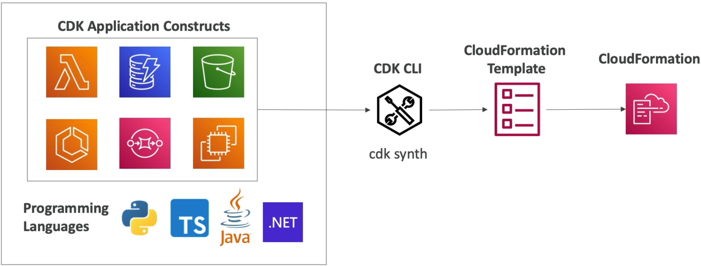
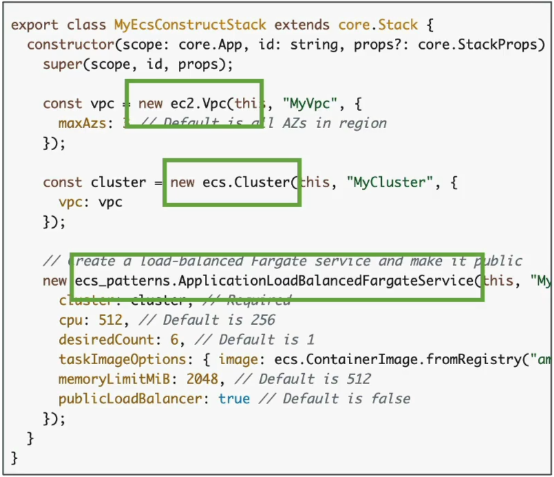
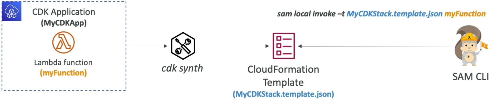

# CDK Overview

Welcome to the absolute peak of modern **Infrastructure as Code (IaC)** engineering! 🏎️💨 The **AWS Cloud Development Kit (CDK)** is where we stop treating infrastructure like a massive, static YAML data chore and start programming it like actual application software.

---

## Key Takeaways

Instead of hand-coding thousands of lines of fragile declarative text, the CDK lets you use **real, compiled, object-oriented programming languages**—like TypeScript, JavaScript, Python, Java, and .NET. You get full autocomplete Intellisense inside your IDE, structural loops (`for` loops to create clusters), object inheritance, and logic gates.

### 🏗️ The Synthesis Compilation Loop

The most important architectural fact to anchor for the exam is that **the CDK does not talk directly to the AWS resource provisioners.** It is an abstraction layer that compiles straight down into standard AWS CloudFormation templates.

```text
💻 THE CDK COMPILATION ENGINE:
   ├── 📝 1. Write Code    ──► TypeScript/Python files utilizing standard OOP logic.
   ├── 🔮 2. cdk synth     ──► Translates code into a raw JSON/YAML CloudFormation Template!
   └── 🚀 3. cdk deploy    ──► Ships the template to CloudFormation to provision live assets.

```

- **Type-Safety Win 🛡️:** If you reference a variable wrong, drop a typo in a parameter, or miss a mandatory configuration property, **your code won't compile!** You catch the structural errors right inside your local terminal _before_ you ever spend a single second waiting on a cloud stack to process!  
  

---

### 🧱 The Abstraction Hierarchy: Constructs

The CDK operates on modular building blocks called **Constructs**, which are categorized into three levels of abstraction:

- **L1 Constructs (CFN Resources) 🔍:** Exact 1:1 direct mappings to raw CloudFormation resources. They always start with the prefix `Cfn` (e.g., `CfnBucket`). You have to configure every single detail manually, just like raw YAML.
- **L2 Constructs (AWS Intent) 🧠:** Curated components engineered by AWS experts. They come baked with secure defaults, smart boilerplate, and dynamic security profiles. For example, declaring `new vpc()` automatically builds your public and private subnets, internet gateways, and routing paths behind the scenes with minimal configuration noise!
- **L3 Constructs (Solutions) 🚀:** Full, ready-to-roll architecture patterns that stitch multiple services together (e.g., `ApplicationLoadBalancedFargateService`). This single object automatically wires up an Application Load Balancer, provisions an ECS Cluster, configures task execution scaling policies, and hooks it right to an auto-generated Fargate container fleet.  
  

---

### ⚖️ CDK vs. SAM: The Architectural Stand-Off

This is a high-frequency validation point on the exam blueprint. You must know exactly when to pull each tool out of your bag:

| Feature Criteria    | 🐿️ AWS SAM                                                                        | 🔮 AWS CDK                                                                                                |
| ------------------- | --------------------------------------------------------------------------------- | --------------------------------------------------------------------------------------------------------- |
| **Primary Focus**   | Strictly **Serverless-focused** (Lambda, API Gateway, DynamoDB).                  | **Global Scope.** Supports every single AWS resource block in existence.                                  |
| **Language Format** | Declarative text shorthand (**YAML/JSON**).                                       | **Imperative Programming** (TypeScript, Python, Java, .NET).                                              |
| **Use Case Lane**   | Perfect for rapid, standalone serverless microservices and function code testing. | Ideal for large-scale enterprise infrastructure, networking meshes, and complex container configurations. |

---

### 🤝 Cross-Framework Integration (CDK + SAM Local)

Here is an elite hybrid DevOps play: **You do not have to choose between them!** You can use the programming power of the CDK to build your infrastructure, and leverage the local Docker simulation speed of the SAM CLI to debug your Lambda functions completely offline.

```bash
# Step A: Synthesize your TypeScript/Python CDK code down into a CloudFormation bundle
cdk synth

# Step B: Pass that generated template directly into the SAM simulation engine to execute your code locally!
sam local invoke -t ./cdk.out/MyStack.template.json MyLambdaFunction --event events/mock.json
```

By passing the synthesized template artifact location using the **`-t` (template)** flag, the SAM CLI spins up its local Docker container layer and executes your CDK function handler seamlessly right on your machine!  
 

---

## Exam Tips

- **The Object-Oriented Scaling Choice:** If an exam prompt presents a large engineering enterprise that needs to spin up dozens of standardized, identical microservice clusters across multiple AWS accounts, and demands an infrastructure strategy that allows them to reuse code modules, write unit tests against their configuration logic, and leverage standard OOP inheritance—**look straight for the AWS CDK using an L3 Construct Pattern.**
- **The Hybrid Serverless Local Testing Loop:** If a scenario outlines a developer who has authored a complex infrastructure layout using the CDK, but needs an efficient mechanism to test an internal Lambda function's handler logic completely offline with a mock payload—**choose the answer that runs `cdk synth` to generate the template, then executes `sam local invoke` referencing that synthesized template asset path.**
