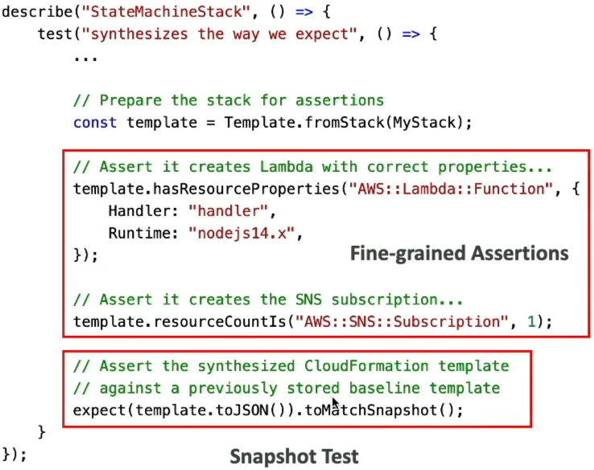

# CDK - Unit Testing

Writing **Unit Tests** for your infrastructure code is the absolute ultimate flex in cloud engineering, chief! 🔮🧪 Because the CDK relies on actual programming languages, we get to treat our cloud configurations with the exact same high-level testing rigor as standard application logic.

Instead of deploying a massive stack blind and crossing our fingers that the security boundaries hold up, we pull down standard testing runners like **Jest** (for JavaScript/TypeScript) or **Pytest** (for Python) paired right with the official **AWS CDK Assertions Module**.

---

## Key Takeaways

Let's explore the two major testing strategies, the core verification methods, and the exact syntax parsing rules you need to crush for your DVA-C02 exam.

### 🏗️ The Two Pillars of CDK Testing

When you write tests against your synthesized templates, you partition your assertions into two common engineering strategies:

- **Fine-Grained Assertions (The Precision Audit) 🎯:** This is the most widely deployed approach, bro. You explicitly verify whether specific resources exist inside the template and ensure they carry the exact right configuration parameters. For example, you can write an assertion checking that a Lambda function has its `Runtime` pinned explicitly to `nodejs22.x`, or that an SNS topic has exactly 1 subscription rule attached to it. It’s perfect for test-driven development (TDD) and preventing regressions!
- **Snapshot Tests (The Baseline Radar) 📸:** Instead of checking individual properties, you take the entire synthesized CloudFormation template output and compare it string-for-string against a previously saved baseline "snapshot" file. If a team member refactors the CDK code and accidentally shifts a property value or drops a resource entirely, the snapshot test catches the delta and fails instantly.  
  

---

### 📜 The Template Ingestion Handshake: `fromStack` vs. `fromString`

To run assertions, you must first feed your template metadata directly into the CDK assertions engine. You have two foundational static ingestion methods to create a testing wrapper, and **the exam loves to check if you know the exact difference between them:**

```text
🔮 AWS CDK TEMPLATE INGESTION VECTOR:
   ├── 🧠 1. Template.fromStack(MyStack)  ──► Ingests a live, active programmatic CDK Stack object.
   └── 📄 2. Template.fromString(MyString) ──► Ingests a raw, external pre-baked JSON/YAML text string!
```

#### 🧠 Vector A: `Template.fromStack(stack)`

This is what you use when your code lives natively inside your active CDK application. You pass the literal programmatic `Stack` instance variable straight into the method. The framework automatically synthesizes the stack down to its core elements right inside memory on the fly so you can test it directly.

#### 📄 Vector B: `Template.fromString(jsonString)`

What if you are trying to test a legacy CloudFormation template that was written completely outside the CDK by another team years ago? **You call `Template.fromString()`!** You feed a raw JSON or YAML text string file right down its pipe, and the assertions module builds a mock test target out of that external template string, allowing you to run full programmatic unit tests against legacy raw text stacks.

---

## Exam Tips

- **The Legacy Infrastructure Migration:** If an exam prompt presents a company migrating old, raw CloudFormation YAML templates into a unified testing pipeline, and demands an architectural approach that validates these old raw text assets using standard programmatic Jest/Pytest suites—**look straight for the answer that uses the `Template.fromString()` method to parse the raw layout text into the CDK assertions engine.**
- **The Security Compliance Guardrail:** If a scenario demands that all auto-generated microservice queues must have a strict `VisibilityTimeout` threshold parameter pinned to a minimum value of 30 seconds, and must fail the build runner pipeline if a developer attempts to lower it—**choose the answer that writes a fine-grained assertion using the `template.hasResourceProperties()` matcher targeting the `AWS::SQS::Queue` type definition block.**
