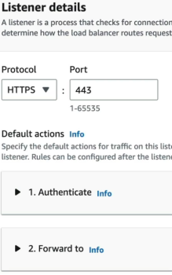
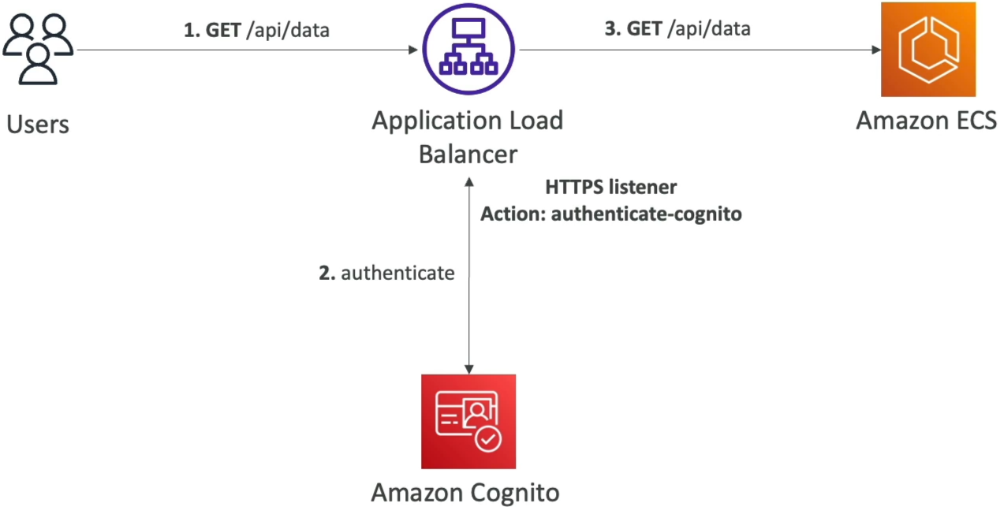
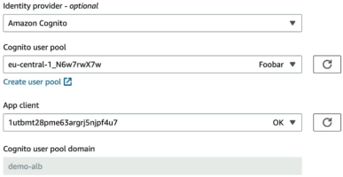
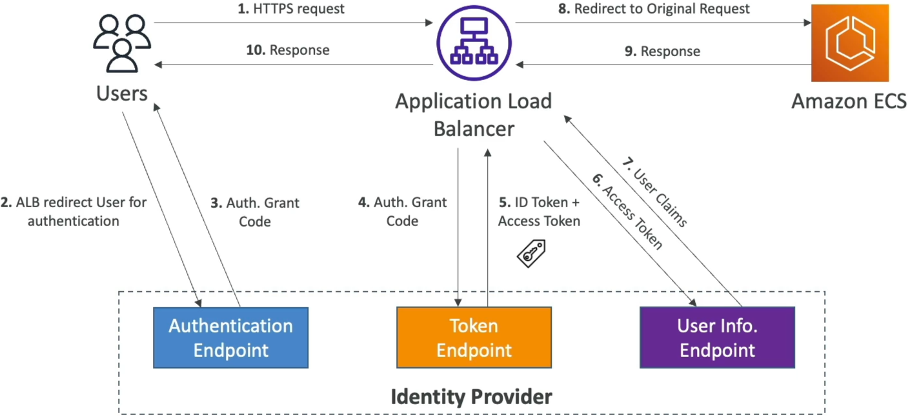
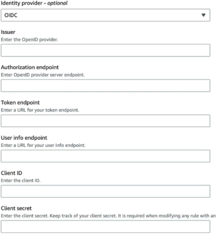

# Application Load Balancer - User Authentication

Offloading the entire security perimeter straight down to your **Application Load Balancer (ALB)** is an absolute masterclass engineering play.

By letting the network infrastructure tier completely manage sign-ins and session state validation, you strip a massive pile of security boilerplate right out of your container or Lambda code base. Your backend targets (EC2, ECS Fargate, or EKS) never have to parse OAuth endpoints or manually check login statuses—they only wake up when a pristine, fully authenticated request hits them.

---

## Key Takeaways

Let’s deep dive into the listener logic, the network routing flows, and the mission-critical **HTTP Request Headers** you must master to crush the DVA-C02.

### 🏗️ The Secure HTTPS Listener Configuration

To get this security wall working, **you must route traffic exclusively over an HTTPS secure listener tier.** Inside the ALB routing dashboard, you map a listener rule combining an authentication action followed immediately by a standard backend dispatch block:



When defining the rule, you specify what the balancer should execute if an incoming request is completely missing a valid session cookie. You get three explicit behaviors:

- **Authenticate (Default) 🔑:** The standard secure guardrail. Automatically issues a clean HTTP 302 redirect to push the user straight to your identity provider's login interface.
- **Deny 🛑:** Hard drops the connection immediately, serving an absolute HTTP 401 Unauthorized block at the perimeter.
- **Allow ✅:** Passes the traffic forward to the target group anyway, even without a session token. _Dev-Ops Blueprint Trap:_ This is exactly what you use to expose a public marketing layout page or a shared splash window, allowing your backend application code to dynamically show a personalized dashboard _only_ if the user claims happen to be present!

---

### 🛰️ The Native Cognito Integration Flow (`authenticate-cognito`)

When hooking up **Amazon Cognito User Pools**, the ALB acts as an automated OIDC client wrapper.



- **The Blueprint Hookup:** You provision a User Pool, spin up an App Client, and ensure a **Client Secret** is checked and generated (unlike public mobile apps, the ALB runs in a highly secure server boundary and _requires_ that secret key to process the cryptographic exchange)!  
  
- **The Handshake Logic:** If a user hits a route without a session cookie, the ALB drops an HTTP 302 and hands them off to Cognito’s **Hosted UI / Managed Login page**. The user types their password, Cognito authorizes the user, fires an authorization grant code back to the ALB's callback URL (`/oauth2/idpresponse`), and the load balancer automatically exchanges that code behind the scenes for full ID and Access tokens!

---

### 🌐 Direct OIDC Core Handshake Flow (`authenticate-oidc`)

If your enterprise forces you to connect straight to an external custom OpenID Connect identity provider (like Okta, Ping Identity, or Auth0) _without_ passing through Cognito, the ALB manages a robust backchannel exchange pipeline:

```text
🌎 END USER              🛰️ APPLICATION LOAD BALANCER         🌐 OPENID CONNECT IDENTITY PROVIDER (IdP)
   │                                  │                                  │
   ├── 1. GET /api/data ─────────────►│                                  │
   │◄── 2. 302 Redirect to IdP ───────┤                                  │
   │                                  │                                  │
   ├── 3. Authenticates with Password ──────────────────────────────────►│
   │◄── 4. Issues Auth Code payload ─────────────────────────────────────┤
   │                                  │                                  │
   ├── 5. Returns to ALB with Code ──►├── 6. Exch Auth Code for Tokens ─►│
   │                                  │◄── 7. Delivers ID & Access JWTs ─┤
   │                                  │                                  │
   │                                  ├── 8. GET /userinfo (Access Token)►│
   │                                  │◄── 9. Delivers raw User Claims ──┤
   │                                  │                                  │
   │◄── 10. Sets Cookie & Serves ─────┴── 11. Forwards Request + Claims ─► 📦 BACKEND (ECS/EC2/EKS)

```

1. The user hits the endpoint; ALB spots no session cookie and drops a 302 redirect pointing to the IdP's **Authorization Endpoint**.
2. The user logs in successfully, and the IdP bounces them back to the ALB carrying a temporary **Authorization Grant Code**.
3. The ALB catches the code, intercepts it, and runs a secure backchannel call directly to the IdP's **Token Endpoint** to trade the code for full ID and Access tokens.
4. The ALB makes one final backchannel hop to the IdP's **User Info Endpoint**, presenting the access token to pull down the verified user claims dictionary.
5. Finally, the ALB drops a secure cryptographic cookie (**`AWSELBAuthSessionCookie`**) straight into the user's browser for subsequent tracking and gracefully forwards the target traffic down to your compute instances!  
   
   ***
   

---

### 🖨️ The Critical Target Headers: Parsing User Identity Natively

Once the session is secured, how does your backend code actually know _who_ logged in? **This is the absolute highest-frequency validation point on the DVA-C02 exam.**

The load balancer seamlessly sanitizes the request headers and injects three dedicated, immutable **`X-Amzn-Oidc-*`** HTTP headers right into the payload passing down to your Fargate containers or EC2 instances:

- **`X-Amzn-Oidc-Accesstoken` 🔑:** Carries the raw, live access token issued directly by the identity endpoint provider, useful if your application code needs to make secondary API hops.
- **`X-Amzn-Oidc-Identity` 🪪:** Contains the absolute unique subject identity string (**`sub`** field user UUID) mapped straight out of the user directory database.
- **`X-Amzn-Oidc-Data` 📊:** This is the holy grail header, chief! It holds the entire structural dictionary of user attributes and claims (like name, email, roles) packaged inside an ultra-secure, custom **Base64 JSON Web Token (JWT)**.

#### 🚨 The Backend Security Rule:

To prevent malicious users from hacking their local headers and passing fake user accounts directly to your backend targets, **your internal application code must verify the signature of the `X-Amzn-Oidc-Data` JWT using public keys before parsing its fields!** The ALB signs this token using the highly secure **ES256** algorithm.

---

## Exam Tips

- **The Zero-Code Application Migration Catch:** If an exam prompt presents a legacy microservice fleet sitting on EC2 or Fargate that needs to instantly roll out a strict Single Sign-On (SSO) login lock matching corporate Active Directory or Google credentials, but the engineering manager forbids modifying any application software code due to deadlines—**look straight for the answer that wraps the app behind an Application Load Balancer with an HTTPS listener rule configured for `authenticate-cognito` or `authenticate-oidc`.**
- **The Target Identity Parsing Header:** If a multi-choice question asks exactly how a container target sitting behind an authenticated load balancer can grab the validated email address and user metadata claims of an incoming connection—**target the option that reads and decodes the `X-Amzn-Oidc-Data` HTTP header payload.**
