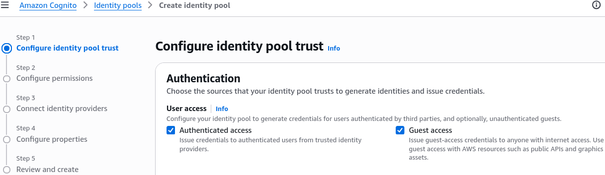
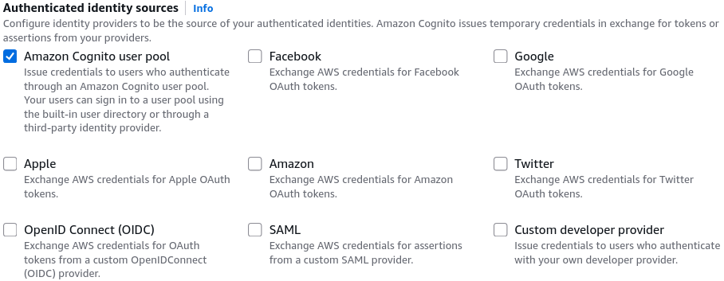
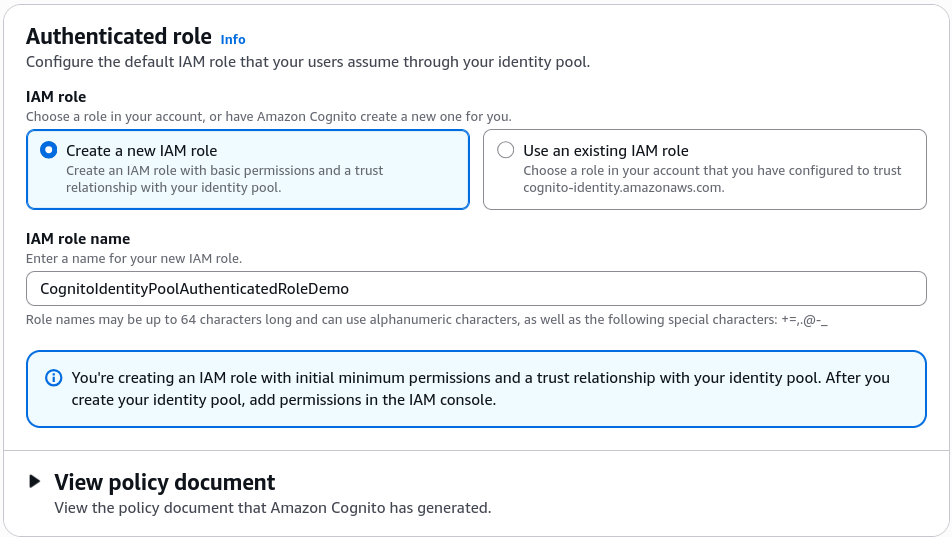
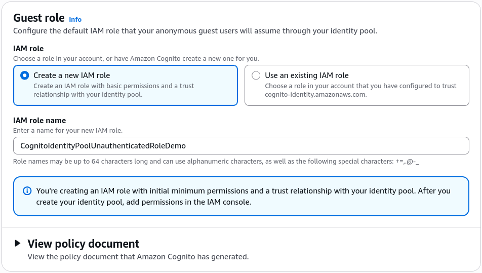
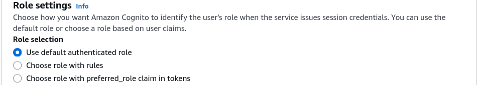
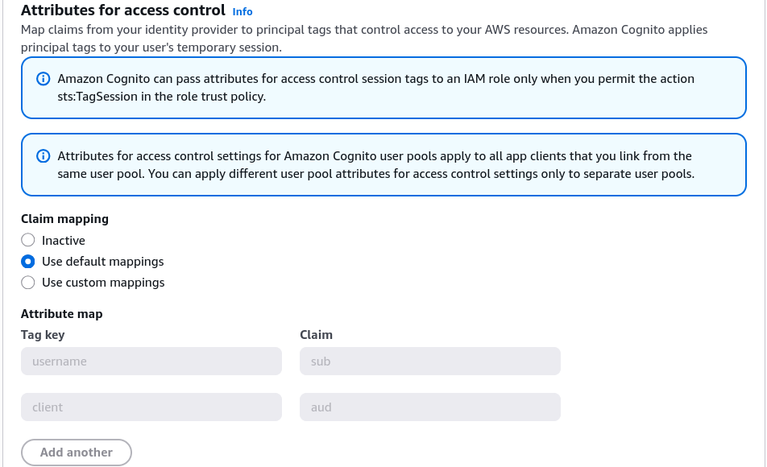
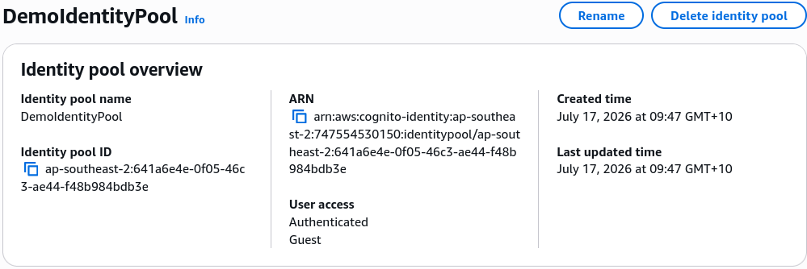
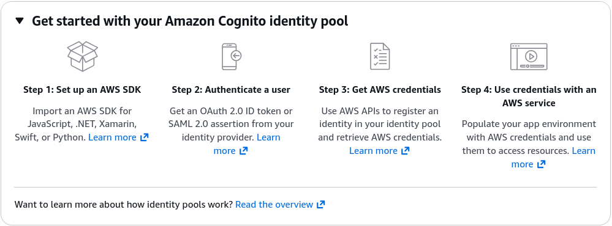

# Cognito Identity Pools Hands On

Dropping a live **Amazon Cognito Identity Pools (Federated Identities)** configuration right through the management console interface is how you seal the lock on direct, secure client-to-cloud computing paths.

Stephane’s walk-through peels back the exact layer where authentication tokens turn into active, hard-hitting **AWS IAM session keys** that authorize frontend web or mobile apps natively.

---

## Key Takeaways

### 🎛️ The Console Step-by-Step Execution Blueprint

When you hit the **Identity Pools console dashboard**, you map your authentication sources and session access lines step-by-step through a 5-stage setup layout:

```text
🪪 COGNITO IDENTITY POOLS CREATION TIMELINE:
   ├── 🔒 1. Configure Trust    ──► Choose Authenticated Access sources (CUP, Google) and/or enable Guest paths.
   ├── 🔑 2. Map IAM Roles      ──► Auto-generate or assign separate Auth and Unauth Execution Roles.
   ├── 🛰️ 3. Connect Providers   ──► Input your home User Pool ID and App Client ID strings.
   ├── ⚙️ 4. Configure Basic UI ──► Name the Pool (e.g., DemoIdentityPool) and select classic or basic flow.
   └── 🏆 5. Review & Launch    ──► Fire the creation loop to activate the pool's permanent unique ID!

```

- **Step 1: User access Setup 🔓:** Toggle your access channels. You can simultaneously check **Authenticated access** and enable **Guest access**.  
  
  - For your authenticated path, you pick your exact identity engines—selecting our pre-baked **Cognito user pool** alongside social logins like Google or Apple.  
    
- **Step 2: Core Permission Structuring 🔑:** Cognito prompts you to assign your core session boundaries. You command the system to auto-create two completely separate, brand-new IAM roles directly inside your account ledger:
  - `CognitoIdentityPoolAuthenticatedRoleDemo` (For logged-in users)  
    
  - `CognitoIdentityPoolUnauthenticatedRoleDemo` (For guest tracking)  
    

---

### Connect to Your User Pool 🛰️

- **The User Pool Handshake 🤝:** Next step is to connect your **Identity Providers**. To bind your user pool directly to this broker layer, you drop in the specific **User Pool ID** (e.g., `us-east-1_xxxxxxxxx`) and the matching public **App Client ID** string you captured during your CUP setup.
- **Role selection :** When a user logs in via your user pool and presents their JWT token, how does the Identity Pool decide what security clearance they get?  
  By default, the system enforces the standard **Default authenticated role** you mapped during the initial console creation flow. However, if your application requires granular group separation, you can switch the setting over to **Choose role with rules**:
  - _The Rules Engine:_ You can inspect specific structural claims coming inside the inbound user token (like checking if `cognito:groups` contains `"PremiumUsers"` or `"Engineers"`), and dynamically assign entirely different, heavily customized IAM roles to those sessions on the fly.  
    
- **Attributes for Role Mapping:** You can also use other token claims like `sub`, `email`, or any custom attribute you defined in your user pool to create more complex role mapping rules. This allows for a highly flexible and secure access control mechanism based on user identity and attributes.  
  

---

### Configure properties ⚙️

- Name your identity pool (e.g., `DemoIdentityPool`) and you have option to enable Basic (classic) flow, enable this if your app relies on separate API requests to retrieve an identity token, and then to assume a role using that token.

---

### Review & Launch 🏆

- After you finish the configuration, review all the settings and click **Create Pool**. Cognito will generate a unique identity pool ID (e.g., ap-southeast-2:xxxxxxxx-xxxx-xxxx-xxxx-xxxxxxxxxxxx`) that you will use in your application to authenticate users and obtain temporary AWS credentials.
- Review that you have both **Authenticated** and **Guest** access enabled.
  
- When you are ready to use the identity pool, you will need to Set up an AWS SDK in your application to authenticate users and obtain temporary AWS credentials. The identity pool ID generated by Cognito will be used in your application code to interact with AWS services securely.  
  

### 🔑 The IAM Target Adjustment (Granting Actual AWS Power)

:::tip
When Cognito finishes auto-generating your baseline Auth and Guest roles, **they ship completely bare with absolute minimum parameters (basically just granting basic cloud tracking rights).**
:::

To actually let your mobile app upload photos straight to an S3 bucket or execute database lookups, you must inject the necessary permissions directly over to the **IAM Console Dashboard**:

1. Search for your newly generated role matching your identity pool's tag name. (e.g., `CognitoIdentityPoolAuthenticatedRoleDemo` and `CognitoIdentityPoolUnauthenticatedRoleDemo`).
2. Open the role properties and choose to append an **Inline Policy** or attach an active **AWS Managed Policy**.
3. Inject the precise service permissions your code requires—like adding `s3:PutObject` or `dynamodb:GetItem` bounded cleanly by policy variables.

The exact millisecond you update that IAM policy document, any client device that trades an identity token through your pool instantly receives the fresh, expanded resource rights via their temporary credentials.

---

## Exam Tips

- **The Post-Creation Configuration Lock:** Always remember for scenario management tasks that while you can constantly edit your IAM roles, inject complex rules, or add custom S3/DynamoDB policy boundaries down the wire, if you configure a **Custom developer provider** source line during the initial creation wizard steps, **it becomes an unmodifiable parameter that cannot be altered or deleted from that pool layout.** Take extra care when staging enterprise custom provider setups.
