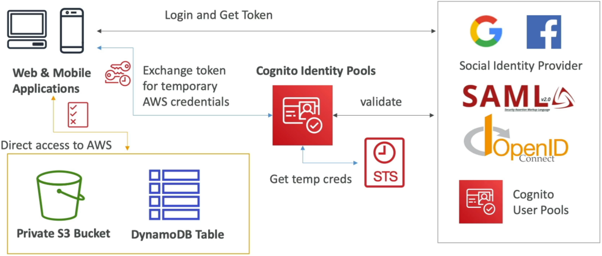
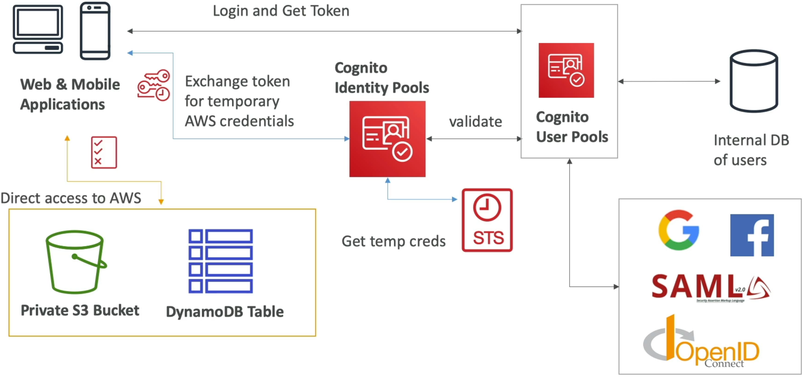
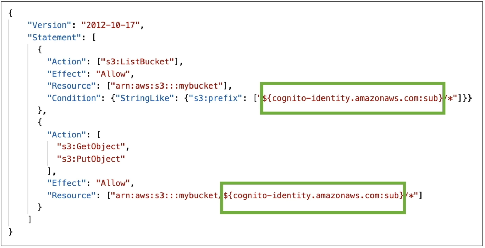
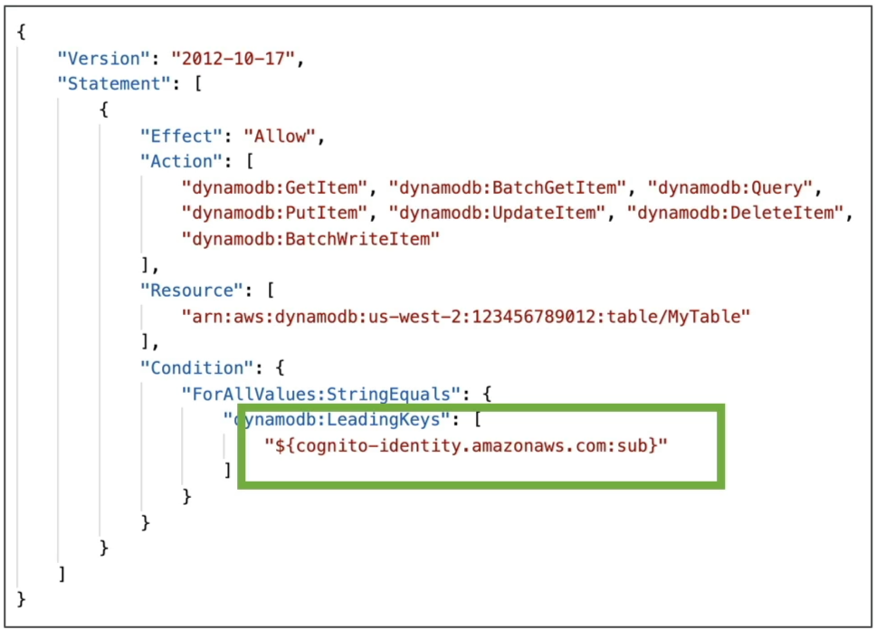

# Cognito Identity Pools

Bridging the gap between external digital identities and raw AWS computing resources means stepping out of user directories and plunging straight into **Amazon Cognito Identity Pools (Federated Identities)**.

Stephane drops some major truth bombs here. The naming convention is an absolute mind-meld trap because User Pools and Identity Pools do completely different architectural jobs, yet live under the exact same Cognito branding umbrella.

---

## Key Takeaways

Let's explore the role mapping engines and the **Row-Level Security / Variable Mappings**.

### 🏗️ The Core Architecture Loop: Token for Access Keys Exchange

The mission-critical purpose of an Identity Pool is **Authorization**. It doesn't hold passwords or maintain a user registration database. Its entire job in the cloud is to act as a secure transaction broker:

```text
🌎 MOBILE/SPA CLIENT ──► 1. Authenticates ──► 🔑 IDENTITY PROVIDER (CUP, Google, OIDC, SAML)
     │                                           │
     │◄───────────────── 2. Returns JWT Token ───┘
     │
     ├── 3. Presents JWT ────────────────────► 🪪 COGNITO IDENTITY POOLS
     │                                           │
     │                                           ├── 4. Vets token validity with Provider
     │                                           ├── 5. Invokes AWS STS: AssumeRoleWithWebIdentity 🚀
     │                                           └── 6. Dispenses short-lived IAM Credentials 🔑
     │
     │◄── 7. Returns Access Key/Secret/Session ──┘
     │
     └── 8. Direct API Call (via SDK) ───────► 📦 AWS RESOURCES (Private S3 Bucket / DynamoDB)

```

1. **The Identity Identification Gate:** The client application first authenticates against a trusted external **Identity Provider (IdP)**. This can be your own internal **Cognito User Pool**, public social logins (Google, Facebook, Amazon, Apple), standard enterprise SAML/OIDC systems, or even your own custom backend developer-authenticated server!
2. **The Token Handshake:** The provider passes back an identity token (like a JWT or SAML assertion).
3. **The STS Cross-Over 🚀:** The client hands that token straight to the Identity Pool. The pool verifies the token's cryptographic integrity, maps it to a unique tracking identity string, and runs a backchannel call to the **AWS Security Token Service (STS)** using the core API method **`AssumeRoleWithWebIdentity`**.
4. **Direct Cloud Access 🖨️:** STS dispenses short-lived, temporary AWS IAM credentials (an Access Key ID, Secret Access Key, and Session Token) back to the app client. The client can now drop these keys directly into the AWS SDK to read or write files to S3 or run queries against DynamoDB completely bypassing your custom backend application servers.



<center>**Cognito Identity Pools Diagram**</center>

---



<center>**Cognito Identity Pools with User Pool Diagram**</center>

---

### 🎛️ The Guest Factor: Unauthenticated Identities

Identity Pools have a unique superpower: **they natively allow Guest Access.**

Inside the provider dashboard configuration settings, you can toggle the flag **`Enable access to unauthenticated identities`** to true.

- _The Architectural Play:_ This partitions your pool into two distinct, dedicated IAM role tracks: one for **Authenticated Users** and one for **Unauthenticated Guests**.
- _The Practical Use Case:_ Perfect if a new mobile app needs to allow anonymous guest users to dynamically stream performance data up into an S3 bucket or read a shared database list _before_ they ever fill out a sign-up sheet or type a password.

---

### 🔒 Granular Isolation: Policy Variables & Row-Level Security

How do you prevent millions of authenticated public users from reading each other's private data if they are all sharing the exact same baseline IAM role? **This is the absolute peak validation track on the certification blueprint**

You don't need to provision millions of separate IAM roles. Instead, you inject specialized **IAM Policy Variables** straight into a single master policy document to achieve absolute runtime isolation based on their resolved Cognito user tracking string.

#### 📂 S3 Prefix Isolation (Folder-Level Control)

By dropping the variable string **`${cognito-identity.amazonaws.com:sub}`** right inside the resource ARN card, IAM dynamically resolves that variable to the user's specific Identity ID at the exact second they make a call, chief:



- _The Result:_ User A (`us-east-1:aaaa-bbbb`) can effortlessly upload and download files inside the bucket folder matching their ID, but if they attempt to modify a path matching User B's folder (`us-east-1:cccc-dddd`), the IAM evaluation engine drops a hard, ironclad Access Denied block on the spot.

#### 📊 DynamoDB Row-Level Security (Fine-Grained Data Segments)

You can lock down exact data row interactions inside a shared Amazon DynamoDB table by binding a strict conditional filter targeting the primary partition index key using the **`dynamodb:LeadingKeys`** parameter:



- _The Result:_ This creates absolute row-level data segregation. A user can execute queries or updates on the table _only_ if the primary partition key of the row precisely matches their specific tracking identity string parameter!

---

## Exam Tips

- **The STS API Identification Blueprint:** If a multi-choice exam prompt asks you to identify the exact low-level cryptographic token exchange API call invoked behind the scenes when a public social login token is traded for temporary AWS credentials—**look straight for `AssumeRoleWithWebIdentity`.** Do _not_ choose `AssumeRole` or `GetSessionToken`.
- **The Mobile User Storage Direct Bypass:** If a scenario presents an architecture group launching a mobile photo journal app, and they want to reduce compute loads by letting users upload image files directly to an Amazon S3 bucket without routing data through an intermediate ECS container tier—**choose the option that deploys a Cognito Identity Pool hooked to a Cognito User Pool, leveraging the `${cognito-identity.amazonaws.com:sub}` variable inside the authenticated IAM policy to securely isolate user storage folders.**
